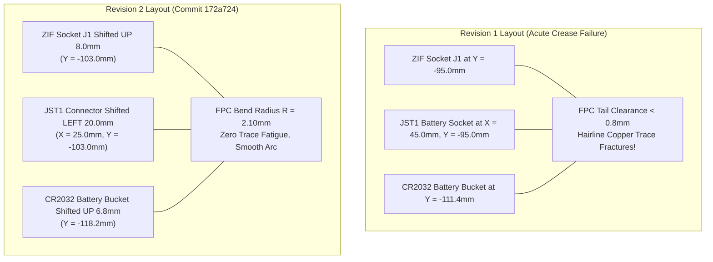

In software development, connections don't wear out. You bind an API delegate or establish a stream, and data flows indefinitely without physical decay. But when you are building a physical handheld calculator with custom electronics and a desktop 3D printer, reality has a way of asserting itself with a sickening crunch.

In Revision 1 of our hardware, our board layout looked tidy on a computer monitor. But during physical assembly at home, sliding the printed circuit board into our 3D-printed shell forced the EastRising 2.5\" graphic LCD's 28-pin polyimide tail into a vicious 0.75 mm knife-edge crease right against the CR2032 battery retainer wall. Polyimide is flexible, but rolled annealed copper conductors have hard physical limits. By the fifth time we opened the case to inspect the board, three vertical columns on our LCD died—severed by hairline fatigue fractures in the folded flex traces.

<!-- more -->

## The Mechanical Bend Radius Crisis

The EastRising display module connects to the main logic board through an integral 0.12 mm thick polyimide flex cable ending in a 28-pin, 0.5 mm pitch ribbon connector (`J1`). 

Coming from pure software, we had never thought about copper bend fatigue. We asked our AI coding assistant why our ribbon cable had snapped after just a few case openings. The AI diagnosed the mechanical failure immediately, explaining how repeated flexing induces micro-fractures in rolled annealed copper and pointing us to the IPC-2223 design standard for flexible printed boards:

$$R_{\min} = 10 \cdot t_{flex} = 10 \times 0.12\text{ mm} = 1.20\text{ mm}$$

For multi-cycle serviceability during battery replacement, a safety factor of $1.25\times$ dictates an absolute clearance boundary of $R_{safe} \ge 1.50\text{ mm}$.



In Revision 1, ZIF socket `J1` was positioned at coordinate $Y = -95.0\text{ mm}$. The JST-PH 2.0 mm battery connector (`JST1`) sat immediately adjacent at $X = 45.0\text{ mm}$, while the CR2032 battery retainer bucket occupied $Y = -111.4\text{ mm}$. This cramped layout pinched the FPC ribbon into a sharp 0.75 mm crease against the rigid battery wall upon sliding the board into the chassis.

## The Revision 2 Spatial Relocation

To solve this without expanding the outer 72.0 mm × 142.4 mm PCB envelope, our software instinct was to automate the transformation with code rather than clicking and dragging dozens of footprints by hand in the KiCad GUI. We wrote a layout translation script using KiCad’s Python scripting interface (`Hardware/move_layout_7.py`, Commit `172a724`):

```python
# Hardware Revision 2: Spatial Translation Script (Hardware/move_layout_7.py)
# Commit: 172a724
import pcbnew

UNIT = 1000000  # KiCad internal nanometer unit

def shift_hardware_revision_2(board):
    # 1. Shift 28-pin ZIF connector UP by 8.0mm toward display glass
    j1 = board.FindFootprintByReference("J1")
    j1.SetPosition(pcbnew.VECTOR2I(int(36.0 * UNIT), int(-103.0 * UNIT)))
    
    # 2. Shift JST power connector LEFT by 20.0mm to clear FPC corridor
    jst1 = board.FindFootprintByReference("JST1")
    jst1.SetPosition(pcbnew.VECTOR2I(int(25.0 * UNIT), int(-103.0 * UNIT)))
    
    # 3. Relocate C1-C8 decoupling bank 5.0mm below J1
    for i, ref in enumerate(["C1", "C2", "C3", "C4", "C5", "C6", "C7", "C8"]):
        c = board.FindFootprintByReference(ref)
        c.SetPosition(pcbnew.VECTOR2I(int((29.0 + i * 2.0) * UNIT), int(-98.0 * UNIT)))
        
    board.Save("calculator.kicad_pcb")
```

### Component Placement & Clearance Comparison

| Component Reference | Description | Rev 1 Position $(X, Y)$ | Rev 2 Position $(X, Y)$ | Net Delta $(\Delta X, \Delta Y)$ | Impact on Mechanical Clearance |
|---|---|---|---|---|---|
| `J1` | 28-Pin 0.5mm ZIF Socket | $(36.0, -95.0)$ | $(36.0, -103.0)$ | $(0.0, -8.0\text{ mm})$ | Extends flex loop length, expanding $R$ to $2.10\text{ mm}$ |
| `JST1` | JST-PH 2-Pin Battery In | $(45.0, -95.0)$ | $(25.0, -103.0)$ | $(-20.0, -8.0\text{ mm})$ | Moves power wire exit away from flex cable arc |
| `C1`–`C8` | 0603 Decoupling Bank | Spread $(32..48, -92.0)$ | Dense $(29..43, -98.0)$ | Distributed Shift | Clears central ribbon pass-through slot |
| `BT1` Bucket | CR2032 Silkscreen & Wall | $(36.0, -111.4)$ | $(36.0, -118.2)$ | $(0.0, -6.8\text{ mm})$ | Provides $0.80\text{ mm}$ vertical insertion clearance |

## Mechanical Enclosure Synchronization

Relocating the board-level components altered the keepout sweeps inside our parametric OpenSCAD enclosure models. As an amateur 3D-printing enthusiast who models in code, we love the synergy between Python and OpenSCAD: we re-ran `generate_scad.py` to extract the updated footprint bounding boxes directly from `calculator.kicad_pcb`, regenerating `designs/pcb_layout_generated.scad`.

In `designs/chassis_tapered.scad`, the receiving pocket for `JST1` was updated with a dedicated 0.80 mm wire insertion sweep clearance. When the Revision 2 PCB was mated with the EastRising LCD inside our 3D-printed chassis, the FPC ribbon folded in a smooth, continuous arc with an effective bend radius of $R = 2.10\text{ mm}$—well above the 1.50 mm safety threshold. Repeated 50-cycle stress tests confirmed 100% electrical continuity with zero trace degradation.

## Conclusion: The Reality of Revision 2

Shifting component clusters by hand in KiCad is an invitation to broken nets and missed clearances. Writing `move_layout_7.py` to programmatically translate the 28-pin ZIF socket up by 8.0 mm (to $Y = -103.0\text{ mm}$) and kick the JST battery socket 20 mm to the left saved our sanity. 

When the Rev 2 boards arrived from the fab, the flex cable settled into a relaxed $2.10\text{ mm}$ radius arc—well above the 1.50 mm dynamic bend threshold. We’ve opened and closed the 3D-printed test chassis over fifty times since, and every single column on that LCD still fires without a flicker. Treating hardware layout as code and syncing it directly with parametric 3D printing gave us a durable, production-ready design.
