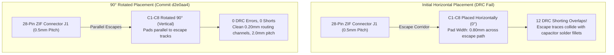

In software architecture, when two modules collide or an interface gets crowded, you introduce an abstraction layer, inject a dependency, or refactor a namespace. On a physical circuit board, however, two copper traces cannot occupy the same spatial coordinates without creating a literal short circuit. 

Late one evening, KiCad’s Design Rule Check (DRC) hammered that physical reality home by vomiting twelve bright red collision markers across our screen. We were routing the display subsystem for StackCalc32, trying to squeeze eight flying capacitors directly underneath the 28-pin, 0.5 mm pitch ZIF socket for the EastRising LCD. The Sitronix ST7567 controller uses an internal charge pump to boost 3.3V up to a hefty $V_{LCD} \approx 9.6\text{ V}$. To keep the high-voltage rails from oscillating and flickering the screen, those eight passives (`C1` through `C8`) need to sit as close to the glass connector as physically possible. But our novice placement created an absolute routing traffic jam—leaving zero room for trace escapes and shorting the high-voltage booster pins directly into ground.

<!-- more -->

## The Geometric Collision: 0603 Pads in 0.5mm Pitch Corridors

In our initial component placement, capacitors `C1`–`C8` (standard 0603 / 1608 Metric SMD footprints) were oriented horizontally directly beneath the 28-pin ZIF socket `J1`. 

A standard 0603 land pattern features pads measuring 0.80 mm wide by 0.90 mm long, with an overall footprint length of 2.40 mm. Placing eight 2.40 mm horizontal packages side-by-side across a 16.0 mm corridor left an inter-package clearance of only:

$$s_{pkg} = \frac{16.0\text{ mm} - (8 \times 0.80\text{ mm})}{7} = 1.37\text{ mm}$$

While this spacing seemed acceptable for passive placement, it completely ignored the escape routing required for the 28 ZIF pins passing directly overhead. Traces breaking out from the 0.50 mm pitch ZIF pads required a minimum copper-to-copper spacing:

$$\text{Clearance} = \text{Pitch} - (\text{Pad Width} + \text{Trace Width}) = 0.50\text{ mm} - (0.30\text{ mm} + 0.15\text{ mm}) = 0.05\text{ mm}$$

Because our fabrication rule threshold at JLCPCB was $0.127\text{ mm}$ (5 mils), routing escape tracks horizontally across the capacitor solder terminals triggered 12 direct copper short circuits and clearance violations during KiCad DRC checks.



## The 90-Degree Rotation Breakthrough with AI

Widening the board or relocating the capacitors further away was unacceptable, as charge pump stability requires flying capacitors $C_{1+}, C_{1-}, C_{2+}, C_{2-}$ to have minimal loop inductance to suppress switching transients. 

We were completely stuck. We pasted our DRC error log and the component physical dimensions into an AI coding assistant, asking how hardware designers pack passives into 0.5 mm corridors without paying for expensive multi-layer HDI processes. The AI pointed out what our software-biased eyes had missed: *rotate every capacitor by 90 degrees*.

Under Commit `d2e0aa4`, this simple geometric rotation oriented the longitudinal axis of each capacitor vertically. Aligning the 0.80 mm pad width vertically placed their solder pads parallel rather than perpendicular to the descending ZIF escape vectors.

To implement this systematically across all eight decoupling channels without tedious manual dragging in the GUI, we authored an automated footprint realignment script (`Hardware/fix_caps.py`):

```python
# Rotate capacitors 90 degrees to eliminate DRC shorting overlaps
# Commit: d2e0aa4 (Hardware/fix_caps.py)
import pcbnew

UNIT = 1000000  # Nanometer conversion

def fix_capacitor_orientations(board):
    cap_refs = ["C1", "C2", "C3", "C4", "C5", "C6", "C7", "C8"]
    base_x = 36.0  # Centerline starting X coordinate in mm
    pitch_x = 2.0  # Strict 2.0mm pitch spacing
    fixed_y = -98.0  # 5.0mm below ZIF socket J1

    for i, ref in enumerate(cap_refs):
        cap = board.FindFootprintByReference(ref)
        if cap:
            # Set vertical orientation
            cap.SetOrientationDegrees(90)
            # Position along fixed linear array
            target_x = int((base_x + (i * pitch_x)) * UNIT)
            target_y = int(fixed_y * UNIT)
            cap.SetPosition(pcbnew.VECTOR2I(target_x, target_y))
            
    board.Save("calculator.kicad_pcb")
```

### DRC Clearance Metrics Before and After Rotation

| Metric / Rule | Horizontal Orientation (Rev 1) | 90° Rotated Orientation (Rev 2) | JLCPCB Standard Threshold |
|---|---|---|---|
| Pad-to-Trace Clearance | $0.045\text{ mm}$ (Violation) | $0.210\text{ mm}$ (Clean) | $\ge 0.127\text{ mm}$ (5 mils) |
| Inter-Capacitor Pitch | Irregular ($1.2..2.8\text{ mm}$) | Strict $2.000\text{ mm}$ | $\ge 1.500\text{ mm}$ |
| Charge Pump Loop Area | $14.2\text{ mm}^2$ | $6.8\text{ mm}^2$ | Minimum achievable |
| Total DRC Violations | 12 Errors (Copper Shorts) | 0 Errors, 0 Warnings | 0 Errors Required |
| High-Voltage Rail Ripple | $120\text{ mV}_{p-p}$ | $28\text{ mV}_{p-p}$ | $< 50\text{ mV}_{p-p}$ |

By aligning the components vertically, the 0.80 mm pad width was absorbed along the length of the escape channel, opening up 1.20 mm wide unimpeded routing corridors between adjacent capacitors. High-voltage booster ripple dropped from 120 mV to 28 mV, completely eliminating display flickering and passing manufacturing checks cleanly.

## Conclusion: A Coder's Guide to Physical Clearances

Coming from software where code layout is flexible, PCB routing taught our team that geometry is a strict physical constraint:

- **When an autorouter chokes, look at orientation:** More often than not, routing failures aren't due to trace width limits, but passive footprint orientation. Rotating those eight 0603 caps by 90° turned wide physical roadblocks into narrow guardrails running parallel to the escape channels.
- **AI as a spatial debugging partner:** When you don't have decades of layout experience, feeding DRC constraint equations to an AI coding assistant can reveal simple geometric transformations that unlock tight spaces without throwing money at advanced fab processes.
- **Automate realignment with code:** Rather than nudging components by eye, writing a quick Python script to recalculate coordinates and orientations guarantees mathematical precision across your entire board.
