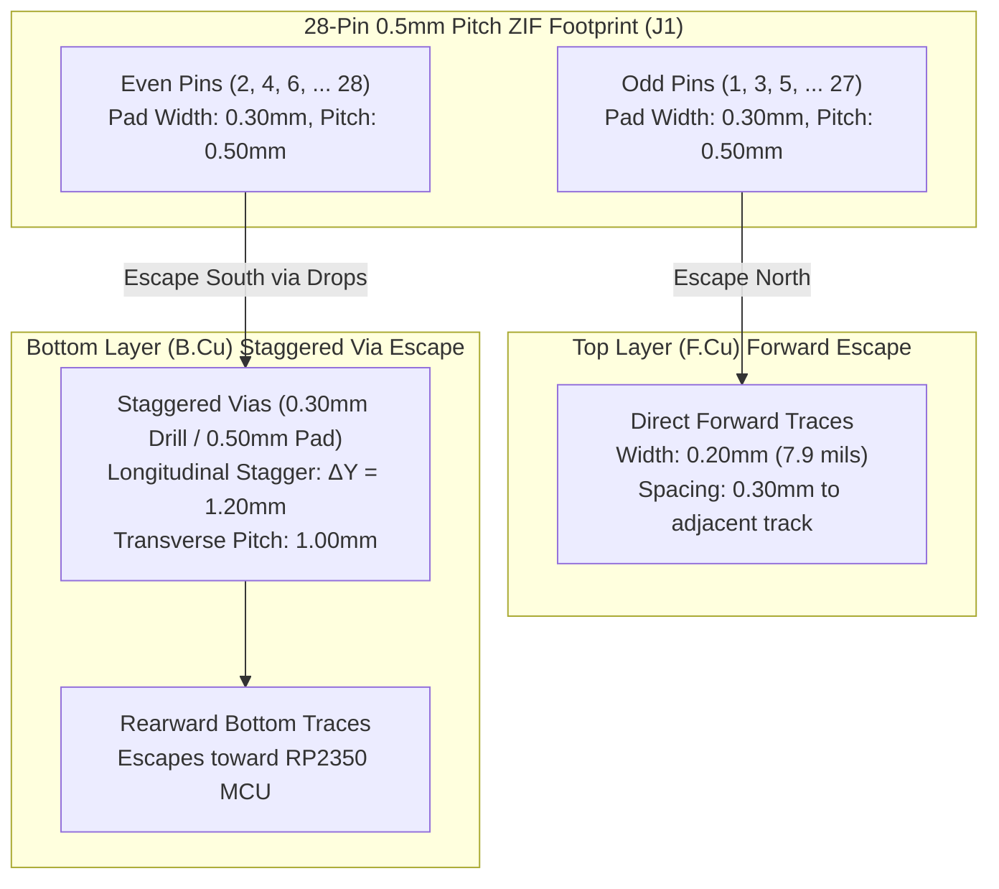

If you have an unlimited commercial budget, high-density surface-mount packaging is straightforward: you check the box for blind and buried laser microvias, hand the fab house an extra \$150, and let 3-mil traces vanish magically into inner board layers. But our entire mission with StackCalc32 is grounded in a deep conviction: it is a genuine injustice that more people do not use RPN calculators today. Most young engineers and students have never experienced the flow of postfix calculation because vintage units sell for exorbitant prices and modern options are nearly nonexistent.

To build an open-source, ultra-low-cost physical calculator that students and makers can actually afford, the PCB had to pass on standard, dirt-cheap \$5 fabrication pooling runs at services like JLCPCB and PCBWay.

When we chose the EastRising 132×65 graphic LCD for its remarkable microamp power draw, its 28-pin flexible printed circuit (FPC) demanded a 0.5 mm pitch Zero Insertion Force (ZIF) socket (`J1`). Escaping 28 dense pins through standard 5-mil fabrication design rules without triggering unroutable copper collisions forced us to solve a discrete geometric puzzle.

<!-- more -->

## The 0.5mm Pitch Geometric Impossibility

Standard hobbyist PCB fabrication pooling services impose rigid baseline manufacturing constraints:
- Minimum trace width ($w_{\min}$): $0.127\text{ mm}$ ($5.0\text{ mils}$)
- Minimum trace-to-trace / trace-to-pad clearance ($s_{\min}$): $0.127\text{ mm}$ ($5.0\text{ mils}$)

The physical SMT land pattern for our 28-pin 0.5 mm ZIF socket uses copper pads measuring $0.30\text{ mm}$ wide on an exact center-to-center pitch of $P = 0.50\text{ mm}$. The gap remaining between two adjacent pads is strictly:

$$g_{pad} = P - w_{pad} = 0.50\text{ mm} - 0.30\text{ mm} = 0.20\text{ mm}$$

If you try to squeeze an escape track between two adjacent pads on the top layer, you need:

$$g_{req} = w_{trace} + 2 \cdot s_{clearance} = 0.127\text{ mm} + 2(0.127\text{ mm}) = 0.381\text{ mm}$$

Because $0.381\text{ mm} > 0.200\text{ mm}$, passing any signal trace between adjacent pads on `F.Cu` is mathematically impossible under standard rules! In software, you can pass parameters through any method signature. In hardware, you cannot route through the corridor; every single pin must escape either forward or backward without clipping its neighbor's copper.

## Alternating Staggered Escape Topology Guided by AI

As software developers designing our first PCB, we asked an AI coding agent how engineers route high-density connectors without turning to laser microvias. The AI suggested an alternating, staggered escape topology that splits the 28 pins into two interleaved geometric vectors:

1. **Top Layer (`F.Cu`) Forward Escapes**: All odd-numbered pins ($1, 3, 5, \dots, 27$) shoot straight north toward the upper edge of the board in $0.20\text{ mm}$ tracks. Because every second pin exits north, the pitch between active tracks doubles from $0.50\text{ mm}$ to $1.00\text{ mm}$, leaving a comfortable $0.80\text{ mm}$ clearance corridor.
2. **Bottom Layer (`B.Cu`) Via Escapes**: All even-numbered pins ($2, 4, 6, \dots, 28$) exit south. Standard mechanical vias have a $0.30\text{ mm}$ drill hole and a $0.50\text{ mm}$ outer pad—meaning they physically cannot sit side-by-side on a $0.50\text{ mm}$ pitch. We staggered them into a two-tier diagonal grid with a longitudinal offset of $\Delta Y = 1.20\text{ mm}$.

The diagonal center-to-center distance between adjacent via pads in this staggered grid is:

$$D_{via} = \sqrt{(\Delta X)^2 + (\Delta Y)^2} = \sqrt{(0.50)^2 + (1.20)^2} = \sqrt{0.25 + 1.44} = 1.30\text{ mm}$$

Subtracting the $0.50\text{ mm}$ annular ring gives the physical edge-to-edge copper clearance:

$$s_{via} = D_{via} - d_{pad} = 1.30\text{ mm} - 0.50\text{ mm} = 0.80\text{ mm}$$

That provides an abundant $0.80\text{ mm}$ clearance margin—more than six times our fab limit—completely preventing solder bridging during automated reflow.

### Escape Routing Dimensional Audit

| Geometric Parameter | Physical Value | Design Rule Threshold | Safety Margin |
|---|---|---|---|
| ZIF Pin-to-Pin Pitch ($P$) | $0.500\text{ mm}$ ($19.7\text{ mils}$) | — | Fixed Component Datum |
| SMT Pad Width ($w_{pad}$) | $0.300\text{ mm}$ ($11.8\text{ mils}$) | — | Manufacturer Footprint |
| Odd Pin Escape Width (`F.Cu`) | $0.200\text{ mm}$ ($7.9\text{ mils}$) | $0.127\text{ mm}$ ($5.0\text{ mils}$) | $+57.5\%$ |
| Odd Pin Trace-to-Trace Spacing | $0.800\text{ mm}$ ($31.5\text{ mils}$) | $0.127\text{ mm}$ ($5.0\text{ mils}$) | $+530\%$ |
| Via Drill Diameter | $0.300\text{ mm}$ ($11.8\text{ mils}$) | $0.300\text{ mm}$ ($11.8\text{ mils}$) | Standard Mechanical Drill |
| Via Pad Outer Diameter | $0.500\text{ mm}$ ($19.7\text{ mils}$) | $0.450\text{ mm}$ ($17.7\text{ mils}$) | $+11.1\%$ Annular Ring |
| Staggered Via-to-Via Clearance | $0.800\text{ mm}$ ($31.5\text{ mils}$) | $0.127\text{ mm}$ ($5.0\text{ mils}$) | $+530\%$ Anti-Bridging Margin |

This interleaved fanout enabled us to route the entire 28-pin display interface cleanly on a standard 4-layer FR-4 board without paying a single cent in laser micro-via surcharges.

## Conclusion: Designing for Low-Cost Accessibility

Keeping hardware affordable for students and makers means respecting fabrication boundaries:

- **Split your vectors 180 degrees:** Escaping half your pins north on the component layer and half south to the opposite side immediately doubles your effective routing pitch.
- **Stagger your via drops longitudinally:** Staggering via drill centers by $\Delta Y = 1.20\text{ mm}$ turns an impossible $0.50\text{ mm}$ linear pad cram into a roomy $1.30\text{ mm}$ diagonal pitch.
- **Stay on standard fab tiers:** Designing within 5-mil trace/space and 0.3 mm mechanical drills keeps prototype spins fast, accessible, and cheap enough to iterate without blowing a hobbyist budget.

With an AI coding assistant helping us treat fanout geometry like an algorithmic graph problem, we escaped a dense 0.5 mm pitch connector on a dirt-cheap 4-layer board, proving that thoughtful geometry can keep hardware accessible to everyone.
