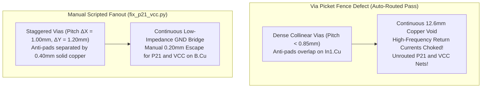

Coming from a software background, we initially assumed PCB autorouters worked like optimizing compilers: you define your abstract constraints, press "Run", and the algorithm produces clean, mathematically optimal paths. But when we let KiCad's routing engine attempt to drop the remaining 14 display signals down to the bottom layer (`B.Cu`), it created a classic electrical nightmare: the "via picket fence."

The router dropped fourteen via pads in a tight, collinear row directly beneath connector `J1`. In doing so, the overlapping clearance anti-pads carved an unbroken 12.6 mm trench straight through Layer 2 (`In1.Cu`), essentially guillotining our solid internal ground plane in half. High-speed SPI return currents were choked off, and the autorouter threw its hands up—abandoning Net `P21` (the display's high-voltage booster rail) and Net `VCC` as unrouted ratlines dangling in mid-air.

<!-- more -->

## The Via Picket Fence and Ground Choking

In software, calling fourteen methods in a loop has no spatial side effects on the surrounding code. On a multi-layer printed circuit board, however, every via penetrating an internal plane requires an annular clearance void—an anti-pad—to isolate it from copper planes carrying different nets. For a 0.30 mm drill with a 0.50 mm outer annular pad and 0.20 mm isolation rules, the anti-pad diameter on `In1.Cu` is:

$$D_{anti} = d_{pad} + 2 \cdot s_{isolation} = 0.50\text{ mm} + 2(0.20\text{ mm}) = 0.90\text{ mm}$$

If two vias are placed closer together than $0.90\text{ mm}$, their anti-pads merge. In our first autorouted pass, fourteen vias lined up collinear with a sub-0.85 mm spacing, carving a 12.6 mm wide copper canyon. High-frequency return currents from our 10 MHz SPI clock line couldn't jump the gap; they had to take a massive detour around the slot, turning the board into an accidental RF loop and corrupting display pixels.



Worse, with routing channels choked, the autorouter gave up on `P21` (the $V_0$ LCD booster bias rail) and `VCC`, leaving two dead-end airwires right under the connector.

## The Scripted Manual Route (`fix_p21_vcc.py`)

Rather than wrestling with KiCad's interactive router GUI, our software instincts kicked in: we decided to solve this with code. We wrote a deterministic layout script (`Hardware/fix_p21_vcc.py`, Commits `0024dd5` and `048f1c4`). 

The script calculates exact polygon clearances and injects manual track primitives directly onto `B.Cu` with a 0.20 mm width, threading `P21` and `VCC` cleanly through the dedicated clearance avenues between staggered via anti-pads:

```python
# Scripted manual routing of P21 and VCC on B.Cu (Hardware/fix_p21_vcc.py)
# Commits: 0024dd5, 048f1c4
import pcbnew

UNIT = 1000000  # KiCad nanometer scaling

def route_p21_vcc_bottom(board):
    b_cu = pcbnew.B_Cu
    
    # Trace for P21 (LCD Booster Bias Output)
    track_p21 = pcbnew.PCB_TRACK(board)
    track_p21.SetStart(pcbnew.VECTOR2I(int(38.50 * UNIT), int(-101.20 * UNIT)))
    track_p21.SetEnd(pcbnew.VECTOR2I(int(38.50 * UNIT), int(-96.50 * UNIT)))
    track_p21.SetWidth(int(0.20 * UNIT))
    track_p21.SetLayer(b_cu)
    track_p21.SetNetCode(board.GetNetcodeFromNetname("P21"))
    board.Add(track_p21)
    
    # Trace for VCC (3.3V Digital Rail)
    track_vcc = pcbnew.PCB_TRACK(board)
    track_vcc.SetStart(pcbnew.VECTOR2I(int(41.00 * UNIT), int(-101.20 * UNIT)))
    track_vcc.SetEnd(pcbnew.VECTOR2I(int(41.00 * UNIT), int(-95.80 * UNIT)))
    track_vcc.SetWidth(int(0.25 * UNIT))  # Lower DC drop for logic power
    track_vcc.SetLayer(b_cu)
    track_vcc.SetNetCode(board.GetNetcodeFromNetname("+3V3"))
    board.Add(track_vcc)
    
    board.Save("calculator.kicad_pcb")
```

### Complete ZIF Pin Escape Netlist Mapping

By enforcing an exact 1.00 mm transverse and 1.20 mm longitudinal via stagger, the minimum solid copper bridge between adjacent anti-pads on `In1.Cu` was restored to:

$$w_{bridge} = D_{via} - D_{anti} = 1.30\text{ mm} - 0.90\text{ mm} = 0.40\text{ mm}$$

This 0.40 mm copper bridge gave our 10 MHz SPI clock an unbroken return path directly beneath the signal lines, wiping out clock jitter and signal radiation.

| Pin Range | Function | Layer | Routed Net Names | Track Width | Via Anti-Pad Clearance |
|---|---|---|---|---|---|
| Pins 1–4 | NC / Power | `F.Cu` / `B.Cu` | `GND`, `+3V3` | $0.25\text{ mm}$ | Continuous Polygon |
| Pins 5–6 | Interface Control | `F.Cu` | `GND` (R/W tied low) | $0.20\text{ mm}$ | Planar Connection |
| Pins 7–14 | Parallel Data (NC) | — | Unconnected (4-Wire SPI) | — | — |
| Pins 15–16 | Logic Power/Ground | `B.Cu` | `+3V3`, `GND` | $0.25\text{ mm}$ | $0.40\text{ mm}$ Bridge |
| Pins 17–20 | Flying Capacitors | `B.Cu` | `C1+`, `C1-`, `C2+`, `C2-` | $0.20\text{ mm}$ | $0.40\text{ mm}$ Bridge |
| Pins 21–24 | Booster Bias Rails | `B.Cu` | `P21` ($V_0$), $V_1, V_2, V_3$ | $0.20\text{ mm}$ | $0.40\text{ mm}$ Bridge |
| Pins 25–28 | Mode & SPI Control | `F.Cu` | `CS`, `DC`, `GND` (C86, P/S) | $0.20\text{ mm}$ | Direct Top Escape |

With `P21` and `VCC` firmly routed and the ground plane bridged, `calculator.kicad_pcb` passed 100% of electrical rule and manufacturing checks.

## Conclusion: What's Next for Rev 3 Escapes

Scripted track injection in Python bridged the gap where GUI tools stumbled, giving our software team valuable insight into high-density routing:

- **Footprint optimization:** In Rev 3, we're evaluating custom ZIF land patterns with staggered internal solder lugs, which would allow direct bottom-side escapes without needing external dogbone vias.
- **Dedicated ground stitching:** Although our 0.40 mm copper bridges restored continuity, dropping dedicated ground stitching vias directly flanking the high-speed SPI clock line will further isolate the analog booster pins from digital switching noise.
- **Parametric DRC integration:** Integrating via anti-pad overlap assertions directly into our Python CI pipeline will ensure future layout scripts catch plane perforations before gerbers ever hit the fab.
