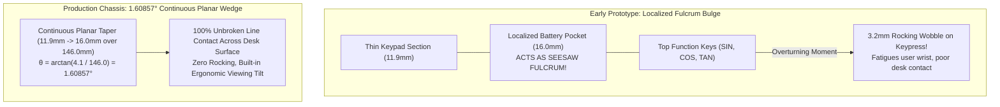

As an amateur 3D-printing enthusiast, there is nothing quite as exciting as writing a few lines of declarative code, sending an STL file to a desktop 3D printer, and holding a physical enclosure in your hands hours later. But there is also nothing quite as humbling as setting that fresh print down on your desk, tapping a top-row button, and having the entire chassis seesaw against the table with a hollow *clack-clack*.

That was the frustrating reality of our first batch of 3D-printed calculator enclosures. In our CAD script, we had carved out a 4.1 mm recessed pocket beneath the display and battery connector while keeping the lower keypad area slim (11.9 mm). On a computer monitor, it looked like clever spatial optimization. On an actual desk, that localized step formed a vicious fulcrum right beneath the third row of keys. Hitting `ENTER` was fine, but the second your thumb reached up to press `SIN`, `COS`, or `SQRT`, the calculator pivoted backward by more than 3 mm. It didn’t feel like a precision scientific tool for students and engineers—it felt like a cheap plastic teeter-totter.

<!-- more -->

## The Desk Seesaw Fulcrum Failure

Vintage calculators often housed battery compartments in localized bulges beneath the display, relying on elevated rubber feet to bridge the height difference. In our early StackCalc32 design iterations, we localized component clearances by carving a 4.1 mm deep recess only beneath the upper display and power connector zones, leaving the lower keypad section thin (11.9 mm).

When placed on a flat desk, this localized drop created a fulcrum point directly beneath the third keypad row. When an engineer pressed `ENTER` or bottom arithmetic keys, the device sat flat; but pressing top-row function keys (`SIN`, `COS`, `TAN`, or `SQRT`) exerted an overturning moment that rocked the entire chassis backward by over 3.0 mm.



## Mathematical Derivation of the Planar Wedge

Rather than relying on adhesive rubber feet that peel off inside a student's backpack, we eliminated the fulcrum entirely by converting the underside of the calculator into a continuous planar incline.

The bare chassis spans a length of $L = 146.0\text{ mm}$, with an installed depth increasing smoothly from $d_{\min} = 11.90\text{ mm}$ at the bottom palm rest to $d_{\max} = 16.00\text{ mm}$ at the top display cap. The precise inclination angle $\theta$ is derived trigonometrically:

$$\Delta d = d_{\max} - d_{\min} = 16.00\text{ mm} - 11.90\text{ mm} = 4.10\text{ mm}$$

$$\theta = \arctan\left(\frac{\Delta d}{L}\right) = \arctan\left(\frac{4.10\text{ mm}}{146.00\text{ mm}}\right) = \arctan(0.028082) \approx 1.60857^\circ$$

This 1.60857° continuous taper ensures that the entire bottom surface maintains continuous contact with the work surface regardless of which key is pressed. Furthermore, this angle naturally tilts the EastRising reflective LCD upward toward the user’s eyes, dramatically improving contrast and legibility under classroom or office lighting without requiring a kickstand.

### Parametric OpenSCAD Implementation

Because we come from software, traditional GUI-based CAD tools felt clumsy. We love OpenSCAD because it treats 3D models as declarative code that can be parameterized, version-controlled, and audited. In `Hardware/designs/chassis_tapered.scad`, the continuous wedge geometry is generated parametrically from the board outline and sliding rail datums:

```scad
// Continuous planar anti-rocking chassis wedge (Hardware/designs/chassis_tapered.scad)
module chassis_tapered_shell(length=146.0, width=80.0, d_min=11.9, d_max=16.0, wall=1.40) {
    taper_angle = atan((d_max - d_min) / length); // 1.60857 degrees
    
    difference() {
        // Outer continuous planar wedge solid
        polyhedron(
            points = [
                [0, 0, 0], [width, 0, 0], [width, length, 0], [0, length, 0], // Bottom planar face
                [0, 0, d_min], [width, 0, d_min],                             // Keypad top face
                [width, length, d_max], [0, length, d_max]                     // Display top face
            ],
            faces = [
                [0, 1, 2, 3], // Bottom (Desk resting surface)
                [4, 5, 6, 7], // Top inclined interface
                [0, 1, 5, 4], // Keypad end cap
                [2, 3, 7, 6], // Display end cap
                [0, 3, 7, 4], // Left structural rail wall
                [1, 2, 6, 5]  // Right structural rail wall
            ]
        );
        
        // Internal sliding cavities (Tier 1 faceplate rails & Tier 2 PCB tracks)
        translate([wall, -0.1, wall])
            chassis_internal_sliding_rails(length + 0.2, width - 2 * wall);
    }
}
```

### Chassis Mechanical Envelope & Clearances

The structural walls maintain minimum thicknesses of 1.40 mm along the lateral rails and 1.20 mm along the bottom shell to prevent torsion during single-handed operation.

| Feature / Interface | Keypad End (mm) | Display End (mm) | Delta / Specification | Functional Rationale |
|---|---|---|---|---|
| Outer Enclosure Depth | $11.90\text{ mm}$ | $16.00\text{ mm}$ | $+4.10\text{ mm}$ ($1.60857^\circ$) | Full-desk planar support without fulcrum |
| Assembled Chassis Envelope | $80.0\text{ mm} \times 146.0\text{ mm}$ | Top Cap: $148.0\text{ mm}$ | Fixed Form Factor | Fits standard desktop and pocket sleeves |
| Structural Side Rails | $1.40\text{ mm}$ | $1.40\text{ mm}$ | Uniform Wall | High flexural rigidity against drop impacts |
| Bottom Shell Thickness | $1.20\text{ mm}$ | Local $1.00\text{ mm}$ at JST | $-0.20\text{ mm}$ sweep | Clears battery cable insertion sweep |
| Tier 1 Faceplate Rails | $2.50\text{ mm}$ datum | Recessed guide | $0.30\text{ mm}$ allowance | Houses button and screen faceplates |
| Tier 2 PCB Guide Rails | $1.60\text{ mm}$ slot | $0.40\text{ mm}$ per side | $0.10\text{ mm}$ front datum | Independent sliding insertion of PCB |

By integrating the 1.60857° planar taper directly into the parametric OpenSCAD architecture, StackCalc32 achieved rock-solid desk stability with zero rocking, pairing retro aesthetic charm with modern mechanical engineering.

## Conclusion: Why Rubber Feet Are a Cop-Out

The cheap, lazy fix would have been sticking four uneven rubber adhesive bumpons on the bottom and calling it a day. But rubber pads peel off inside backpacks, gather lint, and still allow flex if your thumb lands off-center on a key.

Converting the entire underbelly into an unbroken 1.60857° continuous planar wedge gave us two massive wins for zero extra BOM cost: 100% line contact along the table surface so the chassis never rocks, and a natural, glare-free viewing tilt for the reflective monochrome LCD under overhead room lighting. OpenSCAD’s parametric equations meant that once we dialed in the trigonometry with our AI coding assistant, updating our slicing tolerances and sliding PCB guide rails took mere seconds.
