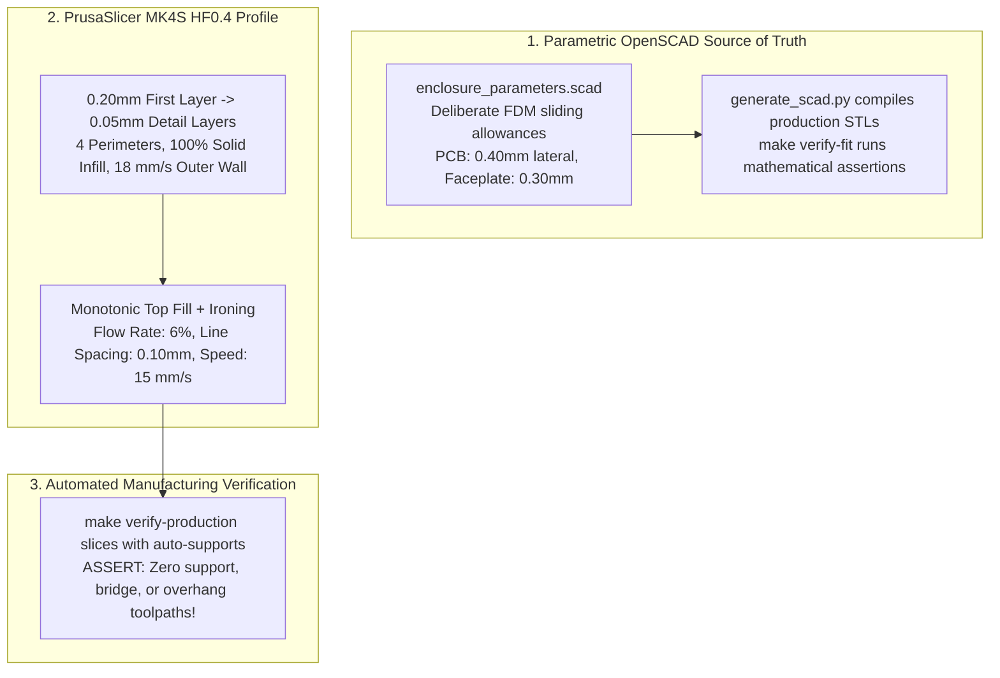

In software engineering, a numeric offset in memory or a layout constraint is exact and deterministic down to the bit. When you are an amateur 3D-printing enthusiast exploring print-in-place mechanisms, however, molten thermoplastic plays by its own physical rules. 

There is a special brand of despair that comes with peeling a 14-hour print off a spring-steel PEI sheet, pressing down on a keycap, and realizing that all 43 tactile plungers have welded themselves into a single, immovable slab of plastic.

On StackCalc32, our physical assembly combines three independently sliding sub-assemblies: a 43-key button faceplate, an optical screen bezel, and a populated four-layer PCB, all captured inside a single tapered monocoque chassis. In a CAD viewer, nominal zero-clearance fits look sleek. On an actual desktop 3D printer, thermal shrinkage, die swell, and nozzle drag turn tight theoretical clearances into fused parts or rattling toys. Squeezing injection-molded precision out of home additive manufacturing meant hardcoding empirical sliding allowances into OpenSCAD and dialing in a specialized slicing profile for our Prusa MK4S.

<!-- more -->

## The Physics of FDM Mechanical Fits

Fused Deposition Modeling (FDM) extrudes molten thermoplastic that expands slightly upon exiting the nozzle orifice (die swell) and shrinks non-isotropically as it cools down to room temperature. For PLA and PETG, linear shrinkage along the XY plane typically lands between $0.2\%$ and $0.5\%$.

Worse, circular holes and narrow sliding slots always print undersized because the hoop tension of the extruded filament bead pulls perimeter segments inward toward the center of curvature. If you don't build deliberate clearance offsets into your parametric equations, your sliding rails will lock up every single time.



## Hardcoded Sliding Allowances in OpenSCAD

Instead of eyeballing scale factors in the slicer or hacking g-code, every mechanical tolerance in StackCalc32 lives as a verified constant in `Hardware/designs/enclosure_parameters.scad`:

```scad
// Shared Mechanical Tolerances & Sliding Interfaces (Hardware/designs/enclosure_parameters.scad)
// Nominal FDM allowances applied per sliding face (mm)

PCB_LATERAL_CLEARANCE     = 0.40; // Per-side allowance in Tier 2 chassis rails
PCB_SWITCH_DATUM_OFFSET   = 0.10; // Z-axis datum offset between switch and plunger
PCB_REAR_CLEARANCE        = 0.50; // Clearance to rear shell wall across taper
PLATE_BODY_CLEARANCE      = 0.30; // Button faceplate effective lateral clearance
SCREEN_BODY_CLEARANCE     = 0.40; // Screen bezel guide clearance in chassis
SCREEN_TRACK_TOLERANCE    = 0.35; // Screen guide clearance in 3.10mm track
TOP_CAP_PLUG_CLEARANCE    = 0.10; // Precision friction plug interface
TPU_COVER_FIT_CLEARANCE   = 0.10; // Reversible C-cover slide fit
```

These parameters ensure that even across batch-to-batch filament variations ($\pm 0.10\text{ mm}$ variance), the populated PCB slides into its Tier 2 guide rails with light hand pressure, while the button faceplate drops in without lateral wobble.

### The MK4S HF0.4 Slicing Strategy & Ironing Physics

To give the keycaps and front faceplate a silky, injection-molded texture under your thumbs, we tuned a dedicated slicing recipe on our Prusa MK4S equipped with a 0.4 mm high-flow nozzle:
- **Layer Height**: $0.20\text{ mm}$ first layer for reliable bed adhesion, dropping down to fixed $0.05\text{ mm}$ detail layers for all keycap features.
- **Perimeters**: 4 solid perimeters with $100\%$ rectilinear infill to maximize mass and kill hollow acoustic resonance.
- **Perimeter Speed**: Throttled to $18\text{ mm/s}$ on outer perimeters to prevent corner ringing around button holes.
- **Ironing**: Monotonic top surface ironing enabled across keycap contact faces.

Ironing glides the heated brass nozzle back across the top layer while extruding a microscopic plastic film to fill layer ridges. The volumetric ironing flow rate is governed by:

$$Q_{iron} = v_{iron} \cdot w_{iron} \cdot h_{layer} \cdot f_{flow} = 15\text{ mm/s} \times 0.10\text{ mm} \times 0.05\text{ mm} \times 0.06 = 0.0045\text{ mm}^3/\text{s}$$

At $6\%$ flow and $0.10\text{ mm}$ line spacing, the nozzle polishes the surface smooth without overheating thin planar coils or causing delicate spring cantilevers to curl upward.

### Production Sliding Interface Allowance Summary

| Sliding Interface | Nominal Allowance (mm) | Tolerance Boundary | Failure Mode if Violated |
|---|---|---|---|
| PCB Lateral Clearance | $0.40\text{ mm}$ per side | $+0.10 / -0.05\text{ mm}$ | PCB jams in Tier 2 chassis rails |
| PCB Switch / Front Datum | $0.10\text{ mm}$ | $+0.05 / -0.02\text{ mm}$ | Plungers pre-load tactile switch domes |
| PCB Rear Shell Clearance | $0.50\text{ mm}$ | $\pm 0.10\text{ mm}$ | Through-hole pins short against chassis |
| Button Faceplate Clearance | $0.30\text{ mm}$ per side | $+0.05 / -0.05\text{ mm}$ | Faceplate binds during top insertion |
| Screen Faceplate Clearance | $0.40\text{ mm}$ per side | $+0.05 / -0.05\text{ mm}$ | Tongue-and-groove joint fails to interlock |
| Screen Guide in 3.10mm Track | $0.35\text{ mm}$ per face | $\pm 0.05\text{ mm}$ | Bezel warps display glass under compression |
| Top-Cap Retention Plugs | $0.10\text{ mm}$ | $+0.02 / -0.02\text{ mm}$ | Loose cap or excessive insertion force |

Bringing our software CI/CD mindset into 3D printing, our build pipeline (`make verify-production`) automatically slices every production mesh with auto-supports turned on and asserts zero support or bridge toolpaths, proving that smart geometry eliminates messy post-processing completely.

## Conclusion: A Programmer's Lessons in 3D Printing

Bridging software development and desktop 3D printing requires accepting physical material realities:

- **Dial in extrusion multiplier first:** Before tweaking CAD clearances by 0.1 mm, print a 20 mm single-wall calibration cube. If your wall is even 0.04 mm too thick due to over-extrusion, your moving parts will fuse solid.
- **Never iron across thin compliant springs:** Keep ironing restricted to broad, supported keycap caps. Passing a hot nozzle over delicate 0.30 mm spring coils deposits excess heat that warps them into useless scrap.
- **Bake allowances into parametric code:** Never rely on slicer-level "horizontal expansion" hacks. When sliding clearances are explicit variables in `enclosure_parameters.scad`, adapting to a new printer or filament takes a single edit.

Treating 3D printable models with the same mathematical rigor and testing discipline as production software turns desktop rapid prototyping into an absolute superpower.
