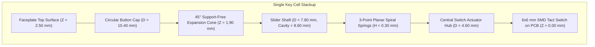

We have always held a deep reverence for vintage scientific calculators and classic manual typewriters—the crisp, mechanical snap of every keystroke makes mathematical calculations feel tangible, intentional, and alive. When we set out to build the physical faceplate for StackCalc32, we wanted to move away from generic rectangular plastic slabs and explore retro circular keycaps.

Printing 39 captive circular buttons in a single monolithic print-in-place faceplate, however, is a mechanical minefield for an amateur 3D-printing enthusiast. If we required builders to assemble 39 individual metal coil springs, guide stems, and retaining clips with tweezers, the barrier to entry would be far too high for students and hobbyists. We wanted the entire faceplate and button cluster to print as a single unified component on a desktop 3D printer, popping off the spring-steel bed ready to use. 

Here is how we combined code-driven OpenSCAD modeling with an AI coding assistant to engineer captive circular keycaps using $45^\circ$ self-supporting expansion cones, 3-point planar spiral coils, and selective thermal ironing relief.

<!-- more -->

## The Geometry Constraints of the Switch Matrix

Our physical printed circuit board (`Hardware/calculator.kicad_pcb`) establishes rigid dimensional constraints. The tactile snap-action switch matrix is arranged in a non-square grid:

$$\Delta X = 11.50\text{ mm (column pitch)}, \quad \Delta Y = 11.30\text{ mm (row pitch)}$$

With standard $6 \times 6\text{ mm}$ tactile momentary pushbuttons, the mechanical housing must fit entirely within this spatial envelope while providing sufficient fingertip land area and preventing mechanical binding between adjacent keys.



To maximize contact surface while guaranteeing adequate finger clearance, we set the circular cap outer diameter:

$$\text{ROUND\_CAP\_D} = 10.40\text{ mm}$$

This dimension leaves a precise mechanical buffer:

$$\text{Clearance}_Y = 11.30\text{ mm} - 10.40\text{ mm} = 0.90\text{ mm}$$

$$\text{Clearance}_X = 11.50\text{ mm} - 10.40\text{ mm} = 1.10\text{ mm}$$

A $0.90\text{ mm}$ gap between neighboring keycaps prevents edge contact even when keys are pressed off-axis, while leaving adequate plastic thickness for the faceplate bezel ribs between key cutouts.

---

## Print-in-Place Assembly via 45° Expansion Cones

Traditional mechanical keyboards rely on multi-part injection-molded assemblies with independent stems, stabilizer bars, and coil springs. For a desktop additive manufacturing workflow, assembling 39 separate springs and guide stems is tedious and fragile. Instead, our design prints the entire faceplate and button cluster as a single unified print-in-place monolithic component.

The assembly is printed faceplate-side down on the build plate ($Z = 0$). As the sliced layers ascend, the opening must expand outward from the narrow button cavity to the wide button cap. Standard horizontal overhangs would require sacrificial support material, which cannot be cleaned out from internal $0.40\text{ mm}$ guide channels.

```
       [ Build Surface / Faceplate Top: Z = 0 ]
             |                        |
             |<--- Cavity D=8.60mm --->|
             |                        |
             \                        /   <-- 45° Self-Supporting Cone
              \                      /        (ROUND_CONE_TOP_Z = 1.90mm)
               \                    /
      ==========|                  |==========
                 \                /
                  |              |
                  |<-- D=7.8mm ->|  <-- Slider Guide Shaft
```

To eliminate support material entirely, all expanding geometries adhere to a strict $45^\circ$ overhang angle:

$$\theta_{\text{overhang}} = 45^\circ \implies \Delta Z = \Delta R$$

As implemented in OpenSCAD:

```openscad
// Hardware/designs/rounded_buttons.scad:60-76
ROUND_CONE_TOP_Z   = 1.90; // 45° transition from hub to narrow slider guide.
ROUND_RETAINER_INNER_R = 2.10;
ROUND_RETAINER_R   = 4.70; // 0.40 mm captive shoulder beyond 4.30 mm bore.
ROUND_RETAINER_SPAN = 30;  // Broad flange sectors fit between spring corridors.
ROUND_RETAINER_CLR = 0.40;
ROUND_RETAINER_RAMP_BASE_Z = 0.30;
ROUND_RETAINER_FLANGE_BASE_Z = 1.20;
ROUND_RETAINER_FLANGE_TOP_Z = 1.50;
ROUND_RETAINER_POCKET_SHOULDER_Z =
    ROUND_RETAINER_FLANGE_TOP_Z + ROUND_UPWARD_PLAY;
ROUND_RETAINER_TAPER_Z = 2.50;
```

By enforcing that no downward-facing face exceeds $45^\circ$ from the vertical axis, our Prusa MK4S's 0.4 mm nozzle deposits each successive extrusion perimeter directly onto the partially overlapping layer beneath it, achieving $100\%$ print reliability without bridging droop.

---

## Planar 3-Point Spiral Spring Coils

Print-in-place mechanisms require a suspension element to hold the button captive during handling while allowing vertical motion when pressed. Writing OpenSCAD functions like `coil_arc` using polar coordinates and hull operations felt just like writing procedural shader code in software:

```openscad
// Hardware/designs/rounded_buttons.scad:89-106
// Each planar coil is a compliant beam with broad fixed anchors at the hub and
// faceplate wall. Three identical coils at 120° make the action balanced; the
// curved turns remain only one extrusion wide so they can flex freely.
module coil_arc(r, angle_start, angle_end, arm_w=ROUND_SPRING_W) {
    steps = 14;
    for (i=[0:steps-1]) {
        t1 = i / steps;
        t2 = (i + 1) / steps;
        a1 = angle_start + (angle_end - angle_start) * t1;
        a2 = angle_start + (angle_end - angle_start) * t2;
        hull() {
            translate([r * cos(a1), r * sin(a1)]) circle(d=arm_w, $fn=12);
            translate([r * cos(a2), r * sin(a2)]) circle(d=arm_w, $fn=12);
        }
    }
}
```

Key kinematic properties of the suspension system:

1. **Retainer Function vs Return Force**: The planar coil is intentionally low-profile ($\text{ROUND\_SPRING\_H} = 0.30\text{ mm}$, single extrusion width $\text{ROUND\_SPRING\_W} = 0.45\text{ mm}$). Its purpose is **not** to provide the mechanical return spring force; that tactile snap is provided directly by the metal dome of the $6 \times 6\text{ mm}$ tactile switch beneath it. The printed spring serves purely as a compliant planar guide to prevent keys from rattling or falling out.
2. **Radial Balance**: Three identical spiral arms are distributed at $120^\circ$ offsets ($\text{ROUND\_RETAINER\_ANGLES} = [107.5^\circ, 227.5^\circ, 347.5^\circ]$), neutralizing parasitic rotational torque when the key is pressed off-center.
3. **Vertical Travel Envelope**: The total working stroke is tuned to $0.80\text{ mm}$ ($\text{ROUND\_TRAVEL} = 0.80$), matching the $0.25\text{ mm} - 0.30\text{ mm}$ collapse travel of the tact switches plus $0.50\text{ mm}$ over-travel protection.

---

## Mitigating Top-Surface Ironing Curling with AI

To create keycaps that feel silky and premium under fingertip contact, we slice with top-surface ironing enabled in PrusaSlicer (MK4S HF0.4 profile). However, full-surface ironing of small circular discs introduced a frustrating thermal defect: **edge curling**. 

When a hot nozzle traverses a sharp $90^\circ$ circular perimeter during ironing, thermal expansion and high surface tension pull the thin outer edge upward. The resulting rim creates an abrasive lip that catches on fingers.

Our AI assistant suggested designing an **eased perimeter transition shoulder**:

$$\text{ROUND\_CAP\_EDGE\_R} = 0.55\text{ mm}, \quad \text{ROUND\_CAP\_EDGE\_Z} = 0.40\text{ mm}$$

```openscad
// Hardware/designs/rounded_buttons.scad:18-24
// Keep ironing away from the tactile rim. A 0.55 mm radial, 0.40 mm tall
// eased transition is built from ordinary perimeter layers; only the broad
// central plane is ironed. The wider supported shoulder resists heat curl and
// feels smoother than the former 0.30 mm, one-to-two-layer roll.
ROUND_CAP_EDGE_R  = 0.55;
ROUND_CAP_EDGE_Z  = 0.40;
ROUND_CAP_EDGE_STEPS = 12;
ROUND_CAP_TOP_SKIN = 0.02;
```

By generating a 12-step radial fillet along the cap rim, the slicer produces concentric perimeter loops on the outer shoulder. Ironing is restricted exclusively to the flat interior disc, keeping the heated nozzle tip $0.55\text{ mm}$ away from the perimeter edge. The shoulder remains dimensionally rigid and cool, completely eliminating thermal curling.

---

## Mechanical Tolerances & Parameter Matrix

| Parameter | Identifier | Value | Design Rationale |
|---|---|---|---|
| Switch Column Pitch | $\Delta X$ | $11.50\text{ mm}$ | PCB tactile switch placement grid |
| Switch Row Pitch | $\Delta Y$ | $11.30\text{ mm}$ | Tight vertical packaging constraint |
| Cap Diameter | `ROUND_CAP_D` | $10.40\text{ mm}$ | Leaves $0.90\text{ mm}$ clearance on Y axis |
| Double-Wide ENTER Width | `ROUND_ENTER_CAP_W` | $21.90\text{ mm}$ | Spans two column pitches with equal edge margins |
| Overhang Expansion Angle | $\theta$ | $45.0^\circ$ | Support-free self-supporting 3D printing |
| Guide Shaft Diameter | `ROUND_SHAFT_D` | $7.80\text{ mm}$ | Internal moving guide clearance |
| Radial Movement Gap | `ROUND_SIDE_CLR` | $0.40\text{ mm}$ | Prevents layer-line friction binding |
| Planar Spring Height | `ROUND_SPRING_H` | $0.30\text{ mm}$ | Low-profile captive suspension beam |
| Planar Spring Width | `ROUND_SPRING_W` | $0.45\text{ mm}$ | Single extrusion trace for maximum flexural compliance |
| Working Key Stroke | `ROUND_TRAVEL` | $0.80\text{ mm}$ | Tact switch depression plus compliance buffer |
| Upward Play Buffer | `ROUND_UPWARD_PLAY` | $0.20\text{ mm}$ | Exactly one layer thickness for print-release |
| Ironing Edge Shoulder | `ROUND_CAP_EDGE_R` | $0.55\text{ mm}$ | Isolates ironing heat to prevent perimeter curling |

---

## Conclusion: The Print-in-Place Retrospective

Designing compliant mechanisms for desktop 3D printing proved how powerful code-driven CAD can be when paired with physical testing:

- **Let metal domes do the heavy lifting:** Don't try to print stiff spring cantilevers to generate tactile snap. Delicate 0.30 mm planar coils are ideal captive guides precisely because they get out of the way, letting the underlying metal snap domes deliver crisp 1.6 N actuation.
- **Isolate thermals on ironed rims:** Curling on small circular keycaps isn't bad luck; it's physics. A 0.55 mm eased perimeter keeps the hot nozzle away from un-backed edges, giving you glass-smooth button surfaces without sharp lips.
- **Embrace print-in-place consolidation:** Eliminating 39 individual guide stems, retaining clips, and coil springs turned what would have been an hour of frustrating tweezers-and-magnifier assembly into a single monolithic component that pops straight off the print bed ready to click.

By combining procedural OpenSCAD code with home 3D printing, we created an accessible, delightful mechanical keypad that makes RPN feel tactile and engaging for anyone building their own calculator.
