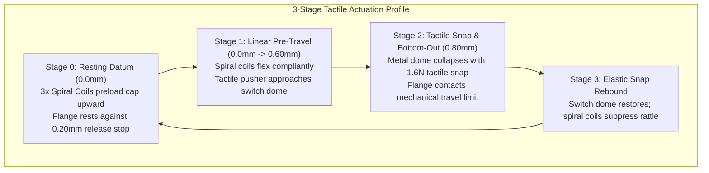

In software UI design, a button press is an instantaneous event callback with zero physical resistance. When you are using a physical calculator, however, tactile response is the entire soul of the tool. Nothing ruins the satisfaction of using an RPN calculator faster than a sticky, binding key: you reach out to hit `ENTER` or punch `COS`, your fingertip lands slightly off-center on the cap, and instead of a crisp, immediate click, the plunger binds sideways against the plastic bore—wedging solid until you wiggle your finger.

When building StackCalc32, our goal was to deliver the iconic, authoritative snap of vintage HP calculators without forcing users to assemble 43 microscopic coil springs and stabilizer clips with tweezers. But our earliest print-in-place plunger prototypes either felt like pressing down on a stiff rubber eraser or jammed immediately when struck off-axis. Perfecting the key mechanism required engineering a 3-point planar spiral suspension in OpenSCAD that decouples key alignment from tactile switch actuation.

<!-- more -->

## The Mechanics of Off-Axis Keycap Binding

In traditional key mechanisms, a cylindrical plunger slides vertically inside a cylindrical bore. If the key is pressed off-center, the tilting moment creates two-point contact friction:

$$\mu_{binding} \ge \frac{d_{shaft}}{2 \cdot h_{guide}}$$

where $d_{shaft}$ is shaft diameter and $h_{guide}$ is engagement depth. For a compact 2.50 mm thick faceplate, $h_{guide}$ is small, making standard straight plungers seize if pressed along their outer perimeter.



Furthermore, relying solely on standard FDM clearances caused keys to rattle when the calculator was handled. We needed a compliant mechanism that actively centers the keycap in XY space while providing low-resistance Z-axis compliance.

## The 3-Point Planar Spiral Suspension with AI

Without formal mechanical engineering backgrounds, we turned to an AI coding assistant to analyze our CAD cross-section and diagnose why our 3D-printed plungers were wedging. The AI explained the kinematics of cantilever deflection and suggested compliant planar suspension beams radiating from the hub.

Modeled in `Hardware/designs/rounded_buttons.scad`, our production retro button family utilizes 10.40 mm diameter circular keycaps with an eased 0.55 mm radius perimeter. Beneath the cap, a 7.80 mm diameter cylindrical shaft houses a central 4.60 mm tactile pusher.

Suspension is achieved through three balanced planar spiral coils spaced at 120° intervals radiating outward from the central hub to the outer faceplate cavity wall. Printed at 0.05 mm detail layers on a 0.40 mm nozzle on our desktop 3D printer, each spiral arm measures 0.30 mm high and 0.45 mm wide:

```scad
// 3-Point planar spiral spring suspension (Hardware/designs/rounded_buttons.scad)
module planar_spiral_spring(r_inner=3.90, r_outer=5.20, h=0.30, w=0.45) {
    for (theta = [0, 120, 240]) {
        rotate([0, 0, theta]) {
            // Archimedean spiral segment: r(a) = r_inner + k * a
            for (a = [0 : 6 : 120]) {
                let (
                    r1 = r_inner + (r_outer - r_inner) * (a / 120),
                    r2 = r_inner + (r_outer - r_inner) * ((a + 6) / 120)
                )
                hull() {
                    rotate([0, 0, a]) translate([r1, 0, 0]) cube([w, 0.20, h], center=true);
                    rotate([0, 0, a + 6]) translate([r2, 0, 0]) cube([w, 0.20, h], center=true);
                }
            }
        }
    }
}
```

The torsional cantilever deflection of these curved arms follows an elastic beam model:

$$k_z \approx \frac{3 \cdot E \cdot w \cdot h^3}{L_{arc}^3}$$

Because height $h = 0.30\text{ mm}$ is cubed, the spring is exceptionally compliant in vertical actuation ($k_z \approx 0.15\text{ N/mm}$), contributing negligible parasitic resistance before the tactile switch dome collapses at its nominal $1.6\text{ N}$ operating point. Conversely, width $w = 0.45\text{ mm}$ and radial anchoring resist lateral shear, maintaining strict 0.40 mm radial moving clearance without tilting.

### The Double-Wide ENTER Carriage

The double-wide `ENTER` key (21.90 mm × 10.40 mm)—the absolute centerpiece of an RPN calculator—presented an even greater binding risk. Pressing the extreme edge of `ENTER` would tilt a standard single plunger sideways. 

We solved this by mounting the `ENTER` squircle atop a broad 19.20 mm × 9.20 mm balanced carriage. Rather than doubling BOM cost with twin switches, a single tactile switch is centered directly under the centroid, while four captive flange stops at the rectangular corners enforce parallel descent across the entire 0.80 mm travel stroke.

### Button Mechanism Dimensional Specifications

| Mechanical Parameter | Dimension (mm) | Tolerance | Functional Purpose |
|---|---|---|---|
| Keycap Diameter | $10.40\text{ mm}$ | $\pm 0.05\text{ mm}$ | Finger contact zone with 0.55mm eased perimeter |
| Plunger Shaft Diameter | $7.80\text{ mm}$ | $\pm 0.05\text{ mm}$ | Main structural sliding core |
| Centered Tactile Pusher | $4.60\text{ mm}$ | $\pm 0.05\text{ mm}$ | Concentrates force on SMD switch metal dome |
| Radial Moving Clearance | $0.40\text{ mm}$ | $\pm 0.03\text{ mm}$ | Prevents layer-line binding during stroke |
| Spiral Spring Arm Height ($h$) | $0.30\text{ mm}$ | Fixed 6 layers ($0.05\text{mm}$) | Vertical compliance ($k_z \approx 0.15\text{ N/mm}$) |
| Spiral Spring Arm Width ($w$) | $0.45\text{ mm}$ | 1 extrusion perimeter | Lateral stability & rattle suppression |
| Downward Working Travel | $0.80\text{ mm}$ | $\pm 0.05\text{ mm}$ | Full switch actuation to mechanical flange stop |
| Upward Release Clearance | $0.20\text{ mm}$ | $\pm 0.05\text{ mm}$ | Allows adjacent print layers to separate cleanly |

This compliant 3-point spiral suspension transformed our 3D-printed faceplate into a high-precision mechanical keyboard assembly that requires zero post-processing or external spring hardware.

## Conclusion: Decoupling Retention from Tactile Snap

Achieving a clean mechanical keystroke with desktop 3D printing taught our software team to separate kinematic guidance from tactile feedback:

- **What failed:** Trying to generate tactile click feedback out of 3D-printed plastic leaf springs. Polymer creep and fatigue kill snap force after a few thousand cycles.
- **What worked:** Letting SMD metal switch domes provide 100% of the crisp 1.6 N tactile snap, while using ultra-thin 0.30 mm Archimedean spirals solely to guide vertical motion and prevent key rattle.
- **The off-axis rule:** Spacing three spiral arms symmetrically at 120° neutralizes off-center rocking moments. Even when you hit the corner of a key at an angle, the plunger translates straight down without catching on the bore.

By solving off-axis binding with code-driven compliant spirals in OpenSCAD, we achieved the authoritative feel of vintage HP hardware on a homemade 3D print.
