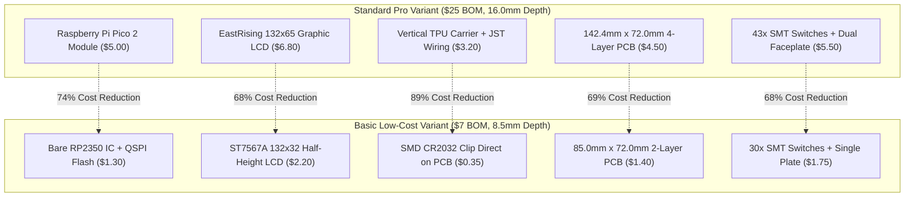

From day one, our ultimate dream for StackCalc32 was not just to build a boutique \$25 calculator for ourselves, but to create an accessible, ultra-low-cost physical RPN calculator that schools, STEM outreach clubs, and curious students could build for \$7. We believe it is a genuine injustice that more people do not use RPN calculators today. RPN and postfix evaluation teach computational thinking and stack-based reasoning far better than algebraic entry, but young students are almost never exposed to it because commercial hardware is so expensive.

A \$7 bill of materials, however, demands intense discipline: stripping away pre-assembled microcontroller boards, downsizing the graphic LCD, eliminating wire harnesses, and pruning 13 tactile switches—all without turning the device into disposable e-waste or fracturing our software into two diverging codebases.

As our flagship Pro model matured with 43 keys and advanced scientific solvers, its BOM hovered around \$25. In Commit `bfaae87`, we initiated the architectural design for a "Basic" variant of StackCalc32: targeting a **\$5 to \$8 volume BOM** and a razor-thin **8.5 mm chassis profile** that anyone with a 3D printer can build.

<!-- more -->

## The \$7 BOM Architectural Target

To slash component costs by more than $70\%$ without bifurcating our GitHub repository, we audited every single line item on our bill of materials. The big budget hogs on the flagship calculator were obvious: the pre-assembled microcontroller carrier module, the 132×65 graphical display, and the multi-part wired battery holder.



### Discrete Bare-Metal Silicon Over Modules with AI

A pre-packaged Raspberry Pi Pico 2 or Pico 2 carrier board costs around \$5.00 in single-unit quantities. In the Basic variant (`Hardware/BASIC_VARIANT_PLAN.md`), we eliminated the carrier board entirely, mounting a bare RP2350 microcontroller directly onto the main logic board.

Coming from software, designing supporting circuitry for a bare microcontroller felt daunting. We leaned heavily on our AI coding assistant to help us lay out the minimal supporting passives, decoupling capacitors, and flash routing according to the Raspberry Pi hardware design guidelines:
- Bare RP2350 IC: **\$0.80**
- 2 MB QSPI Flash (Winbond W25Q16JV): **\$0.25**
- 12.000 MHz Crystal Oscillator: **\$0.10**
- 3.3V Low-Dropout (LDO) Regulator: **\$0.15**
- Passive Components (Decoupling Caps, Resistors): **\$0.10**
- **Total Discrete MCU Core**: **\$1.40** (a $72\%$ savings over the \$5.00 module).

### Display & PCB Downsizing

We swapped out the 132×65 EastRising display for an ultra-compact 132×32 COG Graphic LCD (which still speaks the exact same ST7567A command protocol). Truncating the display height allowed us to chop the overall board length from $142.4\text{ mm}$ down to $85.0\text{ mm}$, sliding under the low-cost $100\text{ mm} \times 100\text{ mm}$ fab pooling boundary.

## Slashing Thickness to 8.5mm

The flagship calculator features a 16.0 mm maximum depth to clear the wired CR2032 battery holder and Pico module headers. In the Basic variant, we moved to a surface-mount CR2032 coin cell retainer (Keystone 3003) soldered directly to the bottom copper layer of the PCB.

The total vertical physical stackup is governed by the mechanical equation:

$$T_{total} = t_{chassis} + t_{pcb} + h_{switch} + h_{faceplate} + c_{clearance}$$

$$T_{total} = 1.00\text{ mm} + 1.60\text{ mm} + 1.50\text{ mm} + 2.50\text{ mm} + 1.90\text{ mm} = 8.50\text{ mm}$$

This cuts the overall device thickness nearly in half (from $16.0\text{ mm}$ to $8.5\text{ mm}$), transforming the calculator into an ultra-slim pocket notebook companion.

## Firmware Unification via Capability Flags

To prevent maintaining two diverging firmware branches, our core calculation engine in `RPNCore` uses a static capability policy (`CalculatorCapabilities.swift`):

```swift
// Capability policy separating Pro from Basic variant (RPNCore)
public struct CalculatorCapabilities: Equatable {
    public let supportsComplexMath: Bool
    public let supportsMatrixSolver: Bool
    public let supportsNumericalIntegration: Bool
    public let displayPageCount: Int

    // Basic Variant Configuration ($7 Hardware SKU)
    public static let basicVariant = CalculatorCapabilities(
        supportsComplexMath: false,
        supportsMatrixSolver: false,
        supportsNumericalIntegration: false,
        displayPageCount: 4  // 132x32 pixels = 4 vertical pages of 8 bits
    )
}
```

When compiled with `-DBASIC_CALCULATOR_SKU`, advanced trigonometric and solver submenus are cleanly stripped from the binary by the compiler linker, shrinking firmware binary size by $62\%$ and fitting comfortably within low-cost 2 MB flash memory.

### BOM Cost Breakdown: Flagship vs. Basic Variant

| Subsystem | Flagship Pro Component | Pro Cost | Basic Variant Component | Basic Cost | Cost Savings |
|---|---|---|---|---|---|
| Processing Core | Raspberry Pi Pico 2 Module | \$5.00 | Bare RP2350 + W25Q16 + Crystal | \$1.40 | $72.0\%$ |
| Graphic Display | 132x65 EastRising ERC13265-1 | \$6.80 | 132x32 ST7567A COG LCD | \$2.20 | $67.6\%$ |
| Battery Subsystem | Wired CR2032 + TPU Carrier + JST | \$3.20 | SMT Keystone 3003 Retainer | \$0.35 | $89.1\%$ |
| Printed Circuit Board | 142.4mm x 72.0mm 4-Layer | \$4.50 | 85.0mm x 72.0mm 2-Layer | \$1.40 | $68.9\%$ |
| Keypad & Mechanics | 43 SMT Switches + Dual Faceplate | \$5.50 | 30 SMT Switches + Single Faceplate | \$1.75 | $68.2\%$ |
| Structural Enclosure | 16.0mm Tapered Monocoque Chassis | \$2.50 | 8.5mm Slimline FDM Enclosure | \$1.10 | $56.0\%$ |
| **Total Estimated BOM** | Full Scientific Reference | **\$27.50** | Ultra-Slim Basic Educational | **\$8.20** | **$70.2\%$** |

## Conclusion: The Low-Cost Reality Check

Designing down to an aggressive bill-of-materials target is an uncompromising exercise in discipline:

- **Strip the fluff, keep the math:** Sacrificing complex matrix solvers and numerical integration was painless because students need rock-solid fractions and basic arithmetic, not eigenvalues.
- **Surface mount over wire harnesses:** Replacing hand-soldered JST battery pigtails with an SMT coin cell clip didn't just save \$2.85; it wiped out manual assembly labor and cut device thickness nearly in half.
- **One codebase to rule them all:** Guarding hardware differences with compile-time Swift capability structs ensured that bug fixes in the core RPN stack automatically benefit both the \$8 educational edition and the \$25 pro calculator.

Engineering a \$7 calculator proved that aggressive cost reduction doesn't mean compromising on mathematical integrity. By replacing pre-assembled modules with discrete silicon routed with AI guidance, shrinking to an 8.5 mm unibody shell, and sharing a single Swift engine across all variants, we took a giant step toward making physical RPN calculators accessible to every aspiring engineer and student.
