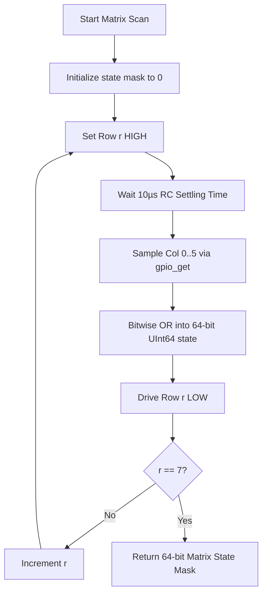

In software development, pressing three keys on a keyboard generates three separate, isolated event callbacks. But when we pressed three keys simultaneously on our early physical calculator prototype—say, `BLUE SHIFT`, `STO`, and `7`—a phantom `5` flashed onto the display. We initially thought our Swift state machine had a logic bug. When we described the symptoms to an AI coding assistant, it diagnosed the issue immediately: an un-dioded switch matrix suffers from physical sneak paths that back-feed electrical current through closed circuits, turning multi-key presses into ghosting chaos.

<!-- more -->

## The 8x6 Matrix Topology

The HP-32SII keyboard layout features 39 primary face keys plus navigation arrows, shift modifiers, and function toggles, resulting in 48 distinct switch intersections. Dedicating an individual microcontroller pin to every single switch would require 48 GPIOs—completely impossible on the RP2350, which only breaks out 30 GPIO pins, half of which are already spoken for by the SPI display, QSPI flash, and debug UART lines.

We organized the physical switches into an 8-row by 6-column matrix across 14 dedicated GPIO pins:

| Matrix Line | RP2350 GPIO Pin | Direction | Default State | Electrical Configuration |
| :--- | :--- | :--- | :--- | :--- |
| **Row 0** | GPIO 6 | Output | Driven LOW (0V) | Push-pull driver (4mA slew) |
| **Row 1** | GPIO 7 | Output | Driven LOW (0V) | Push-pull driver (4mA slew) |
| **Row 2** | GPIO 8 | Output | Driven LOW (0V) | Push-pull driver (4mA slew) |
| **Row 3** | GPIO 9 | Output | Driven LOW (0V) | Push-pull driver (4mA slew) |
| **Row 4** | GPIO 10 | Output | Driven LOW (0V) | Push-pull driver (4mA slew) |
| **Row 5** | GPIO 14 | Output | Driven LOW (0V) | Push-pull driver (4mA slew) |
| **Row 6** | GPIO 18 | Output | Driven LOW (0V) | Push-pull driver (4mA slew) |
| **Row 7** | GPIO 19 | Output | Driven LOW (0V) | Push-pull driver (4mA slew) |
| **Col 0..5** | GPIO 11, 12, 13, 15, 16, 17 | Input | High-Z | Internal 50kΩ pull-down to GND |

By driving all inactive rows LOW by default and holding columns at ground via the RP2350's internal $50\text{ k}\Omega$ pull-down resistors, zero current flows across the board while the keypad is idle.



## Ghosting and Parasitic Sneak Paths

When multiple keys are pressed simultaneously in a matrix, a classic electrical fault known as "ghosting" can occur. If keys $(R_1, C_1)$, $(R_1, C_2)$, and $(R_2, C_2)$ are closed at the same instant, driving $R_2$ high causes current to flow backward through $(R_2, C_2)$ into column 2, backward through $(R_1, C_2)$ into row 1, and forward through $(R_1, C_1)$ into column 1. The microcontroller incorrectly senses a phantom fourth key closure at $(R_2, C_1)$.

The standard textbook solution is slapping an isolation diode on every switch. But our central mission is to build an open, accessible, ultra-low-cost physical RPN calculator for students and engineers—driven by the conviction that it is an absolute injustice that more people do not use RPN. Adding 48 discrete surface-mount diodes would crowd our board routing, inflate our bill of materials, and make hand-assembly intimidating for beginners. With guidance from our AI coding assistant, we eliminated diodes entirely through two software-driven techniques:
1. **Asymmetric Key Mapping**: Modifier keys (such as `BLUE SHIFT` and `ORANGE SHIFT`) are placed on dedicated rows separate from standard numerical cluster groupings.
2. **Drive-Low Push-Pull Sequencing**: Unselected rows are actively driven LOW ($0\text{V}$) rather than left floating in high-impedance mode, clamping back-fed sneak voltages directly to ground potential.

## Bare-Metal Scanning Implementation in C

The physical scan routine executes in `hardware_wrapper.c`. High-speed trace capacitance on the custom PCB requires an explicit $10\mu\text{s}$ settling delay after asserting each row before reading column states to guarantee clean CMOS logic levels:

```c
const uint8_t col_pins[] = {11, 12, 13, 15, 16, 17};
const uint8_t row_pins[] = {6, 7, 8, 9, 10, 14, 18, 19};

uint64_t matrix_scan(void) {
#if WATCHCALC_PROFILE_ENABLED
    firmware_profile_full_matrix_scan_count++;
#endif
#if EMULATOR
    return emu_matrix_state;
#else
    uint64_t state = 0;
    for (int r = 0; r < 8; r++) {
        gpio_put(row_pins[r], 1);
        sleep_us(10); // Capacitive trace settling delay
        for (int c = 0; c < 6; c++) {
            if (gpio_get(col_pins[c])) {
                state |= (1ULL << ((r * 6) + c));
            }
        }
        gpio_put(row_pins[r], 0);
    }
    return state;
#endif
}
```

The resulting 64-bit integer bitmask packs all 48 switch contacts into an immutable scalar: bit $k = (r \times 6) + c$ indicates whether row $r$, column $c$ is closed. This provides zero-allocation representation ready for the multi-sample debouncer in the event loop.

## Conclusion: The Case Against 48 Diodes

Skipping physical diodes was one of the best hardware decisions we made for StackCalc32. By actively clamping inactive matrix rows to ground with push-pull drivers and inserting a disciplined 10-microsecond capacitive settling pause in software, we achieved rock-solid electrical isolation across multi-key combinations without adding 48 extra components to the BOM. You do not always need hardware silicon to solve electrical cross-talk when disciplined GPIO sequencing in firmware can clamp the rails just as cleanly. It keeps the calculator inexpensive, simple to solder, and accessible to anyone wanting to experience the tactile joy of RPN.
