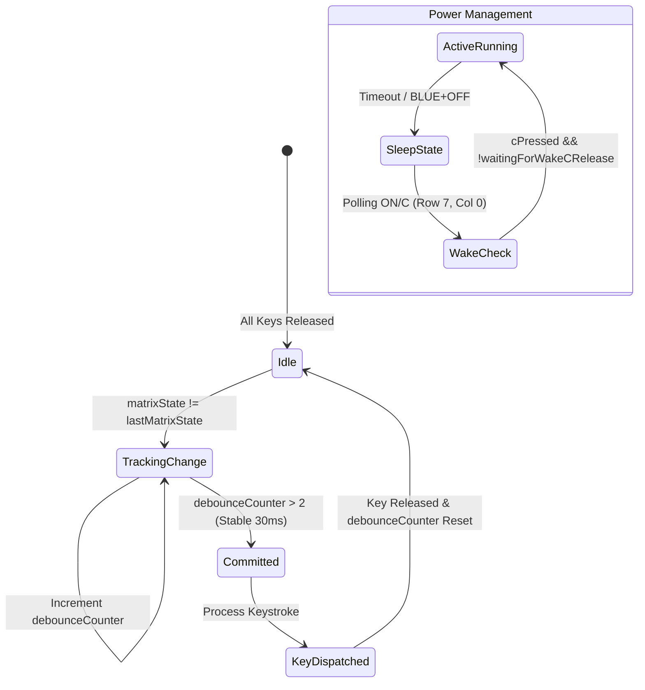

Tactile metal dome switches feel fantastic under the thumb—there is that distinct, mechanical *snap* that gives you immediate physical feedback. But stream the raw GPIO states over a serial monitor or examine digital switch transitions, and that crisp tactile snap looks like pure chaos. The metal dome physically flexes and chatters against the gold-plated PCB pads for 1 to 3 milliseconds before making solid electrical contact. Coming from software, where a button tap is an instantaneous Boolean state change, discovering mechanical chatter was a revelation. If your firmware polls naively at 133 MHz, tapping `ENTER` once will push the stack six times in a row.

<!-- more -->

## Mechanical Switch Dynamics

Tactile dome switches produce electrical noise during actuation: as the metal dome snaps downward onto the gold-plated PCB footprint, the contacts bounce against each other for $1\text{ to }3\text{ ms}$ before settling into a stable low-impedance connection. For an RPN calculator—where stack discipline is sacred and pushing numbers onto the operational stack must be completely deterministic—uncontrolled chatter is catastrophic. We believe it is an absolute injustice that more students and engineers do not use RPN calculators today, and delivering a flawless physical typing experience is essential to winning them over.

To filter this noise without relying on expensive hardware debounce ICs, our firmware runs an active debouncing state machine at a 10 ms polling cadence ($f_s = 100\text{ Hz}$). A keystroke transition is only committed after remaining stable across consecutive samples.



## The 3-Sample Rolling Debounce Algorithm

In `Main.swift`, the main loop samples the raw 64-bit matrix bitmask returned by `matrix_scan()`. When the bit pattern diverges from `lastMatrixState`, an accumulator begins tracking stability:

```swift
// Debounce tracking in Main.swift event loop
if matrixState != lastMatrixState {
    debounceCounter += 1
    if debounceCounter > 2 {
        // Stable contact established for > 20-30 ms
        let changedBits = matrixState ^ committedMatrixState
        if changedBits != 0 {
            for idx in 0..<48 {
                let mask: UInt64 = 1 << idx
                if (changedBits & mask) != 0 {
                    let pressed = (matrixState & mask) != 0
                    handleMatrixKey(index: idx, pressed: pressed)
                }
            }
            committedMatrixState = matrixState
        }
        lastMatrixState = matrixState
        debounceCounter = 0
    }
} else {
    debounceCounter = 0
}
```

This 3-sample sliding window guarantees that transient spikes below 20 ms are rejected, while genuine actuations register within 30 ms—well below the human perception threshold of 50 ms.

## Sleep Mode Optimization: `matrix_scan_wake_key()`

When StackCalc32 enters low-power sleep, continuing to scan all 48 contacts would waste precious battery capacity. A full 8x6 scan requires 8 row assertions, 8 settling delays ($8 \times 10\mu\text{s} = 80\mu\text{s}$), and 48 GPIO reads per pass.

In sleep mode, the calculator only wakes when the user presses the `ON/C` key, located at Row 7, Column 0. The firmware switches to `matrix_scan_wake_key()`:

```c
uint64_t matrix_scan_wake_key(void) {
#if WATCHCALC_PROFILE_ENABLED
    firmware_profile_wake_matrix_scan_count++;
#endif
#if EMULATOR
    return emu_matrix_state & (1ULL << 42);
#else
    // C / ON is row 7, column 0. Sleeping firmware only needs this contact,
    // cutting each wake poll from 48 GPIO reads and eight settles to one.
    gpio_put(row_pins[7], 1);
    sleep_us(10);
    const bool pressed = gpio_get(col_pins[0]);
    gpio_put(row_pins[7], 0);
    return pressed ? (1ULL << 42) : 0;
#endif
}
```

| Metric | Full Active Matrix Scan | Sleep Wake Key Scan (`matrix_scan_wake_key`) | Reduction |
| :--- | :--- | :--- | :--- |
| **Row Assertions** | 8 rows | 1 row (Row 7) | **87.5% reduction** |
| **GPIO Reads** | 48 reads | 1 read (Col 0) | **97.9% reduction** |
| **Settling Wait Time** | $80\,\mu\text{s}$ | $10\,\mu\text{s}$ | **87.5% reduction** |
| **CPU Wake Overhead** | ~140 µs total per loop | ~14 µs total per loop | **90.0% reduction** |

## Preventing Wake-on-Release with `waitingForWakeCRelease`

Because the `C` key doubles as both `ON` (wake from sleep) and `OFF` (via `BLUE + C`), a critical race condition emerges: if the user powers off the calculator by pressing `BLUE + C`, the key may still be held physically down when the firmware enters sleep. Without latch protection, the sleep loop would detect the held `C` contact and immediately wake up within 10 milliseconds.

The firmware introduces the `waitingForWakeCRelease` latch flag:

```swift
if sleeping {
    let cBit: UInt64 = 1 << 42 // Row 7, Col 0
    if (matrixState & cBit) == 0 {
        waitingForWakeCRelease = false
    }
    if !waitingForWakeCRelease && (matrixState & cBit) != 0 {
        // Immediate wake-up on clean edge transition
        sleeping = false
        hw_display_wake_c()
        requestFullRedraw()
    }
}
```

Furthermore, notice that waking bypasses the 3-sample debouncer: the very first positive transition on `cBit` immediately restores the display and starts CPU clocks, reducing cold wake latency from 30 ms down to a crisp, instantaneous response.

## Conclusion: What Software Developers Learn from Mechanical Keypads

Filtering physical switch bounce without making typing feel sluggish is an art of milliseconds. The lessons from our keypad bring-up on bare silicon are clear:
- Never use blocking delays (`delay_ms`) to debounce; a non-blocking 3-sample accumulator at 100 Hz keeps the CPU unencumbered.
- Prune your sleep polling down to the single wake key to save 90% of standby energy.
- Always include a software release latch when overloading power toggles onto operational keys, or your users will find it impossible to turn their calculator off.
By applying software state machine discipline to physical switch chatter, we gave StackCalc32 the authoritative, instantaneous responsiveness that makes classic RPN calculators so addictive to use.
