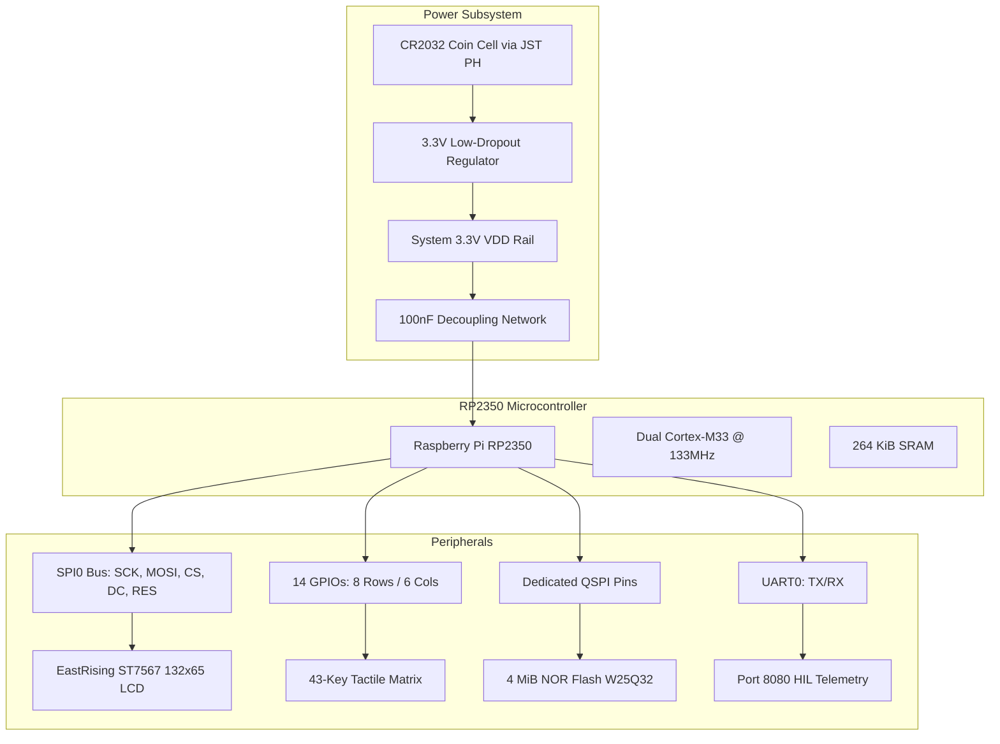

Nothing takes the wind out of your sails quite like popping a fresh battery into a freshly assembled calculator, flipping the power, and watching the LCD screen dissolve into an unreadable blizzard of static noise. On our initial prototype bring-up, cold boots produced random visual garbage every three or four tries. Coming from software, we are used to code executing deterministically from the very first instruction. The root cause was an eye-opening collision between digital speed and analog physics: the RP2350 boots and begins running code in a lightning-fast $1.65\text{ ms}$, but the liquid crystal display's analog charge pumps need ten times longer just to stabilize their high-voltage rails.

<!-- more -->

## System Bus Topology

Our driving mission with StackCalc32 is to create an accessible, low-cost physical RPN calculator for students and engineers. We believe it is an absolute injustice that more people do not experience the clarity and power of RPN calculations. To keep our bill of materials affordable while maintaining instant responsiveness, the RP2350 microcontroller serves as the central computation hub, providing dual ARM Cortex-M33 cores and 30 multi-function GPIO pins. We allocated these pins to guarantee contention-free operation across high-speed display transfers and low-latency keypad scanning:



## Microcontroller Pin Allocation

Each GPIO line on the custom PCB was routed to satisfy trace length matching and signal integrity requirements:

| Subsystem | Signal Name | RP2350 Pin | Electrical Function | Drive Configuration |
| :--- | :--- | :--- | :--- | :--- |
| **ST7567 LCD** | `PIN_CS` | GPIO 1 | Chip Select (Active LOW) | Push-pull output (4mA) |
| **ST7567 LCD** | `PIN_SCK` | GPIO 2 | SPI Serial Clock (8 MHz) | Push-pull output (8mA slew) |
| **ST7567 LCD** | `PIN_MOSI`| GPIO 3 | SPI Master Out Slave In | Push-pull output (8mA slew) |
| **ST7567 LCD** | `PIN_DC` | GPIO 4 | Data / Command Select | Push-pull output (4mA) |
| **ST7567 LCD** | `PIN_RES` | GPIO 5 | Hardware Reset (Active LOW)| Push-pull output (4mA) |
| **Keypad Rows** | `ROW_0..7` | GPIO 6..10, 14, 18, 19 | 8 Driven Matrix Rows | Push-pull outputs (4mA) |
| **Keypad Cols** | `COL_0..5` | GPIO 11..13, 15..17 | 6 Sampled Columns | Inputs with 50kΩ pull-down |
| **Debug / HIL** | `UART0_TX` | GPIO 0 | Serial Console Telemetry | UART peripheral function |

## Power Rail Regulation and Decoupling

The primary power rail operates at $3.3\text{V}$, regulated from the battery input via a low-quiescent-current Low-Dropout (LDO) linear regulator (AP2112K-3.3). The AP2112 provides up to $600\text{ mA}$ peak current with an ultra-low dropout voltage of $250\text{ mV}$ and a quiescent ground current of just $55\,\mu\text{A}$, maximizing run-time as coin cell voltage decays from $3.2\text{V}$ down to $2.0\text{V}$.

To suppress high-frequency switching noise induced by the RP2350's internal switching regulator (which converts $3.3\text{V}$ down to $1.1\text{V}$ for the digital core), each $V_{DD}$ pin is paired with an independent $100\text{ nF}$ X7R ceramic decoupling capacitor placed within $1.5\text{ mm}$ of the silicon ball. A $10\,\mu\text{F}$ tantalum bulk capacitor stabilizes the output of the LDO during high-current SPI flash operations.

## Display Hardware Reset and Power Sequencing

Liquid crystal display controllers with integrated charge pumps—such as the ST7567—require strict timing sequences during power application to initialize the internal DC-DC booster without latching up. We asked an AI coding assistant to help us parse the timing diagrams in the ST7567 datasheet, which led us to implement a disciplined C initialization routine:

```c
// Hardware reset sequence in hardware_wrapper.c
void hw_init(void) {
    stdio_init_all();
    
    // SPI initialization at 8 MHz
    spi_init(SPI_PORT, 8000 * 1000);
    spi_set_format(SPI_PORT, 8, SPI_CPOL_0, SPI_CPHA_0, SPI_MSB_FIRST);

    // Assert hardware reset LOW for 50ms
    gpio_init(PIN_RES);
    gpio_set_dir(PIN_RES, GPIO_OUT);
    gpio_put(PIN_RES, 0);
    sleep_ms(50);
    
    // Release reset HIGH and wait 100ms for charge pumps to stabilize
    gpio_put(PIN_RES, 1);
    sleep_ms(100);

    // Transmit initialization command sequence
    gpio_put(PIN_CS, 0);
    gpio_put(PIN_DC, 0);
    uint8_t init_cmds[] = {
        0xE2, // Soft reset
        0xA0, // CLEAR_ADC (segment direction normal)
        0xC8, // SET_SHL (common output reverse)
        0xA2, // CLEAR_BIAS (1/9 bias ratio)
        0x2F, // Power Control (Booster, Regulator, Follower ON)
        0x25, // Internal regulator resistor select
        0x81, 24, // Contrast level 24
        0x40, // Display start line address 0
        0xAF  // Display ON
    };
    spi_write_blocking(SPI_PORT, init_cmds, sizeof(init_cmds));
    gpio_put(PIN_CS, 1);
}
```

This deliberate $150\text{ ms}$ power-up delay guarantees that internal analog bias ladders settle prior to sending graphic data, preventing display ghosting or unstable pixel contrast.

## Conclusion: What Software Engineers Learn About Analog Settling Physics

Modern digital microcontrollers boot orders of magnitude faster than peripheral analog circuitry. If your display or sensors rely on on-chip charge pumps, slamming configuration registers over high-speed SPI before analog rails have settled will cause erratic latch-ups. Giving the ST7567 a disciplined 150 ms hardware reset sequence completely eliminated cold-boot snow. Always respect analog settling physics when pairing fast 32-bit silicon with vintage-style glass displays, ensuring your hardware boots cleanly and reliably every single time.
