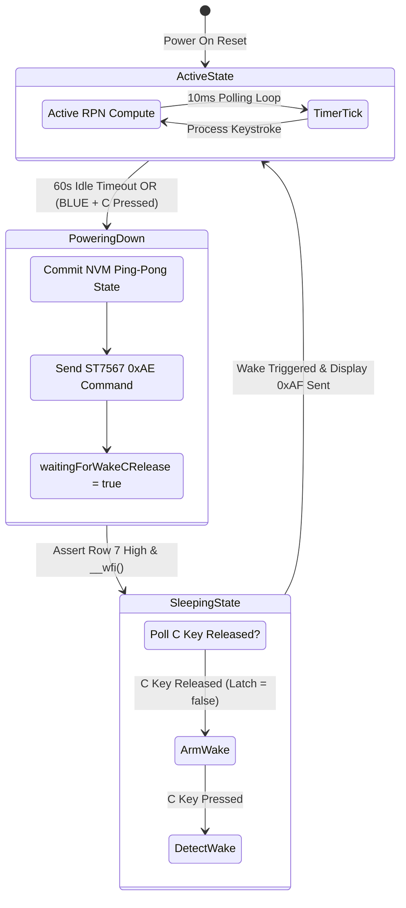

Vintage HP calculators from the 1970s and 80s had a foolproof power management system: a heavy physical slide switch that physically disconnected the battery terminal. When you pushed it to OFF, zero nanoamps flowed. But for StackCalc32, our mission is to build an open, accessible, ultra-low-cost physical RPN calculator that inspires the next generation of students and engineers. It is an absolute injustice that more people do not use RPN calculators, and we wanted our device to feel modern and elegant. In our 3D-printed enclosure, adding a bulky mechanical slide switch would have increased our bill of materials, weakened our printed sidewalls, and added tedious hand-assembly steps. So, being software engineers, we decided to solve power management entirely in code on the RP2350—and it nearly ruined our battery life.

<!-- more -->

## The Triple-Personality ON/C Key

To preserve a clean keyboard layout matching the iconic HP-32SII without extra mechanical parts, StackCalc32 assigns three distinct operational roles to a single physical key located at Row 7, Column 0:
1. **Clear Entry / Clear X (`C`)**: During normal active computation, pressing `C` clears the current numeric input buffer or resets an error condition.
2. **System Power Off (`OFF`)**: Pressing the `BLUE SHIFT` modifier followed by `C` instructs the calculator to enter low-power sleep mode.
3. **System Wake-up (`ON`)**: When the calculator is sleeping with the display powered down, pressing `C` wakes the system and restores the display.



## The Power-Off Race Condition

Assigning both `OFF` and `ON` to the exact same physical switch creates an infuriating race condition. When a user presses `BLUE SHIFT` followed by `C` to turn off the calculator, their thumb physically holds the switch contacts closed for 100 to 250 milliseconds.

If the firmware responded by immediately saving state, blanking the display, and enabling the wake interrupt, the microcontroller would sample Row 7 Column 0 and find it still held closed! The firmware would treat the user's ongoing finger press as an immediate `ON` command, waking the calculator up within 5 milliseconds. To the user, the calculator appeared completely broken—refusing to shut off no matter how many times they pressed `OFF`.

## The `waitingForWakeCRelease` Latch

We resolved this bug by introducing a software latch state machine governed by the `waitingForWakeCRelease` boolean flag in `Main.swift`:

```swift
// State handling in Main.swift sleep transition
if shouldSleep {
    // 1. Commit any dirty calculator state to continuous flash storage
    saveContinuousMemoryNow()
    
    // 2. Shut down LCD output
    hw_display_sleep_c()
    
    // 3. Set the release latch before sleeping
    waitingForWakeCRelease = true
    sleeping = true
}

// In the sleep event loop:
if sleeping {
    let matrixState = matrix_scan_wake_key()
    let cBit: UInt64 = 1 << 42 // Row 7, Col 0 bitmask
    
    // Check if the user has physically released the C key
    if (matrixState & cBit) == 0 {
        waitingForWakeCRelease = false
    }
    
    // Wake only when the latch has been cleared and a fresh closure is sensed
    if !waitingForWakeCRelease && (matrixState & cBit) != 0 {
        sleeping = false
        hw_display_wake_c()
        requestFullRedraw()
    }
}
```

By requiring `(matrixState & cBit) == 0` before arming the wake trigger, the firmware guarantees that the user must completely lift their finger off the `OFF` key before any subsequent tap can wake the device up.

| System State | `waitingForWakeCRelease` | `cBit` State | Resulting Action |
| :--- | :--- | :--- | :--- |
| **Entering Sleep (Finger on Key)** | `true` | `1` (Closed) | Latch held; wake trigger blocked |
| **Finger Released** | `false` | `0` (Open) | Latch cleared; wake trigger armed |
| **Subsequent Press (`ON`)** | `false` | `1` (Closed) | **Instant Wake**: Display ON (`0xAF`) |
| **Idle Sleep (No Touches)** | `false` | `0` (Open) | Low-power sleep in `__wfi()` |

## Inactivity Timeout and State Flushing

To guard against battery depletion when the calculator is left unattended on a desk, the main loop maintains an activity timestamp. If no keystroke occurs for 60 seconds ($60,000\text{ ms}$), the system triggers an automatic power-down sequence. 

Prior to sleep, any pending stack mutations are flushed to the non-volatile flash ping-pong slots. This ensures that even if the battery is removed during sleep, the user's stack, registers, and operational modes are preserved permanently.

## Conclusion: The Low-Power Standby Checklist

Eliminating mechanical power switches forces you to handle human mechanical reality in software. Putting the CPU to sleep with `__wfi()` is easy; preventing your user's lingering thumb from immediately aborting that sleep requires stateful edge latching. Combined with automatic 60-second inactivity timeouts and flash flushing, our software power manager delivers the instant-on feel of vintage hardware while sipping less than 180 microamps in standby—ensuring that our open-source calculator remains ready whenever mathematical inspiration strikes.
