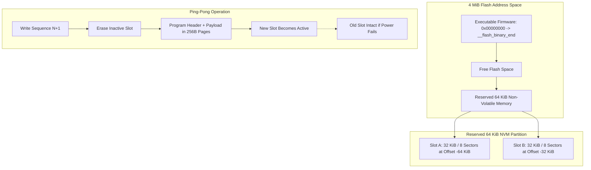

Imagine you are thirty steps deep into calculating the eigenvalues of a matrix, evaluating a complex continued fraction expansion, or working through a multi-step engineering problem. You bump your calculator against the edge of your desk, the coin cell pops loose for a split second, and when you slide it back in, your entire stack, memory registers, and custom settings are wiped clean. On a true scientific instrument inspired by Hewlett-Packard's legendary Continuous Memory, that is completely unacceptable. As software engineers who believe it is an absolute injustice that more students and engineers do not use RPN calculators, building an accessible, rock-solid physical calculator meant guaranteeing that calculations survive sudden power drops without losing a single bit of state.

<!-- more -->

## Flash Architecture and Sector Boundaries

In software development, saving state is second nature: you serialize an object to JSON or write to SQLite within an ACID transaction. On bare-metal NOR flash memory, however, physics gets in the way: you cannot overwrite existing bits without first erasing an entire sector back to `0xFF`. On the Raspberry Pi RP2350 and Pico 2, NOR flash is organized into $4\text{ KiB}$ erasable sectors ($4,096\text{ bytes}$) and $256\text{ byte}$ programming pages. 

If the calculator performed in-place overwrites within a single sector, any sudden power loss—such as a battery jarred loose or dropped—during the erase cycle would wipe user data permanently. To guarantee atomic safety, StackCalc32 implements a dual-slot ping-pong storage engine in the final $64\text{ KiB}$ of flash memory.



## The Dual 32 KiB Ping-Pong Architecture

We allocate two independent $32\text{ KiB}$ slots at the top of the flash address space:

```c
#define NVM_MAGIC 0x5743324dU /* "WC2M" */
#define NVM_FORMAT_VERSION 1U
#define NVM_SLOT_SIZE (FLASH_SECTOR_SIZE * 8U)
#define NVM_SLOT_A_OFFSET (PICO_FLASH_SIZE_BYTES - (NVM_SLOT_SIZE * 2U))
#define NVM_SLOT_B_OFFSET (PICO_FLASH_SIZE_BYTES - NVM_SLOT_SIZE)

struct __attribute__((packed)) NvmHeader {
    uint32_t magic;           // Identifier: 0x5743324D ("WC2M")
    uint32_t format_version;  // Layout versioning
    uint32_t sequence;        // Monotonically increasing sequence number
    uint32_t payload_length;  // Byte size of serialized state
    uint32_t checksum;        // 32-bit FNV-1a hash
};
```

Each $32\text{ KiB}$ slot spans 8 consecutive sectors, providing sufficient capacity to serialize the entire calculation context, including deep 999-level stack history:

| Field | Type / Size | Function | Validation Rule |
| :--- | :--- | :--- | :--- |
| **`magic`** | `uint32_t` (4 bytes) | Identifies StackCalc32 storage format | Must equal `0x5743324D` ("WC2M") |
| **`format_version`** | `uint32_t` (4 bytes) | Schema migration version | Must match `NVM_FORMAT_VERSION` (1) |
| **`sequence`** | `uint32_t` (4 bytes) | Monotonic counter tracking writes | Highest valid sequence wins at boot |
| **`payload_length`** | `uint32_t` (4 bytes) | Size of compressed state blob | Must be $> 0$ and $\le 32,748\text{ bytes}$ |
| **`checksum`** | `uint32_t` (4 bytes) | FNV-1a 32-bit integrity digest | Must match calculated payload hash |

## FNV-1a Verification and Atomic Writing

The Fowler–Noll–Vo (FNV-1a) hash was selected for payload verification because it requires zero dynamic memory, executes in $O(N)$ linear time, and provides robust avalanche properties on byte streams:

```c
static uint32_t nvm_checksum(const uint8_t *bytes, uint32_t length) {
    uint32_t hash = 2166136261u; // FNV offset basis
    for (uint32_t i = 0; i < length; ++i) {
        hash ^= bytes[i];
        hash *= 16777619u;        // FNV prime
    }
    return hash;
}
```

During persistence, `hw_nv_memory_save_c()` inspects both slots to determine which contains the latest valid sequence. The alternate slot is selected as the write target. 

Writing to flash on the RP2350 requires executing from SRAM while interrupts are disabled, because accessing Execute-In-Place (XIP) flash while programming halts the bus:

```c
// Critical flash programming section in hardware_wrapper.c
const uint32_t irq_state = save_and_disable_interrupts();
flash_range_erase(target_offset, NVM_SLOT_SIZE);

// Program in aligned 256-byte flash pages
for (uint32_t offset = 0; offset < program_length; offset += FLASH_PAGE_SIZE) {
    // Fill page buffer with header and payload slices
    flash_range_program(target_offset + offset, nvm_page_buffer, FLASH_PAGE_SIZE);
}
restore_interrupts(irq_state);
```

## Binary Overlap Protection and Autosave Cadence

To guard against catastrophic firmware regressions where an enlarged firmware image collides with the reserved storage partition, the driver checks linker boundaries at runtime:

```c
if ((uintptr_t)&__flash_binary_end > (uintptr_t)(XIP_BASE + NVM_SLOT_A_OFFSET)) {
    return false; // Refuse write to prevent corrupting executable code
}
```

State is flagged dirty upon any stack or register mutation and committed 2.0 seconds after the last keystroke, or immediately when entering sleep. If an unexpected power drop occurs during erase, the older ping-pong slot remains unblemished, restoring calculator state flawlessly upon reboot.

## Conclusion: What Software Engineers Learn About Non-Volatile Flash Persistence

Flash memory is unforgiving. If you overwrite data in place on a battery-powered device, you are gambling with user data. The rules we follow for embedded storage are non-negotiable:
- Always use alternating ping-pong sectors so you never erase your only good copy of user data.
- Validate every payload with a fast, deterministic hash like FNV-1a before accepting it at boot.
- Verify that your compiler's binary output never grows into your storage offsets with a compile-time or runtime assert against `__flash_binary_end`.
With these safeguards running, StackCalc32 can survive sudden battery drops without losing a single calculation—providing the rock-solid reliability that makes RPN calculating a lifelong joy.
