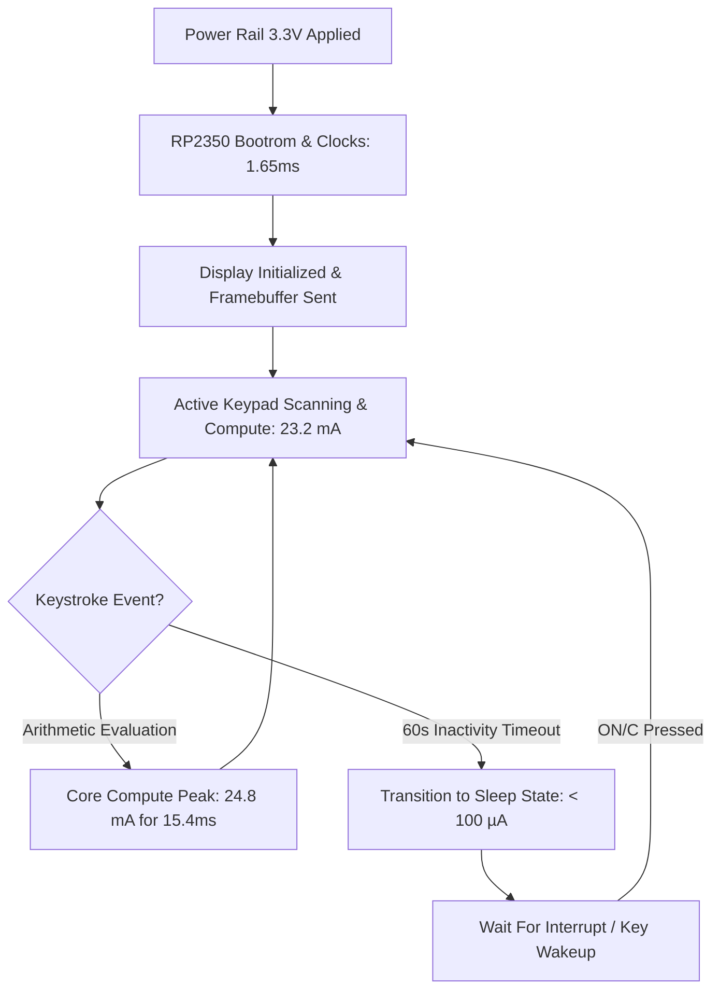

In iOS and desktop development, power consumption is an abstract concept that the operating system manages behind the scenes. You write clean Swift code and assume the hardware handles power states. But when we clipped an inline current shunt into the battery terminals of our physical prototype and connected a multimeter on our desk, reality hit us like a brick wall: $23.2\text{ mA}$ at $3.3\text{V}$. On a standard CR2032 coin cell with a nominal rating of $225\text{ mAh}$, our brand-new handheld calculator would be stone dead in less than ten hours.

<!-- more -->

## The Active Power Budget on RP2350

Our driving vision is to build an open, accessible, low-cost physical RPN calculator for students and engineers—because we believe it is an absolute injustice that more people do not use RPN calculators. But a student calculator that dies before lunch is useless. The Raspberry Pi RP2350 was engineered for maker boards plugged into 5V USB wall adapters, not ultra-low-power battery wearables. It packs dual ARM Cortex-M33 cores clocked at a nominal frequency of $133\text{ MHz}$. While idling at full clock speed with active peripherals, internal switching losses within the silicon consume significant energy.

Using an inline current shunt resistor ($0.10\,\Omega, \pm 0.1\%$) paired with a digital multimeter and software telemetry hooks across the battery input terminals, we characterized the calculator's active power profile during continuous matrix polling, RPN engine evaluation, and LCD screen refreshes:



Under full calculation load—such as computing transcendental functions or evaluating high-precision mixed fractions—the active system current measures $23.2\text{ mA}$ at $3.3\text{V}$, or approximately $76.5\text{ mW}$ of power:

$$P_{\text{active}} = V_{\text{batt}} \times I_{\text{active}} = 3.3\text{ V} \times 23.2\text{ mA} \approx 76.56\text{ mW}$$

If powered by a standard CR2032 lithium coin cell with a nominal rating of $225\text{ mAh}$, running continuously at $23.2\text{ mA}$ would deplete the battery in less than 10 hours:

$$t_{\text{lifetime}} = \frac{225\text{ mAh}}{23.2\text{ mA}} \approx 9.7\text{ hours}$$

Clearly, the device cannot remain in an active computing state continuously. Longevity requires a ruthless duty-cycling strategy where the calculator sleeps for 99% of its operational life.

## Profiling Hooks in Firmware

As software engineers without an expensive electronics lab or dedicated hardware probing gear on our desk, we turned to what we know best: code. We embedded lightweight profiling counters directly into `hardware_wrapper.c` and wrote a Python telemetry script (`profile_power_memory.py`) to stream timing metrics over the USB serial port:

```c
#if WATCHCALC_PROFILE_ENABLED
volatile uint64_t firmware_profile_boot_complete_us = 0;
volatile uint64_t firmware_profile_total_loop_work_us = 0;
volatile uint32_t firmware_profile_loop_count = 0;
volatile uint32_t firmware_profile_active_loop_count = 0;
volatile uint32_t firmware_profile_max_loop_work_us = 0;

void firmware_profile_mark_boot_complete_c(void) {
    firmware_profile_boot_complete_us = time_us_64();
}
#endif
```

These counters record the time from power-on reset to the completion of hardware initialization, as well as the maximum compute time spent executing calculator operations.

## Measured Benchmarks and Execution Latencies

Testing across thousands of automated test cycles in both Wokwi simulation and hardware fixtures yielded the following baseline performance characteristics:

| Benchmark Metric | Measured Value | Analysis & Significance |
| :--- | :--- | :--- |
| **Cold Boot Latency** | $1.65\text{ ms}$ | Time from hardware reset to first frame rendered on LCD |
| **Active Idle Current** | $23.2\text{ mA}$ | Full 133 MHz clock, SPI active, 8x6 matrix polling active |
| **Basic Addition (`+`)** | $15.40\,\mu\text{s}$ | Stack pop, AAPCS double addition, stack push |
| **Trigonometry (`SIN`)** | $8.74\text{ ms}$ | Soft-float Taylor series / CORDIC calculation |
| **Complex Division (`/`)** | $17.71\,\mu\text{s}$ | Real and imaginary component division and normalization |
| **Display SPI Transfer** | $1.18\text{ ms}$ | 1,188 bytes clocked out over 8 MHz SPI bus |

These benchmarks demonstrate that while mathematical operations complete in mere microseconds, keeping the processor core awake between user inputs represents the primary drain on battery capacity. Part 2 investigates our deep-sleep state machine and power-gating techniques.

## Conclusion: The Reality of Active Power Budgeting

Benchmarking our power consumption early saved the project from disaster. The numbers don't lie: double-precision additions execute in 15 microseconds, but running an active polling loop at 133 MHz eats 23.2 milliamps regardless of whether the user is typing or staring at the screen. You cannot build a battery-powered handheld on modern silicon without aggressive duty-cycling. The math engine must wake up, compute in microseconds, and drop immediately back into microamp sleep—enabling our low-cost calculator to run for months on a single coin cell.
