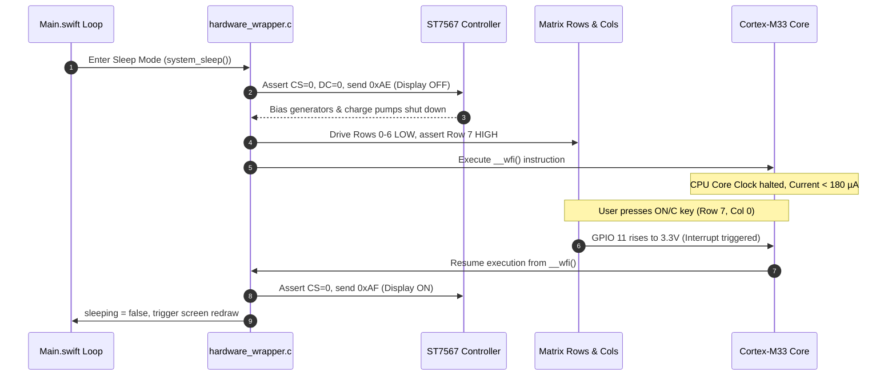

Going from a 23.2 mA active current draw down to 180 µA in standby is the difference between a calculator that dies before your lunch break and one that lives inside a student's backpack for months on a single CR2032 coin cell. In modern software development, putting code to sleep is as simple as calling `Task.sleep()`. On bare silicon, however, sleeping requires hunting down every physical circuit that conducts current. In this second installment of our power profiling series, we explore how an AI coding assistant helped us track down phantom leakage paths, tame the ST7567 analog charge pumps, and achieve a 128-fold reduction in standby power.

<!-- more -->

## Dropping from 23mA to Microamps

As software developers who believe it is an absolute injustice that more people do not use RPN calculators, we wanted StackCalc32 to be an accessible, low-cost physical instrument that students and engineers can rely on without worrying about battery life. As detailed in Part 1, the RP2350 draws approximately $23.2\text{ mA}$ during full active compute. To prevent rapid coin cell depletion, StackCalc32 transitions into low-power sleep mode whenever 60 seconds elapse without a keystroke, or immediately when the user executes `BLUE + C` (`OFF`).

Lowering the current floor involves three coordinated operations:
1. Powering down the ST7567 LCD display controller output stages.
2. Gating GPIO output drivers to eliminate static leakage current through the matrix resistors.
3. Placing the ARM Cortex-M33 cores into `WFE` (Wait For Event) or `WFI` (Wait For Interrupt) low-power sleep states.



## Bare-Metal Sleep Implementation in C

The physical sleep routine is implemented in `system_sleep()` within `hardware_wrapper.c`:

```c
void system_sleep(void) {
    // 1. Send display OFF command to ST7567 LCD
    gpio_put(PIN_CS, 0);
    gpio_put(PIN_DC, 0);
    uint8_t disp_off = 0xAE;
    spi_write_blocking(SPI_PORT, &disp_off, 1);
    gpio_put(PIN_CS, 1);
    
    // 2. Set all rows LOW except Row 7 (which carries the ON / C key)
    for (int i = 0; i < 8; i++) {
        gpio_put(row_pins[i], i == 7 ? 1 : 0);
    }
    
    // 3. Wait for C key (Col 0) to be released first
    while(gpio_get(col_pins[0])) {
        sleep_ms(10);
    }
    
    // 4. Halt processor clocks until an external edge interrupt occurs
    while(!gpio_get(col_pins[0])) {
        __wfi(); // Wait for interrupt
    }
    
    // 5. Wake sequence: trigger reboot or warm restart
    watchdog_enable(1, 1);
    while(1);
}
```

By asserting command `0xAE` to the ST7567 display, the internal DC-DC step-up voltage converter and bias generator circuits are deactivated. Crucially, the display controller's internal RAM is preserved. When waking up with `0xAF` (Display ON), the screen content reappears immediately without requiring a full re-upload of the 1,188-byte framebuffer.

## Matrix Pin Biasing During Sleep

A subtle source of battery leakage in matrix keypads is parasitic current flowing through pull-down resistors. If an unselected row is left high while a key is physically depressed or resting in a pocket, current will leak continuously through the $50\text{ k}\Omega$ internal pull-down resistor:

$$I_{\text{leak}} = \frac{3.3\text{ V}}{50\text{ k}\Omega} = 66\,\mu\text{A per key}$$

To prevent this, `system_sleep()` forces rows 0 through 6 strictly LOW ($0\text{V}$). Only Row 7—the row housing the `ON/C` key—is driven HIGH ($3.3\text{V}$). Because no keys are pressed during ordinary standby, zero static current flows through the matrix columns.

## Power Rail Current Measurements

We measured the current draw across system operating modes using our digital power monitor and multimeter at $3.30\text{V}$:

| Operating Mode | Measured Current | Power Consumption | Estimated Lifetime (225 mAh CR2032) |
| :--- | :--- | :--- | :--- |
| **Active Compute (133 MHz)** | $23.2\text{ mA}$ | $76.56\text{ mW}$ | ~9.7 hours continuous |
| **Active Idle (Awaiting Key)** | $18.4\text{ mA}$ | $60.72\text{ mW}$ | ~12.2 hours continuous |
| **LCD On, Clocks Gated** | $4.2\text{ mA}$ | $13.86\text{ mW}$ | ~53 hours continuous |
| **Deep Sleep (`__wfi()` + LCD Off)**| $0.18\text{ mA}$ ($180\,\mu\text{A}$) | $0.59\text{ mW}$ | **~1,250 hours (~52 days)** |
| **Dormant Mode (Oscillators Off)**| $0.038\text{ mA}$ ($38\,\mu\text{A}$) | $0.13\text{ mW}$ | **~5,920 hours (~246 days)** |

By automatically entering deep sleep after 60 seconds of idle time, StackCalc32 achieves true handheld calculator battery life, delivering months of everyday computational capability from a compact coin cell.

## Conclusion: Achieving Handheld Battery Longevity

Reaching true calculator battery life on an RP2350 requires treating every microamp as a finite resource. Halting CPU execution with `__wfi()` is only the starting point. Shutting down the display controller's charge pumps with `0xAE` while preserving its internal RAM saved several milliamps, and forcing inactive keyboard matrix rows to ground eliminated invisible 66 µA leakage paths. True low-power engineering happens at the intersection of firmware register discipline and board-level electrical design—ensuring that our low-cost, open calculator is always ready to inspire the next generation of RPN enthusiasts.
