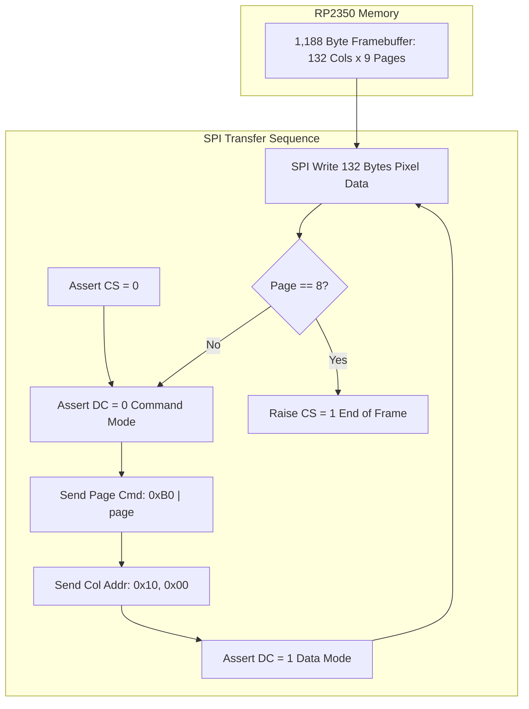

Pushing pixels to a monochrome LCD controller over SPI feels like stepping into a time machine. Modern software engineers are accustomed to linear 2D framebuffers where pixel $(X, Y)$ lives at memory offset $Y \times \text{width} + X$, rendered effortlessly by GPU shaders or CoreGraphics. The Sitronix ST7567 controller on our EastRising ERC13265-1 display completely throws that mental model out the window. It slices display memory into 9 horizontal "pages" of 8 vertical pixels each, where every transmitted byte represents an 8-pixel vertical column slice.

<!-- more -->

## The ST7567 Hardware Display Interface

Our mission with StackCalc32 is to build an open, accessible, ultra-low-cost physical RPN calculator that can inspire the next generation of students and engineers to love RPN as much as we do. It is an absolute injustice that more people do not experience the tactile elegance of RPN calculation. To give our physical device the razor-sharp, sunlight-readable legibility of vintage Hewlett-Packard instruments, we chose the EastRising ERC13265-1 $132 \times 65$ dot-matrix LCD.

Communicating with this controller from an RP2350 requires a high-speed 4-wire Serial Peripheral Interface (SPI):

| Pin Name | RP2350 Pin | Hardware Function | Electrical Characteristic |
| :--- | :--- | :--- | :--- |
| **`PIN_CS`** | GPIO 1 | Chip Select (Active LOW) | Lowers before transaction, raises at end |
| **`PIN_SCK`** | GPIO 2 | SPI Serial Clock | Operating frequency: $8.0\text{ MHz}$ |
| **`PIN_MOSI`**| GPIO 3 | Master Out Slave In | Serial pixel and command data stream |
| **`PIN_DC`** | GPIO 4 | Data / Command Select | LOW = Command byte, HIGH = Display RAM data |
| **`PIN_RES`** | GPIO 5 | Hardware Reset (Active LOW)| Pulsed low to reset display internal state |



## Page-Mode Framebuffer Layout

Coming from software UI frameworks, the ST7567 memory structure was a major puzzle. Staring at the datasheet, we used an AI coding assistant to decode how page-mode addressing works. Display RAM is structured in horizontal "pages", where each page represents an 8-pixel-high horizontal strip spanning the entire 132-pixel width:

$$\text{Display Height: } 65\text{ pixels (mapped to } 9\text{ pages} \times 8\text{ bits} = 72\text{ bits addressable)}$$

$$\text{Total Framebuffer Size: } 132\text{ columns} \times 9\text{ pages} = 1,188\text{ bytes}$$

Within each byte, bit 0 corresponds to the top pixel of the page row, while bit 7 corresponds to the bottom pixel. Because the display controller does not support direct linear 2D addressing, refreshing the screen requires iterating through all 9 pages sequentially.

## The Bare-Metal Transfer Driver in C

The physical transmission logic is executed in `display_send_buffer()` within `hardware_wrapper.c`. Rather than introducing complex DMA interrupts and ring buffer synchronization, we opted for clean, high-speed synchronous blocking SPI (`spi_write_blocking`):

```c
void display_send_buffer(const uint8_t* buffer) {
    watchdog_update();

#if WATCHCALC_PROFILE_ENABLED
    firmware_profile_display_transfer_count++;
#endif

#ifndef EMULATOR
    // Assert Chip Select LOW
    gpio_put(PIN_CS, 0);
    
    // Transfer each of the 9 horizontal display pages
    for (int p = 0; p < 9; p++) {
        // 1. Enter Command Mode to set page and column address
        gpio_put(PIN_DC, 0);
        uint8_t page_cmd[] = { 
            (uint8_t)(0xB0 | p), // Set Page Address (B0h - B8h)
            0x10,                 // Set Higher Column Address (MSB = 0)
            0x00                  // Set Lower Column Address (LSB = 0)
        };
        spi_write_blocking(SPI_PORT, page_cmd, 3);
        
        // 2. Enter Data Mode to blast 132 bytes of pixel data
        gpio_put(PIN_DC, 1);
        spi_write_blocking(SPI_PORT, buffer + (p * 132), 132);
    }
    
    // De-assert Chip Select HIGH
    gpio_put(PIN_CS, 1);
#endif
}
```

Clocked at $8\text{ MHz}$, transmitting the 3 address bytes and 132 pixel bytes across all 9 pages requires:

$$t_{\text{frame}} = 9 \times \frac{(3 + 132) \times 8\text{ bits}}{8,000,000\text{ Hz}} \approx 1.215\text{ ms}$$

A refresh duration of $1.22\text{ ms}$ allows the calculator to achieve silky smooth 60 Hz frame rates while using less than 8% of available bus time.

## ST7567 Initialization Sequence

Upon cold power-up, the controller must be initialized with its optimal analog voltage bias and contrast multipliers. We prompted our AI assistant to walk us through the ST7567 register map, arriving at the following command table:

| Hex Command | ST7567 Instruction | Purpose |
| :--- | :--- | :--- |
| `0xE2` | Soft Reset | Resets internal registers to default state |
| `0xA0` | Clear ADC | Normal horizontal segment scanning direction (s1 to s132) |
| `0xC8` | Set SHL | Reverse vertical scan direction (c65 to c1) |
| `0xA2` | Clear Bias | Selects optimal 1/9 LCD voltage bias ratio |
| `0x2F` | Power Control | Powers up internal booster, voltage regulator, and follower |
| `0x25` | Resistor Ratio | Configures internal feedback divider (ratio 5) |
| `0x81, 24` | Contrast Setting | Tunes electronic volume contrast to level 24 |
| `0x40` | Start Line | Sets display start line address to 0 |
| `0xAF` | Display ON | Enables pixel gate outputs |

Coupled with dirty-frame throttling in the main event loop, this bare-metal driver delivers instantaneous screen updates without wasting a single milliwatt of battery power.

## Conclusion: What Software Engineers Learn About Synchronous SPI vs Over-Engineering

It is always tempting for software developers venturing into embedded systems to reach for hardware DMA channels to stream pixels in the background. But when streaming 1,188 bytes over an 8 MHz SPI bus takes just 1.21 milliseconds—and our dirty-screen throttling skips 95% of frames when the calculator is idle—synchronous blocking SPI with `spi_write_blocking` is by far the superior engineering choice. It eliminates interrupt handler overhead, avoids DMA channel contention, and keeps our display driver simple, rock-solid, and completely deterministic. Simple code wins every time.
