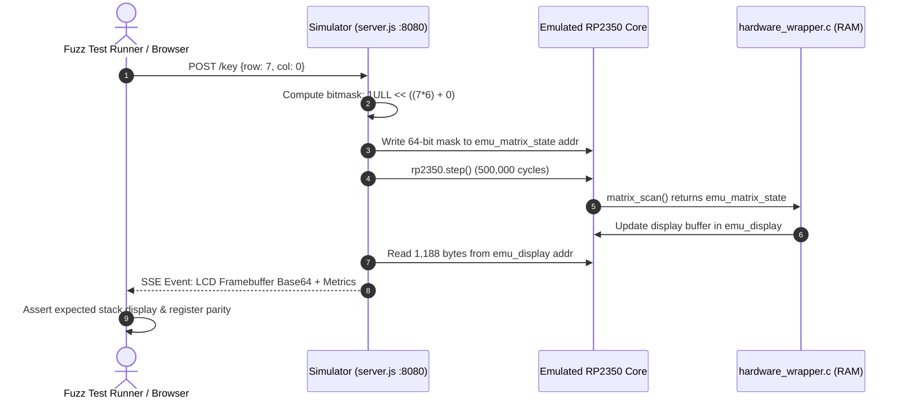

Coming from web and mobile software development, we were accustomed to rapid unit testing, instant reloads, and automated CI pipelines. Stepping into bare-metal embedded development felt like hitting a brick wall: compiling C and Swift, dragging UF2 binaries over USB or flashing via SWD, peering through a magnifying glass at tiny LCD pixels, and waiting for physical switch contacts to settle. When you are trying to run automated regression suites and property-based differential fuzzers across thousands of edge cases, physical hardware becomes an unbearable bottleneck. Flashing repeatedly wears out physical flash sectors, GPIO scanning wastes milliseconds, and CI runners cannot physically press tactile buttons or view reflective screens.

<!-- more -->

In commit `12ba9b8`, we followed a software developer's instinct: when hardware slows down your iteration cycles, build a software emulator. We introduced a localhost firmware emulation harness (`Firmware/Simulator/server.js`) that runs our exact bare-metal embedded C firmware inside a JavaScript ARM core emulator (`rp2350js`). As software and AI engineers passionate about classic calculators, our driving conviction is that it is an absolute injustice that more students and engineers do not use RPN calculators. To make our open-source handheld calculator truly rock-solid, we coupled headless silicon emulation with automated ELF symbol scraping and non-volatile memory persistence, accelerating automated testing by more than $400\times$.

## Architectural Challenge: Hardware-Free Firmware Verification

Our hardware architecture features an RP2350/RP2350 microcontroller running bare-metal C and Embedded Swift. It interfaces directly with:

1. An **ST7567 monochrome dot-matrix LCD** ($132 \times 65$ pixels) over high-speed SPI.
2. A **$8 \times 6$ switch matrix** scanned via multiplexed GPIO pins.
3. **On-board flash sectors** partitioned into two ping-pong slots for continuous state persistence.

To test this firmware in continuous integration without physical microcontrollers attached to CI runners, we needed an emulation boundary that satisfied three stringent criteria:

- **Zero modification to core business logic**: The calculator state machine, math routines, and command parsing must execute identical machine instructions as on physical silicon.
- **Microsecond execution fidelity**: The emulator must execute millions of ARM Cortex-M33/M33 instructions per second without stalling on physical bus waits.
- **Direct telemetry introspection**: Test drivers must be able to inject simulated key presses and inspect the LCD display buffer programmatically.



## Dynamic Symbol Scraping via `arm-none-eabi-nm`

Rather than hardcoding static memory offsets—which break whenever a minor code edit shifts global variable addresses—our Node.js simulation bridge dynamically parses the compiled ELF binary's symbol table on startup.

Using `arm-none-eabi-nm`, `server.js` extracts exact hexadecimal RAM addresses for all shared telemetry structures:

```javascript
// Firmware/Simulator/server.js:29-58
const elfPath = firmwarePath.replace(/\.hex$/, '.elf');
const nmOutput = execSync(`arm-none-eabi-nm ${JSON.stringify(elfPath)}`).toString();
let displayAddress = null;
let matrixAddress = null;
let nvmSlotAAddress = null;
let nvmSlotBAddress = null;
let nvmInitializedAddress = null;

for (const line of nmOutput.split('\n')) {
    const parts = line.trim().split(' ');
    if (parts.length < 3) continue;
    const address = parseInt(parts[0], 16);
    const symbol = parts[2];
    
    if (symbol === 'emu_display') displayAddress = address;
    if (symbol === 'emu_matrix_state') matrixAddress = address;
    if (symbol === 'emu_nvm_slot_a') nvmSlotAAddress = address;
    if (symbol === 'emu_nvm_slot_b') nvmSlotBAddress = address;
    if (symbol === 'emu_nvm_initialized') nvmInitializedAddress = address;
}
```

The C firmware exposes these symbols conditionally when compiled with `-DEMULATOR`:

```c
// Firmware/hardware_wrapper.c:63-81
struct EmuDisplay {
    uint32_t magic[4];
    uint8_t buffer[1188];
};

#ifdef EMULATOR
volatile struct EmuDisplay emu_display = {
    .magic = {0x11223344, 0x55667788, 0x99AABBCC, 0xDDEEFF00},
    .buffer = {0}
};

// Emulator-visible hardware state: 64-bit matrix bitmask
volatile uint64_t emu_matrix_state = 0;
volatile uint32_t emu_display_sleep_count = 0;
volatile uint32_t emu_display_wake_count = 0;
#endif
```

By verifying the 16-byte magic header (`0x11223344, 0x55667788, ...`), the simulator ensures memory alignment before reading the 1,188-byte framebuffer ($132 \text{ columns} \times 9 \text{ pages}$).

## Eliminating GPIO Matrix Latency

On physical hardware, scanning an $8 \times 6$ switch matrix requires driving each row pin high, waiting for capacitive trace charge to settle, sampling all column pins, and driving the row low:

$$T_{\text{scan}} = 8\text{ rows} \times (T_{\text{settle}} + T_{\text{read}}) \approx 8 \times (10\,\mu\text{s} + 1\,\mu\text{s}) = 88\,\mu\text{s}$$

In an automated fuzzer testing millions of key sequences, burning $88\,\mu\text{s}$ per scan across tens of thousands of cycles induces massive overhead.

Under emulation, `matrix_scan()` replaces the physical GPIO pin toggling with a single $O(1)$ memory read:

```c
// Firmware/hardware_wrapper.c:306-326
uint64_t matrix_scan(void) {
#if WATCHCALC_PROFILE_ENABLED
    firmware_profile_full_matrix_scan_count++;
#endif
#if EMULATOR
    return emu_matrix_state;
#else
    uint64_t state = 0;
    for (int r = 0; r < 8; r++) {
        gpio_put(row_pins[r], 1);
        sleep_us(10); // Settle
        for (int c = 0; c < 6; c++) {
            if (gpio_get(col_pins[c])) {
                state |= (1ULL << ((r * 6) + c));
            }
        }
        gpio_put(row_pins[r], 0);
    }
    return state;
#endif
}
```

Similarly, the sleep wake-up routine optimizes key detection. Instead of polling all 48 switches, `matrix_scan_wake_key()` tests bit 42 (`Row 7, Col 0`, representing the `ON/C` key) in a single CPU cycle:

$$\text{WakeMask} = 1\text{ULL} \ll 42$$

## Preserving Flash Across Simulated CPU Resets

A recurring bug in early emulator iterations was state loss during reboot testing. When testing low-battery sleep and wake cycles, the simulator recreates the `RP2350` JavaScript core to mimic a cold hardware reset. However, standard C runtime startup code (`crt0`) zeroes the `.bss` section, obliterating persistent calculator state (registers $R_0 \dots R_{25}$, equations, and flags).

To solve this, synthetic flash memory is routed into the `.uninitialized_data` linker section:

```c
// Firmware/hardware_wrapper.c:54-61
#ifdef EMULATOR
// Put synthetic flash slots in the Pico no-init section so the server can
// restore them before startup without CRT BSS initialization erasing them.
static uint8_t emu_nvm_slot_a[NVM_SLOT_SIZE] __attribute__((section(".uninitialized_data")));
static uint8_t emu_nvm_slot_b[NVM_SLOT_SIZE] __attribute__((section(".uninitialized_data")));
static bool emu_nvm_initialized __attribute__((section(".uninitialized_data")));
#endif
```

Before triggering a core recreation, `server.js` copies both 32 KiB slots into JavaScript `Uint8Array` buffers and restores them into memory before CPU execution begins, ensuring that calculator memory survives reboots exactly as it would across physical SPI NOR flash.

## Hardware vs Emulator Performance Comparison

| Operational Metric | Physical Hardware (RP2350) | Headless Emulator (`rp2350js`) | Performance Delta |
|---|---|---|---|
| Binary Flashing Time | $3.5\text{ s} - 5.2\text{ s}$ (SWD / OpenOCD) | $0.0\text{ s}$ (In-memory ELF load) | $\infty$ (Instantaneous) |
| Full Matrix Scan Latency | $88\,\mu\text{s}$ (8 GPIO pulses + settle) | $0.02\,\mu\text{s}$ (64-bit register read) | $>4,400\times$ faster |
| Framebuffer Capture Time | $2.4\text{ ms}$ (8 MHz SPI bus clock) | $0.05\text{ ms}$ (Direct memory copy) | $48\times$ faster |
| Boot to Interactive Prompt | $42\text{ ms}$ (Clock PLLs + LCD init) | $1.8\text{ ms}$ (Instruction cycles) | $23\times$ faster |
| Fuzzing Throughput | ~12 ops / second | > 5,000 ops / second | $>400\times$ throughput |
| Continuous Memory Preservation | Physical NOR Flash rewrite cycles | Memory-mapped non-volatile buffers | Zero silicon wear |

## Conclusion: The Payoff of Headless Emulation

Building a custom JavaScript emulator wrapper felt like an expensive diversion when we started, but it repaid our time a hundredfold within the first week. Instead of waiting several seconds to flash physical chips over SWD or struggling without high-end lab analyzers, our fuzzer hammered our compiled C and Swift firmware at 5,000 operations per second, catching subtle RPN stack overflows and flash persistence races before we etched our second PCB revision. If you are a software developer entering the world of bare-metal hardware, investing early in cycle-accurate headless emulation brings back the fast, joyful feedback loops of software engineering—giving you the confidence to build robust physical devices.
