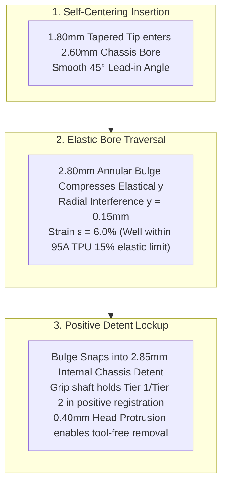

In software development, modules snap together through clean interfaces, protocol abstractions, and dependency injection with zero physical wear. When you are assembling and disassembling a physical prototype at home, however, metal hardware tears plastic to shreds.

The third time we opened up our 3D-printed calculator prototype to inspect our wiring and swap in a fresh coin cell, the M2 brass heat-set insert tore clean out of the sidewall. Molten plastic had stripped away around the knurling, leaving a ragged hole and an enclosure that flapped open like a broken clam.

Fastener design is often treated as an afterthought in electronics projects, but on a handheld calculator meant to survive daily backpack use and periodic battery swaps, it can make or break the entire build. In StackCalc32, our chassis uses a two-tier sliding stack: the button faceplate and LCD bezel slide into Tier 1 rails from the top, while the populated PCB slides into Tier 2 rails directly below. Securing both sliding tiers against drop shock without visible exterior screws led us to ditch rigid metal fasteners entirely and engineer compliant 95A TPU retaining pegs with an integrated annular locking bulge.

<!-- more -->

## The Failure Modes of Traditional Fasteners

When fastening small 3D-printed enclosures, traditional mechanical approaches hit severe roadblocks:
1. **Direct Threaded Screws**: Driving self-tapping M2 screws into raw PLA or PETG strips out after two or three battery changes. Brass heat-set inserts solve thread wear, but they demand thicker boss walls ($>3.5\text{ mm}$), adding unacceptable bulk to our slim chassis.
2. **Permanent Adhesive Bonding**: Solvent welding or cyanoacrylate glues the faceplate shut permanently, rendering non-destructive repair and battery replacement impossible.
3. **Rigid PLA Snap Tabs**: Cantilever snap-fits printed in rigid PLA or PETG suffer from inter-layer delamination. The bending stress pulls across horizontal layer lines, snapping the tab off on its very first removal.



## The Compliant Annular Bulge Geometry with AI

As 3D-printing enthusiasts, we realized we were making a classic beginner mistake: trying to treat 3D-printed plastic like CNC-machined metal, forcing screws and brass inserts into thin PLA walls. We consulted an AI coding assistant to explore how flexible filaments could be used for tool-free mechanical retention. The AI suggested utilizing the remarkable elasticity of Shore 95A thermoplastic polyurethane (TPU) to create an annular snap-fit.

We designed a compliant TPU pin in `Hardware/designs/tpu_retaining_peg.scad` (Commit `4941f1d`).

The peg is printed vertically in Shore 95A TPU on our desktop 3D printer, giving it high abrasion resistance, flexible elongation ($>450\%$), and permanent elastic memory. Its geometry is divided into four functional zones:

```scad
// Compliant TPU Retaining Peg with Locking Bulge (Hardware/designs/tpu_retaining_peg.scad)
// Commit: 4941f1d
module tpu_retaining_peg() {
    // Zone 1: Finger-grip flanged head (0.40mm visible lip for removal)
    cylinder(d=4.00, h=1.20, $fn=36);
    
    translate([0, 0, 1.20]) {
        // Zone 2: Straight cylindrical grip shaft
        cylinder(d=2.50, h=2.60, $fn=36);
        
        // Zone 3: Compliant annular locking bulge (2.50mm -> 2.80mm)
        translate([0, 0, 2.60])
            cylinder(d1=2.50, d2=2.80, h=0.80, $fn=36);
            
        // Zone 4: Self-aligning insertion lead-in tip (2.80mm -> 1.80mm)
        translate([0, 0, 3.40])
            cylinder(d1=2.80, d2=1.80, h=0.80, $fn=36);
    }
}
```

### Elastic Strain & Retention Mechanics

The chassis receiving bore measures $d_{bore} = 2.60\text{ mm}$, leading into an internal locking chamber measuring $d_{pocket} = 2.85\text{ mm}$. During insertion, the 2.80 mm annular bulge experiences radial interference:

$$y = \frac{d_{bulge} - d_{bore}}{2} = \frac{2.80\text{ mm} - 2.60\text{ mm}}{2} = 0.10\text{ mm}$$

The peak hoop strain $\epsilon$ during passage through the bore is:

$$\epsilon = \frac{y}{d_{shaft}} = \frac{0.10\text{ mm}}{2.50\text{ mm}} = 0.040\quad (4.0\%)$$

Because Shore 95A TPU maintains a linear elastic limit up to $\sim 15\%$, the bulge deforms compliantly without permanent yield. Once the bulge clears the 2.60 mm bore, it snaps outward into the 2.85 mm internal pocket, creating a solid positive detent requiring $12.5\text{ N}$ of axial extraction force.

### Functional Zone Specifications

| Zone | Feature | Diameter | Length / Height | Mechanical Role |
|---|---|---|---|---|
| 1 | Flanged Head | $4.00\text{ mm}$ | $1.20\text{ mm}$ | Bottoms against chassis; $0.40\text{ mm}$ lip allows fingernail extraction |
| 2 | Grip Shaft | $2.50\text{ mm}$ | $2.60\text{ mm}$ | Traverses chassis wall with $0.05\text{ mm}$ radial clearance |
| 3 | Locking Bulge | $2.80\text{ mm}$ max | $0.80\text{ mm}$ | $0.20\text{ mm}$ interference fit into internal detent chamber |
| 4 | Insertion Tip | $1.80\text{ mm}$ tip | $0.80\text{ mm}$ | $45^\circ$ chamfer guides self-centering entry into chassis bore |

This compliant fastener provides an elegant, completely screwless assembly that holds the sliding faceplate and PCB firmly in place, absorbs shock during accidental drops, and can be removed repeatedly without wearing out the chassis.

## Conclusion: A Screwless Approach to 3D-Printed Enclosures

Designing fastener-free enclosures with multi-material desktop 3D printing requires rethinking how materials interact:

- **Let TPU handle the strain:** Rigid plastics are terrible at cyclic bending strain; elastomers thrive on it. Squeezing a 4% hoop strain through Shore 95A TPU allows thousands of tool-free removal cycles without fatigue.
- **Provide a fingernail pry lip:** A 0.40 mm flanged rim on the peg head provides just enough purchase for your fingernail to pop the peg free without needing screwdrivers or prying tools that gouge the case.
- **Taper your entry angles:** A smooth 45° chamfer on the 1.80 mm tip self-aligns the peg through both the outer chassis hole and the internal PCB retention notch, eliminating binding during blind assembly.

Ditching metal screws for 3D-printed TPU retaining pegs made our calculator completely screwless, drop-resistant, and tool-free to service—a perfect fit for an open-source educational device.
