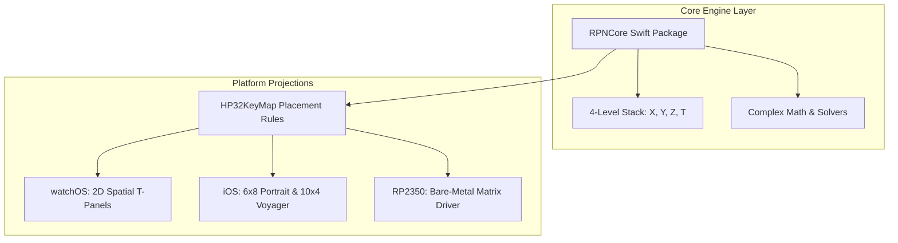

# Why We Started With The Apple Watch (Part 1: The Screen Real-Estate Equation)

Try typing an equation into the default Apple Watch calculator with adult human thumbs. You reach over with your right index finger, aim for the `7`, and end up tapping `4`, `8`, and `CLEAR` all in the span of three agonizing seconds. Now imagine strapping a full Hewlett-Packard HP-48GX or HP-32SII—with its forest of forty-plus buttons, shift keys, and complex exponents—onto your wrist. It sounds like an engineering dare, or pure masochism.

As a software and AI developer, my native comfort zone has always been high-level software, reactive state machines, and modern mobile platforms. Traditional hardware projects typically start on the breadboard: wire up a microcontroller, write a quick C loop, 3D-print a rough enclosure, and maybe, months later, hack together a mobile companion app as an afterthought.

With StackCalc32, we deliberately inverted the entire pipeline: we wrote our very first line of production code for watchOS.

Starting a full scientific RPN calculator on a wearable screen with barely $176\text{ pt}$ of horizontal elbow room felt insane. But from an architectural standpoint, the Apple Watch was our crucible. If we could make a 120-function RPN engine feel effortless, blisteringly fast, and impossible to fat-finger on a 40mm OLED face, then scaling up to the spacious canvas of an iPhone or a physical RP2350 PCB would be pure gravy. More importantly, as someone who believes it's an injustice that RPN isn't in every student's and engineer's pocket, putting a tactile RPN stack directly on the wrist was the ultimate proof of concept before routing a single physical PCB trace.

<!-- more -->

## Starting the Engine From Scratch

Our initial instinct was to save time by pulling in battle-tested open-source RPN engines like C47 or Free42. These projects are incredible testaments to the community and have decades of numerical pedigree. We figured we could just wrap them in a modern SwiftUI shell and call it a day.

However, as an open-source project ourselves, integrating existing GPL-licensed emulation cores posed significant licensing risks we didn't want to take. Furthermore, utilizing proprietary calculator ROM images from vintage hardware is legally problematic. The maintainers of those legacy projects have put a massive amount of effort into their codebases, and while wrapping their C engines might have worked technically, we ultimately needed a clean-room implementation to ensure our project remained free of encumbrances. 

Instead of dealing with restrictive licenses or questionable ROM dumps, we opted to simply use the original vintage calculator user manual as our sole specification to find and implement all the functions.

We built `RPNCore` entirely from scratch as a pure Swift package. The engine knows nothing about UIKit, SwiftUI, pixels, or screen coordinates. It processes inputs and yields state entirely through clean, deterministic structs (`CalculatorValue`, `CalculatorOperation`, `ShiftState`):



## The Screen Real-Estate Equation

Look at the physical geometry: an Apple Watch Series 8 (41mm) gives you an active screen canvas of $352 \times 430\text{ pixels}$ ($176 \times 215\text{ pt}$). A classic HP calculator faceplate has a tall, slender vertical aspect ratio of roughly 2:1. The Apple Watch screen is squarish—nearly 1.2:1.

If you try to draw a standard calculator keypad, your buttons turn into unusable microscopic dots. To keep typography readable and buttons punchable, we locked the viewport into strict geometric budgets inside `ContentView.swift`:

```swift
// StackCalc32/Views/ContentView.swift:206-224
GeometryReader { geo in
    let totalHeight = geo.size.height
    let toolbarHeight = max(26, totalHeight * 0.12)
    // Reserve 25% of the face for the high-contrast LCD header
    let displayHeight = totalHeight * 0.25
    let displayDividerHeight: CGFloat = 3
    
    ZStack(alignment: .top) {
        VStack(spacing: 0) {
            lcdDisplay(totalHeight: totalHeight)
                .frame(height: displayHeight)
                .focusable()
                .focused($isFocused)
            
            Rectangle()
                .fill(Color.white.opacity(0.15))
                .frame(height: 1)
                .padding(.horizontal, 4)
                .padding(.bottom, 2)

            BottomNumpadView(
                horizontalPage: $horizontalPage,
                verticalPage: $verticalPage
            )
        }
    }
}
```

By strictly reserving 25% of the vertical display for the LCD status area, we preserve enough room for a 12-character mantissa, exponent annunciators, and our 29×15 pt spatial minimap without squishing the numbers. The bottom 75% of the glass remains an unobstructed strike zone for $38 \times 28\text{ pt}$ touch targets.

## Display Density Across Apple Watch Hardware Classes

Because we anchored our UI to proportional geometry instead of hardcoded pixel offsets, the keypad automatically stretches and breathes across every watch generation in Apple's lineup:

| Apple Watch Hardware | Usable Width | Usable Height | LCD Height (25%) | Key Target Area (Numeric) | HIG 44pt Compliance |
|---|---|---|---|---|---|
| **38mm (Series 3)** | 136 pt | 170 pt | 42.5 pt | $32.0 \times 23.5\text{ pt}$ | Moderate (Requires 2D paging) |
| **40mm (Series 4–6, SE)** | 162 pt | 197 pt | 49.2 pt | $38.5 \times 27.5\text{ pt}$ | High ($> 1000\text{ pt}^2$ area) |
| **41mm (Series 7–9)** | 176 pt | 215 pt | 53.7 pt | $42.0 \times 30.2\text{ pt}$ | Full ($> 1250\text{ pt}^2$ area) |
| **44mm (Series 4–6, SE)** | 184 pt | 224 pt | 56.0 pt | $44.0 \times 31.5\text{ pt}$ | Full ($> 1380\text{ pt}^2$ area) |
| **45mm (Series 7–9)** | 198 pt | 242 pt | 60.5 pt | $47.5 \times 34.0\text{ pt}$ | Exceeds HIG target |
| **49mm (Ultra 1 & 2)** | 210 pt | 255 pt | 63.7 pt | $50.5 \times 36.0\text{ pt}$ | Exceeds HIG target |

Building for the watch first stripped away every scrap of UI laziness. In Part 2, we dive into the physical biomechanics of the wrist: how RPN eliminates the dreaded "gorilla arm" effect during marathon bench calculations.

## Conclusion: Why the Wrist Defined the Architecture

Designing for the smallest screen first saved this project from becoming another bloated software emulator. When every square point of OLED glass is contested territory, you cannot hide behind sloppy abstractions or sluggish C loops. By enforcing strict proportional geometry and separating our pure Swift engine (`RPNCore`) from UI rendering, we laid a foundation that effortlessly scales to an iPhone screen or a raw SPI LCD on our RP2350 prototype. If it flies on the watch, it flies everywhere.
