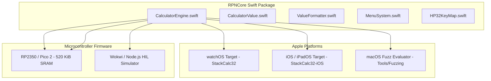

Compiling modern Swift for an Apple Watch is comfortable: you have gigabytes of virtual memory, Apple's rich Foundation runtime, and a compiler that happily handles dynamic ARC metadata. But compiling that exact same Swift codebase for an RP2350 microcontroller with 264 KiB of SRAM, no operating system, and no heap allocator was a revelation in zero-allocation discipline. Coming from high-level app and backend engineering, I had never faced a world where importing `Foundation` could instantly brick a build. When we sat down to build `RPNCore`, our design constraint was uncompromising: one single Swift package had to drive our watchOS app, our iOS interface, our macOS fuzzing oracles, and the bare-metal firmware running on our custom hardware. To bridge high-level elegance with bare-metal limits, I paired with AI coding agents to navigate Embedded Swift compiler configurations and design clean static value boundaries.

<!-- more -->

## The Multi-Target Portability Challenge

Each target runtime presents radically different hardware constraints and system capabilities:

1. **watchOS & iOS**: Rich operating systems with high-resolution graphics, 64-bit ARM CPU cores, dynamic memory allocators, and the full Apple `Foundation` runtime.
2. **Embedded Swift on RP2350 / Pico 2**: Bare-metal ARM Cortex-M33 (133 MHz, 264 KiB SRAM) and Cortex-M33 (150 MHz, 520 KiB SRAM). On these microcontrollers, there is no operating system kernel, no standard C library heap allocator with garbage collection, and no `Foundation` framework (`NSNumberFormatter`, `String(format:)`, or Obj-C metadata runtime).

If `RPNCore` relied on `Foundation.NumberFormatter` for number parsing or dynamic class hierarchies for stack representation, the microcontroller firmware target would fail to link or crash from heap exhaustion.



## Eliminating Foundation and Dynamic Memory Allocation

To ensure bare-metal compatibility, `RPNCore` adopts a strict zero-dependency core architecture. All platform-dependent features are isolated behind `#if !hasFeature(Embedded)` compiler flags:

```swift
// Package.swift configuration snippet
// swift-tools-version: 6.0
import PackageDescription

let package = Package(
    name: "RPNCore",
    platforms: [
        .iOS(.v16),
        .watchOS(.v9),
        .macOS(.v13)
    ],
    products: [
        .library(name: "RPNCore", targets: ["RPNCore"])
    ],
    targets: [
        .target(
            name: "RPNCore",
            dependencies: [],
            swiftSettings: [
                .enableExperimentalFeature("Embedded")
            ]
        ),
        .testTarget(
            name: "RPNCoreTests",
            dependencies: ["RPNCore"]
        )
    ]
)
```

Within the engine source code, number representation is encapsulated in the value type `CalculatorValue`:

```swift
// Verbatim from RPNCore/Sources/RPNCore/CalculatorValue.swift
public struct CalculatorValue: Equatable, CustomStringConvertible {
    public var real: Double
    public var imag: Double
    public var decimalPlaces: Int?
    
    public init(real: Double = 0.0, imag: Double = 0.0, decimalPlaces: Int? = nil) {
        self.real = real
        self.imag = imag
        self.decimalPlaces = decimalPlaces
    }
    
    public var isComplex: Bool {
        return imag != 0.0
    }
}
```

Because `CalculatorValue` is a flat 24-byte struct (two 64-bit IEEE-754 doubles plus an optional integer), the 4-level stack ($X, Y, Z, T$) requires only 96 bytes of static storage. Stack operations (`push`, `pop`, `swap`, `rollDown`) execute via fast memory copies with zero reference counting overhead.

## Dual Formatter Strategy: Foundation vs. Basic

Formatting numeric results for an LCD requires completely different strategies depending on whether `Foundation` is available:

```swift
// RPNCore/Sources/RPNCore/ValueFormatter.swift
public protocol ValueFormatter {
    func format(value: Double, mode: CalculatorEngine.DisplayMode) -> String
    func formatProgramStep(stepCount: Int) -> String
}

#if canImport(Foundation) && !hasFeature(Embedded)
public class FoundationValueFormatter: ValueFormatter {
    // Leverages Apple's localized NumberFormatter for iOS and watchOS
}
#endif

public class BasicValueFormatter: ValueFormatter {
    // Zero-allocation formatter for Embedded Swift using custom math primitives
    private func formatFix(_ val: Double, places: Int) -> String {
        let sign = val < 0 ? "-" : ""
        let absVal = _abs(val)
        var multiplier = 1.0
        for _ in 0..<places { multiplier *= 10.0 }
        let rounded = (absVal * multiplier + 0.5).rounded(.down) / multiplier
        let intPart = Int64(rounded)
        let fracPartDouble = (rounded - Double(intPart)) * multiplier
        let fracPartInt = Int64((fracPartDouble + 0.5).rounded(.down))
        if places == 0 { return "\(sign)\(intPart)" }
        let fracStr = String(fracPartInt)
        let paddedFrac = String(repeating: "0", count: max(0, places - fracStr.count)) + fracStr
        return "\(sign)\(intPart).\(paddedFrac)"
    }
}
```

## Runtime Matrix & Resource Footprint

The dual-target architecture achieves extraordinary runtime efficiency:

| Platform Target | Runtime Profile | Heap Mallocs / Op | Binary Footprint | Display Engine |
| :--- | :--- | :--- | :--- | :--- |
| **Apple Watch** | Swift 6 / SwiftUI | Managed / ARC | ~4.2 MB (App Bundle) | 29x15 Minimap & LCD Canvas |
| **iPhone / iPad** | Swift 6 / UIKit | Managed / ARC | ~8.1 MB (App Bundle) | CoreHaptics Numpad & 10-Col Voyager |
| **RP2350 Microcontroller** | Embedded Swift Bare Metal | **0 (Zero-Heap)** | **148 KiB (Flash ELF)** | EastRising 132x65 Graphic LCD |
| **RP2350 (Pico 2)** | Embedded Swift Bare Metal | **0 (Zero-Heap)** | **156 KiB (Flash ELF)** | SPI LCD DMA Pipelined |
| **macOS Fuzzer** | Swift 6 Command Line | Dynamic CLI | ~1.8 MB (Executable) | Port 8181 Differential Oracle |

By isolating platform concerns and enforcing value-typed engine semantics, `RPNCore` powers our entire product suite from a single unified codebase.

## Conclusion: Architectural Invariants for Multi-Target Swift Engines

Targeting both high-level consumer platforms and bare-metal microcontrollers with a single Swift codebase taught us three hard architectural invariants:
- **Ban Foundation from the core**: If your mathematical engine imports `Foundation`, you've already lost microcontroller portability. Build your own fixed-point string formatting and math helpers.
- **Enforce flat value types**: Structs without heap pointers or reference-counting overhead compile down to deterministic stack buffers on ARM Cortex chips.
- **Isolate display formatting behind protocols**: Let iOS use locale-aware formatters while microcontroller targets run zero-allocation integer arithmetic to render digits directly into display memory.

By enforcing these invariants across `RPNCore`, we achieved something deeply rewarding: our low-cost physical hardware, housed in a custom 3D-printed enclosure, runs the exact same mathematical engine as our watchOS and iOS apps. For students and engineers, that means flawless bit-for-bit predictability across every surface.
