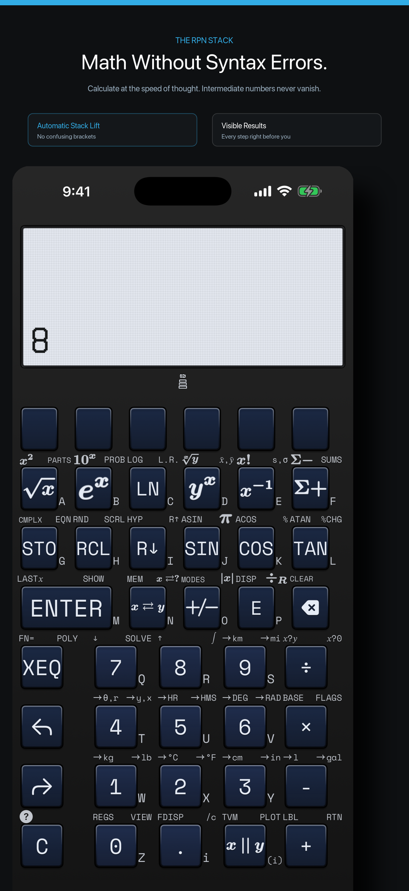

The current StackCalc prototype is a 3D-printed, tool-free mechanical assembly. Its RP2350 calculator PCB design is in fabrication, but no board has yet been assembled and powered, so we cannot yet make claims about powered bring-up, battery life, display behavior, or key feel on the finished electronics.

That is why the firmware simulator is useful. It gives us a fast way to exercise the calculator software and its proposed row-and-column interface while the physical electronics are still being developed. It is evidence about the simulated build, not evidence that a physical PCB works.

<!-- more -->

## A browser window connected to simulated firmware

The browser simulator shell is deliberately thin. It draws the calculator and creates its keypad from the shared firmware key map. A press becomes a row-and-column contact sent to the local simulator service.

That service loads the simulator-specific firmware build into an RP2350 emulator. It advances the emulated processor, exposes its matrix state, and reads the firmware display buffer. Changed 132×65 frames stream back to the browser. This lets us inspect the relationship between a key-map entry, calculator state, and the firmware-rendered display without wiring a board.


## What we use it for

The simulator is most valuable for short, repeatable checks while hardware is in motion:

- confirming that a key-map entry reaches the firmware as the intended matrix contact;
- replaying RPN input sequences against the shared calculator engine;
- checking that a changed calculator state produces a display frame; and
- exercising reset and continuous-memory paths in the simulator build.

It also keeps the firmware-facing keypad work connected to the companion apps, which share the calculator core. The [iPhone app is available on the App Store](https://apps.apple.com/app/id6801788040), while the hardware project and its mechanical files are being documented on [Hackaday](https://hackaday.io/project/206743-stackcalc32-a-tactile-rpn-calculator).

## What remains for the physical build

Simulation does not replace an assembled PCB. The next hardware work is board population, electrical display bring-up, power measurements, and physical switch integration. Mechanical keypad work is documented separately. We will publish those results as physical specimens are built and measured.

## Follow one key from the browser to the firmware

The simulator is useful because it does not stop at a drawn keypad. Its browser shell loads the firmware key manifest, turns a pressed key into a matrix row and column, writes that contact into the RP2350 emulator, and streams the firmware framebuffer back to the page. The loop is deliberately direct:

```text
matrix contact → compiled firmware → 132 × 65 framebuffer → browser display
```

That gives a debugging session a fixed route. If `3 ENTER 4 /` looks wrong, we can first inspect the core’s state, then the matrix contact, then the firmware display buffer. The same sequence can be replayed in the shipping app, which is much more useful than trying to infer behavior from a polished mock screen.

The emulator also preserves continuous-memory slots across a simulated reset. That lets us check restart and stored-state paths while the board is being fabricated, alongside ordinary calculator entry. The browser is not a substitute for a Pico 2 on the bench, but it is the place where keypad mapping, display layout, and state persistence meet before that bench work starts.



For a printable explanation of the same stack behavior, see the [Stack Stage materials](../../learning-lab.md#download-the-prototype-materials). The handheld’s current mechanical configuration is documented in the [hardware guide](../../hardware.md).
