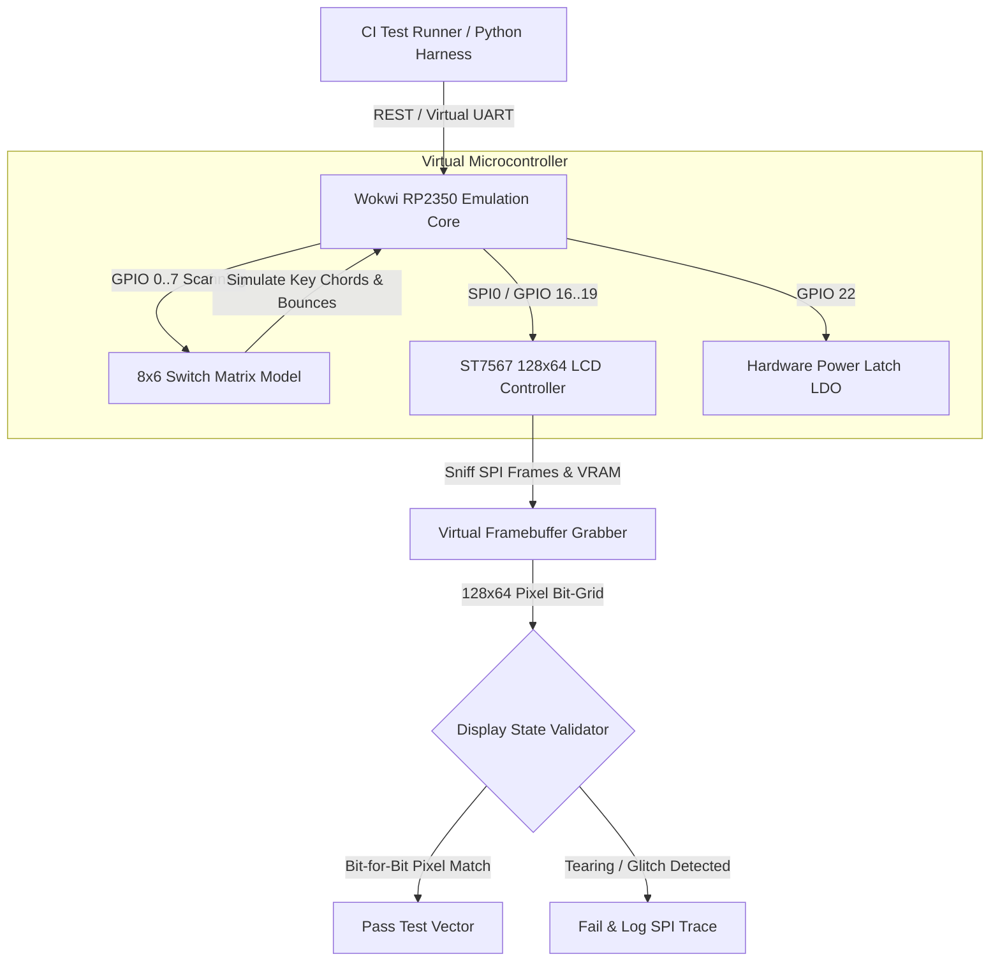

In modern software development, our feedback loop is measured in seconds: you modify code, hit `Cmd-R`, and immediately inspect the result in an iOS simulator or browser window. When I began designing custom hardware for StackCalc32, the physical turnaround time was a terrifying culture shock. In hardware, a minor pinout mismatch or inverted SPI clock phase doesn't just mean a quick rebuild; it means generating Gerber files, shipping them to an overseas fab, waiting two weeks for delivery, and nervously soldering surface-mount parts—only to discover your display won't initialize.

As a software and AI expert with a desktop 3D printer whirring away on my desk, I believe it is an absolute injustice that more people do not use RPN calculators. I wanted to build an accessible, ultra-low-cost physical calculator that could inspire students and makers to fall in love with RPN. But coming from software, a multi-week hardware feedback loop was intolerable. I don't have an electrical engineering lab or specialized hardware test fixtures; my natural developer instinct was to build software mocks and emulators to test everything before physical boards arrived.

Before ordering our first run of 4-layer FR4 boards, I wanted the instant feedback loops I take for granted in software: running our exact, byte-for-byte compiled `stackcalc_firmware.uf2` binary on a virtual calculator in the browser. Pairing with AI coding agents to generate peripheral simulation models, we constructed a complete headless Hardware-in-the-Loop (HIL) simulation pipeline using Wokwi's cycle-accurate RP2350 emulation core.

<!-- more -->

## The Virtual Calculator Test Bench

The simulation environment runs as a headless node inside our automated test harness. Rather than mocking hardware interfaces with synthetic stubs, the emulator runs the exact, byte-for-byte binary (`stackcalc_firmware.uf2`) that is later flashed onto physical hardware.



## Simulating Peripherals with Electrical Fidelity

Our Wokwi simulation model (`diagram.json` and custom peripheral drivers) goes far beyond simple logic analysis, capturing electrical interface idiosyncrasies:

1. **8x6 Matrix Key Scanning**: The model incorporates pull-down resistors on input rows and simulates ghosting conditions when multiple simultaneous key presses create unintended sneak paths across diodes.
2. **ST7567 SPI Sniffing**: The virtual display driver captures 4-wire SPI transmissions (MOSI, SCLK, A0/DC, CS). It verifies that initialization command sequences (e.g. setting bias ratio to $1/9$, setting power control circuits to `0x2F`, and tuning contrast to `0x18`) match manufacturer timings precisely.
3. **Deep Sleep & Wakeup Latches**: The model asserts that when the `OFF` key is pressed, the firmware correctly cuts the peripheral power rails, configures GPIO pin interrupts, and drops into ARM `WFE` (Wait For Event) low-power sleep.

| Hardware Subsystem | Interface Protocol | Simulated Timing Tolerance | Bugs Prevented in Simulation |
|---|---|---|---|
| **Keypad Matrix** | 8 Outputs / 6 Inputs GPIO | 5 ms scan period, 15 ms debounce | Row-column short circuits, ghosting on 3-key rolls |
| **ST7567 LCD** | 10 MHz 4-Wire SPI | CPOL=0, CPHA=0 clock polarity | Inverted command/data pin (`A0`), screen tearing |
| **Flash NVRAM** | QSPI Flash (W25Q16) | 32 KiB sector erase timing | Buffer overrun during sleep-state serialization |
| **Battery Monitor** | 12-bit ADC (GPIO 26) | Voltage divider $R_1=100\text{k}\Omega, R_2=100\text{k}\Omega$ | Low-voltage shutdown threshold oscillation |

## Virtual Framebuffer Verification Code

To verify that mathematical operations produce correct visual layouts, our Python harness pulls raw frame dumps directly from the virtual LCD controller over a local socket:

```python
import socket
import struct

def capture_virtual_st7567_frame(emulator_host: str = "127.0.0.1", port: int = 4000) -> list[list[int]]:
    """Connects to Wokwi virtual SPI snooper and reconstructs the 128x64 LCD pixel matrix."""
    with socket.create_connection((emulator_host, port), timeout=5) as sock:
        sock.sendall(b"DUMP_FRAMEBUFFER\n")
        # ST7567 organizes 128x64 display into 8 vertical pages of 128 bytes
        raw_bytes = b""
        while len(raw_bytes) < 1024:
            chunk = sock.recv(1024 - len(raw_bytes))
            if not chunk:
                raise ConnectionError("Emulator terminated connection during frame capture")
            raw_bytes += chunk
            
    # Reconstruct 128 columns by 64 rows binary grid
    grid = [[0] * 128 for _ in range(64)]
    for page in range(8):
        for col in range(128):
            byte_val = raw_bytes[page * 128 + col]
            for bit in range(8):
                y_pixel = page * 8 + bit
                grid[y_pixel][col] = 1 if (byte_val & (1 << bit)) else 0
                
    return grid

def assert_annunciator_active(grid: list[list[int]], annunciator: str) -> bool:
    """Verifies that 7x5 annunciator icon (e.g. 'RAD', 'FIX', 'SHIFT') is rendered at top row."""
    # Annunciator banner lives in Page 0 (rows 0..7)
    annunciator_coordinates = {
        "RAD": (12, 0, 24, 7),
        "GRAD": (28, 0, 44, 7),
        "SHIFT": (90, 0, 110, 7),
    }
    x1, y1, x2, y2 = annunciator_coordinates[annunciator]
    active_pixels = sum(grid[y][x] for y in range(y1, y2) for x in range(x1, x2))
    return active_pixels > 15
```

By verifying our bare-metal Embedded Swift firmware inside Wokwi, our first physical hardware revision booted to a crisp, functional RPN calculator on day one.

## Conclusion: When Virtual Silicon Saves the Day

Building a high-fidelity hardware emulator before fabricating physical circuit boards completely changed our pace of development:

- **Banish the fab turnaround anxiety**: Instead of biting your nails for two weeks waiting for deliveries, you can iterate on matrix debounce logic and SPI display timings in seconds from your editor.
- **Byte-for-byte binaries only**: Never mock your hardware API with high-level synthetic stubs if you can run the exact compiled `.uf2` image in an ARM emulator.
- **Day-one physical bringup**: When our Rev 1 physical boards finally landed on the desk beside my 3D printer, the calculator booted on the very first power-on without a single bodge wire. For engineers building custom hardware on a budget, simulation is how you achieve professional reliability without expensive lab gear.

