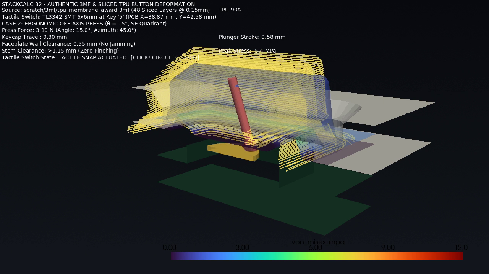

The first useful prototype is rarely the one that looks closest to a product. It is the one that makes the next decision cheaper. The current StackCalc hardware is a 3D-printed, tool-free mechanical prototype. Its KiCad PCB design is complete and fabrication is in progress, but there is no assembled, powered StackCalc board yet. The print lets us ask clearly: does the insertion path make sense, where does a part bind, and which keypad assumptions should be tested next?

<!-- more -->

## Physical prototype and reproducible files

The present mechanical kit is a matching four-part set:

- `chassis_award.stl`
- `unified_faceplate_award.stl`
- `tpu_membrane_award.stl`
- `top_cap_award.stl`

The repository also includes matching PrusaSlicer `.3mf` projects. Those preserve the part orientation and the print overrides used to make this prototype. The chassis and top-cap project filenames retain older `_petg` labels, but their embedded slicer profiles identify PLA; the embedded profile is the source of truth.

The photos show real printed parts, faceplate iterations, and the earlier print-in-place spring experiments. They establish that the parts have been printed and that the TPU membrane direction followed an earlier exploration. They do not yet establish repeatable key force, snap-retention fatigue, assembly time, or lifetime.

## Membrane model: useful before hardware, limited by its inputs

The membrane-study assets include a travel curve, rest and deformed states, a press-angle/offset parameter sweep, and a short deformation animation. The sweep evaluates 280 modeled press conditions across angle, direction, and offset. Its travel and material behavior come from CAD geometry plus assumed TPU and switch values.

That makes the study useful for locating geometry that needs physical testing and for comparing press conditions before a PCB is available. It is not a force measurement, fatigue result, or validation of the present physical assembly. The model includes a proposed switch interface; it does not prove how an unbuilt StackCalc PCB or final membrane will behave.

<video controls preload="metadata" style={{width: '100%'}}>
  <source src="/assets/tpu-membrane-simulation.mp4" type="video/mp4" />
</video>

## Operating software and simulated firmware

The shipping StackCalc iPhone and iPad apps have their own App Store walkthrough videos. They demonstrate the companion software, not the mechanical prototype.

For firmware work, the local browser simulator loads a simulator-specific firmware build into an RP2350 emulator. Its keypad is generated from the firmware key map; a key press becomes a row-and-column contact, and changed 132×65 display frames return to the browser. That gives us a way to exercise the firmware path before a board exists. The [simulator post](2026-08-26-simulating-hardware-in-software.md) describes the flow in more detail.

The simulator establishes behavior of the compiled emulator build. It does not establish power draw, physical display behavior, electrical timing on a real board, or the feel of the printed key mechanism.

## Next physical evidence

The next useful data set is deliberately plain: matching specimen and revision, print material and settings, fit observations, key travel and force, neighboring-key interference, cap retention cycles, and a service/disassembly record. We will report the sample count, method, result, and failures alongside photographs.

The current CAD files, slicer projects, membrane-study assets, and app walkthroughs are staged on the [StackCalc Hackaday project](https://hackaday.io/project/206743-stackcalc32-a-tactile-rpn-calculator) while the project remains private for review.

## Use the prototype as a map of the next revision

The four printed parts tell us where to look next. The chassis establishes the board envelope and the slide direction. The unified faceplate reveals whether the display opening and key windows read as one surface. The TPU membrane is the active keypad direction after the earlier spring experiments. The cap tells us whether final retention can happen without a screw driver or a buried fastener.

A practical prototype review starts with a short handling script: slide the parts into their rails, seat the membrane without twisting it, close the cap, pick the assembly up by its sides, reopen it through the intended release features, and repeat. The point is to identify a specific change—not to give a printed object a pass/fail label before the board is installed.

The printable parts and reference 3MF projects are linked from the StackCalc [hardware guide](../../hardware.md); the public [Learning Lab pack](../../learning-lab.md#download-the-prototype-materials) contains the teacher-facing STL activities and PDFs. The next revision will use the fabricated board to turn these handling observations into real fit, display-alignment, and switch-reach checks.
