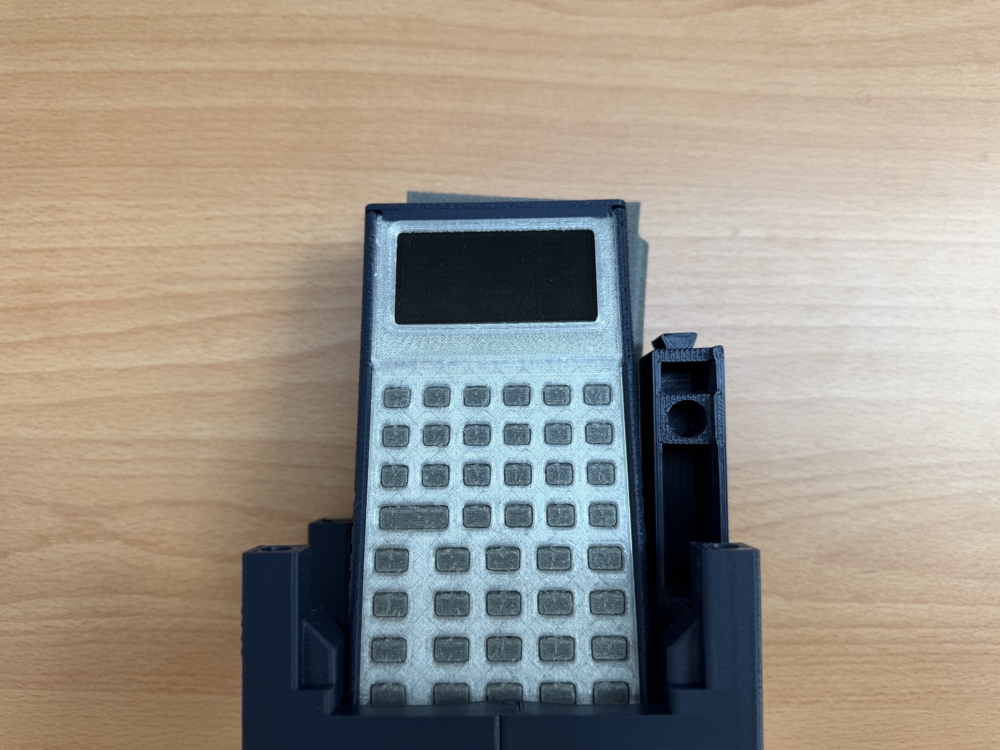
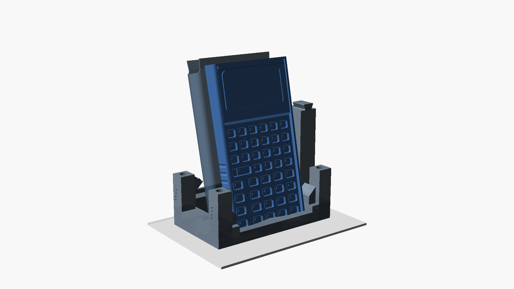
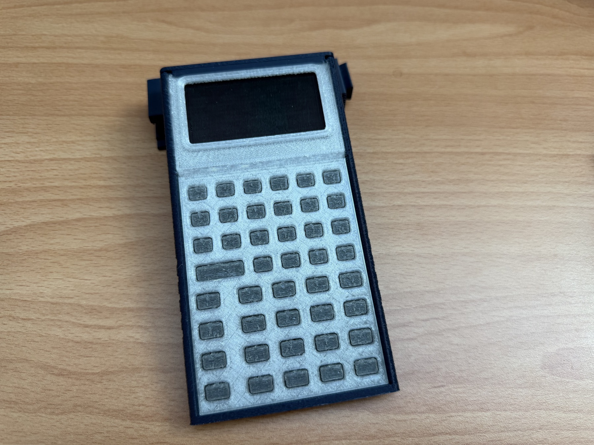

Shipping support is usually dead weight: it protects a device for one trip and then disappears into a bin. We wanted the StackCalc packaging support to keep earning its space on a desk or shelf. That changed the design question from “how do we protect a calculator?” to “what can protect it, organize the kit, and become useful after unboxing?”

The first answer was an origami fold. The current answer is a printed puzzle stand: four dovetail-connected corner pieces form an upright shelf stand, while a separate strut becomes a low desktop typing support. The printed pieces and the package envelope are still being refined together, but the change already made the whole product feel more connected—from the first opened box to the way the calculator lives between uses.

<!-- more -->

## Start with a fold, not a tray

Our first packaging concept was a single scored-cardboard blank. Its panels wrapped an approximately 80 × 150 × 20 mm calculator envelope for transport, then folded into a wedge with a front lip. It was deliberately simple: a cut line, score lines, a tuck flap, and a second fold that turned a carton wall into a desk support.

That experiment was useful even though it was not the direction we kept. It let us see the real questions early: where does the calculator stop, which edge takes the load, how does a user reach the device, and can a support be assembled without a bag of separate hardware? The fold made protection and support depend on the same flexible panel. The next version split those jobs into durable printed parts that could lock together in more than one arrangement.

## Turn the insert into a small construction set

The current CAD works inside a 124.46 × 167.64 × 48.26 mm packaging envelope. Four corner modules surround the calculator bay and lock through dovetail joints with 0.20 mm nominal FDM clearance. The joints are not decorative: they locate the corners, carry the stand geometry, and let the same pieces be rearranged after the package is opened.

In shelf mode, the front bay holds the calculator at 78°. A rear bay leaves room for the accompanying TPU pouch, and the low front lip keeps the device from sliding forward. That creates a near-vertical home for a calculator that might spend much of its time waiting on a bookshelf, kitchen counter, or shared family desk.

In desk mode, a separate lateral strut lifts the rear edge by 25.4 mm. Across the 146 mm calculator length, that produces an 11.6° typing incline. The intent is a quieter role: the calculator stays low enough to use like a desktop tool, with a retaining lip at the back rather than a large display pedestal.

The two configurations ask for different things. The shelf stand needs a stable upright presentation and an easy grab point. The desk stand needs a clean resting angle and a support that does not occupy the area where hands approach the keys. Treating them as the same product component forced us to make every corner, rail, and lip earn its material.

## Use simulation to decide what to print next

The stand geometry was not chosen only by posing it in CAD. We built a custom six-degree-of-freedom contact-dynamics model around the stand’s dimensions and contact surfaces. It steps through the dovetail assembly, calculator settling into the 78° front bay, pouch settling in the rear bay, transverse motion on a desk, pitch-and-roll agitation, and a 4 N top-row keypress load.

That model gives us a fast way to compare geometry before committing to another print. If a retaining lip is moved, a contact point changes. If a bay opens by a millimetre, the simulated settling path changes. If a support is taller, the keypress moment and the centre-of-mass relationship change with it. We use those outputs to choose the next arrangement to print, then compare them with the physical prototypes in hand.

The model is part of the design loop, not a substitute for the printed object. The photos matter because they show the things a simulation does not: whether the dovetail is pleasant to assemble, whether the calculator is easy to lift out, and whether the whole arrangement reads as a useful object instead of packing material that happens to stand up.

## Packaging is part of the interaction design

The stand is one component in a larger product path. Its rails and bays make room for the calculator and companion parts while the mechanical chassis, TPU button membrane, PCB layout, firmware simulator, iPhone app, and Learning Lab are being developed around the same RPN experience.

That is why we started packaging work early. A mailer dimension changes component placement. Component placement changes how a person first encounters the calculator. The first physical action after unboxing can either be “throw this away” or “put this somewhere useful.” We want it to be the latter.

The current mechanical calculator is still a printed prototype, and the RP2350 board is in fabrication. The stand prototypes let us keep improving the whole system around it now rather than leaving shipping and daily placement as last-minute problems. More context on the mechanical direction is in our [tool-free sliding assembly post](2026-09-22-tool-free-sliding-assembly.md), and the companion materials live in the [StackCalc Learning Lab](../../learning-lab.md).

For the next revision, the question is less about whether a stand can be made and more about which everyday use deserves priority: the upright shelf view or the low desktop wedge. That is the tradeoff we are testing in prints, models, and the rest of the product system.
