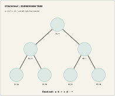

An expression tree can make postfix notation less mysterious: finish each branch before visiting the operation above it. The Learning Lab expression-tree board turns that traversal into an arrangement of removable tokens.

<!-- more -->

## One expression, two readable forms

The 196 × 164 mm board contains seven wells and tokens for `a`, `b`, `+`, `c`, `d`, `-`, and `*`. Arrange the tokens to represent `(a + b) * (c - d)`. The tree communicates precedence spatially; a postorder walk produces `a b + c d - *`.

This gives a useful bridge between algebraic notation and RPN. Before a calculator key is pressed, the learner can point to the branch that must be completed, record its value, and identify the next operation in the traversal.

## The important distinction

Postorder is a way to read an expression tree. ENTER is a calculator action that manages stack entry. They are related, but they are not interchangeable. A useful lesson keeps the parsing step and the key sequence separate, then connects them by following the resulting stack state.

The board is a generated prototype resource. It needs print-fit checks, marking validation, educator review, and classroom testing before it can support stronger teaching claims.

## Give postorder a physical route

An expression tree makes postfix notation less mysterious because the operator is visibly waiting above its completed inputs. Start with `(a + b) * (c - d)`. Build the plus branch, build the minus branch, then place multiply above both. Reading the tokens in postorder produces `a b + c d - *` because each branch is complete before its parent operation is read.

That is a different lesson from ENTER. Postorder tells us the operation order implied by an algebraic expression. ENTER manages repeated numeric entry on an RPN calculator. They meet when someone keys a program, but separating them prevents a learner from believing that ENTER is just another algebra operator.

The public [Learning Lab release](../../learning-lab.md#download-the-prototype-materials) includes the board, removable tokens, reference cards, and teacher booklet. A useful extension is to remove one operation token and ask learners to supply it from the desired postfix program. The activity creates a bridge from algebra notation to the stack model used in the app and handheld.

## Extend the board without changing the rule

Once a learner can read the seven-token example, introduce one new branch rather than a completely different notation. The rule stays stable: finish the left and right subtrees, then read their parent operation. That repeatable visual rule gives a teacher a way to add difficulty while retaining the same RPN explanation.
