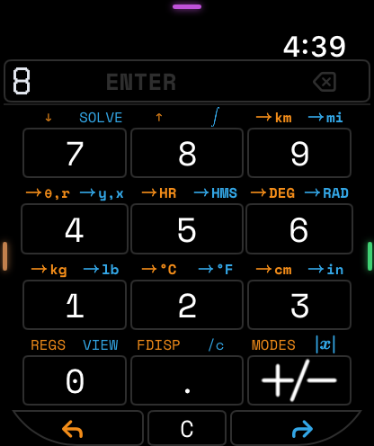

RPN calculators already exist. StackCalc is not a nostalgia project trying to recreate a familiar beige machine. The gap we see is a learning path: a way to move from a familiar screen to a physical instrument while understanding what the stack is doing.

That is why StackCalc joins the current iPhone and Apple Watch apps, a shared calculator core, Learning Lab prototypes, and an RP2350 handheld whose board is in fabrication around the same calculation behavior. The connection is semantic, not cosmetic.

<!-- more -->

## The problem is legible state

RPN turns a calculation into small, checkable actions: place values on the stack, then apply an operation. It can remove parenthesis entry, but the interface must make state legible. A learner needs to see the working value, know when ENTER commits it, and understand what an operation will consume.

Established RPN calculators are excellent instruments for people who already have those habits. StackCalc investigates the earlier step: what should a learner be able to see, touch, and predict before pressing the next key?

## Four connected surfaces

- **A shared RPN core** keeps operation meaning and calculator state consistent across interfaces.
- **The Apple Watch and iPhone/iPad apps** let us study compact controls and display hierarchy on devices a learner already knows.
- **The Learning Lab** makes amounts, stack positions, postfix expression order, and coordinate relationships tangible.
- **The RP2350 handheld design** carries that same interaction model into a dedicated physical calculator. Its KiCad PCB is in fabrication; an assembled, powered board is the next physical milestone.

The design rule is to keep meaning stable while changing the surface. A fraction tower, a stack tile, a watch interaction, and a physical key should all point to the same operation instead of asking the learner to memorize a new model on every device.

## What comes next

The next step is to put the artifacts in people’s hands: printable teaching materials, physical prototypes, and educator sessions that improve the activities. The current mechanical calculator is an unpowered four-part printed prototype; the companion app is available on the [App Store](https://apps.apple.com/app/id6801788040).

## Let each surface do the job it is good at

The Apple Watch is the tightest constraint: the current entry, visible stack, and next action have to survive a very small screen. The iPhone and iPad create room to practise and explore. The Learning Lab slows the interaction down with tiles, fraction pieces, and expression trees. The printed handheld gives the model dedicated keys and a physical place in daily work. None of those surfaces needs to imitate the other perfectly; they need to preserve the same calculator meaning.

The shared core and firmware emulator make that statement testable. A named sequence can be sent through the app, the core, and the RP2350 matrix path instead of being reimplemented as unrelated UI behavior. The board design is in fabrication, so the hardware will soon add a real display, switch layer, and power path to that same set of checks.

The public [Learning Lab](../../learning-lab.md) provides the printable STL pack and teacher PDFs; the companion app is on the [App Store](https://apps.apple.com/app/id6801788040). We are not publishing implementation source. We are publishing the objects, activities, rendered models, and design record that explain how the product is being built. The next project milestone is not another retro shell—it is the first physical comparison between the emulator’s known behavior and the assembled RP2350 calculator.
