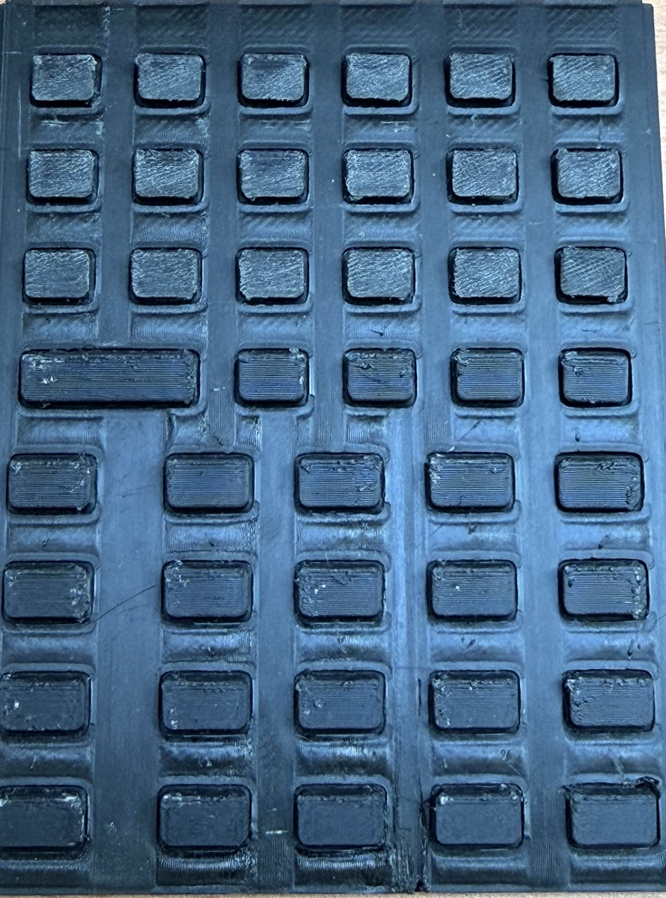

A simulation is much more useful when it makes a design argument visible. In a static CAD view, a TPU key, a faceplate opening, and a switch location can all look compatible. The difficult part happens between those still images: a keycap drops, tilts toward a wall, transfers motion through the web, and either reaches the switch or spends its travel rubbing somewhere it should not.

That is why we made a cutaway video of the StackCalc TPU membrane. It is a short design-review tool built from the same membrane and faceplate STL geometry used for the prototype, not a claim that the unpopulated calculator has already survived a life test. The RP2350 board is in fabrication; the video lets us inspect the mechanical questions now and gives the first board session specific cases to repeat.

<!-- more -->

<video controls preload="metadata" style="width: 100%;">
  <source src="/assets/tpu-membrane-simulation.mp4" type="video/mp4" />
</video>

[Open the TPU membrane cutaway video.](../../assets/tpu-membrane-simulation.mp4)

## Start with the part that actually has to fit

The visualisation clips a single key neighbourhood from the membrane STL, the faceplate STL, and a simple representation of the proposed PCB and tactile-switch interface. It fixes the base of the membrane, then lets the web interpolate between the stationary sheet and the moving cap. The cap is translated and tilted from the same contact model used in the 280-condition press sweep.

That arrangement has a practical advantage: it makes the interface visible in the same coordinate system as the printed parts. You can see the faceplate aperture, the flexible web, the stem path, the switch dome, and the board plane together. A generic animation of a rubber button could be attractive; this one is useful because it exposes the actual clearance problem we have to solve.

The colours are relative stress estimates from the model, not a measurement taken from the printed membrane. Their job is to show where the model concentrates bending during a case, so we know what to inspect in a print and where to put a microscope, force gauge, or high-speed camera later.

## Three presses, three questions

The video deliberately shows three different situations instead of looping a perfect centre press.

**Case 1: vertical press.** The cap comes down without lateral load. This case makes the pretravel gap visible: the stem has to cross the small gap before it begins to compress the switch representation. It is the baseline for cap travel and for the assembly drawing.

**Case 2: a 15° off-axis press.** This is closer to how a thumb actually arrives on a small handheld. The cap shifts and tilts while the membrane web flexes. The point is not that 15° is a universal human factor standard. It is a repeatable middle case for asking whether the aperture still leaves a sensible route to the switch.

**Case 3: a 25° edge-biased jab.** This is intentionally unfriendly. It gives the video a useful failure boundary: there is less sidewall clearance and more bending at the web. If a geometry looks graceful only in the first clip, it has not earned a place in the next print.

The animation is paired with a sweep of angle, direction, and contact offset, which is documented in [the companion post](2026-09-24-tpu-keypad-280-presses.md). The sweep determines which cases are worth showing; the video makes those cases understandable without asking someone to infer a mechanism from a table of numbers.

## Why a video belongs in a build log

Hardware projects often share a finished render or a spreadsheet. Both hide the step where a designer decides what needs changing. A cutaway makes that decision reviewable. A reader can challenge the assumed switch travel, question the material constants, point out an edge contact we omitted, or suggest a better fixture before we print another complete keypad.

It also protects against a surprisingly common mistake: treating a visual model as a validation result. The animation uses declared values for TPU stiffness, friction against the faceplate, switch travel, and load. Change the filament, wall thickness, print orientation, or real switch, and the result can change. The video helps us choose a test; it does not replace that test.

## The first physical follow-up is already defined

The board-fit session will start with the mechanical conditions shown in the video, using the final switch location and a named print profile. We will measure centre and edge travel, force at the cap, switch closure, rebound, cap-to-aperture rub, and neighbouring-key movement. We will then compare the real traces with the model inputs and revise the geometry where the disagreement is useful.

For a small team, that is the value of a model: it turns “we need to see how it feels” into a short list of cases, tools, and observations. The [StackCalc hardware guide](../../hardware.md) is the canonical source for the printable project material; Hackaday carries the build narrative and invites the questions that improve the next test.
