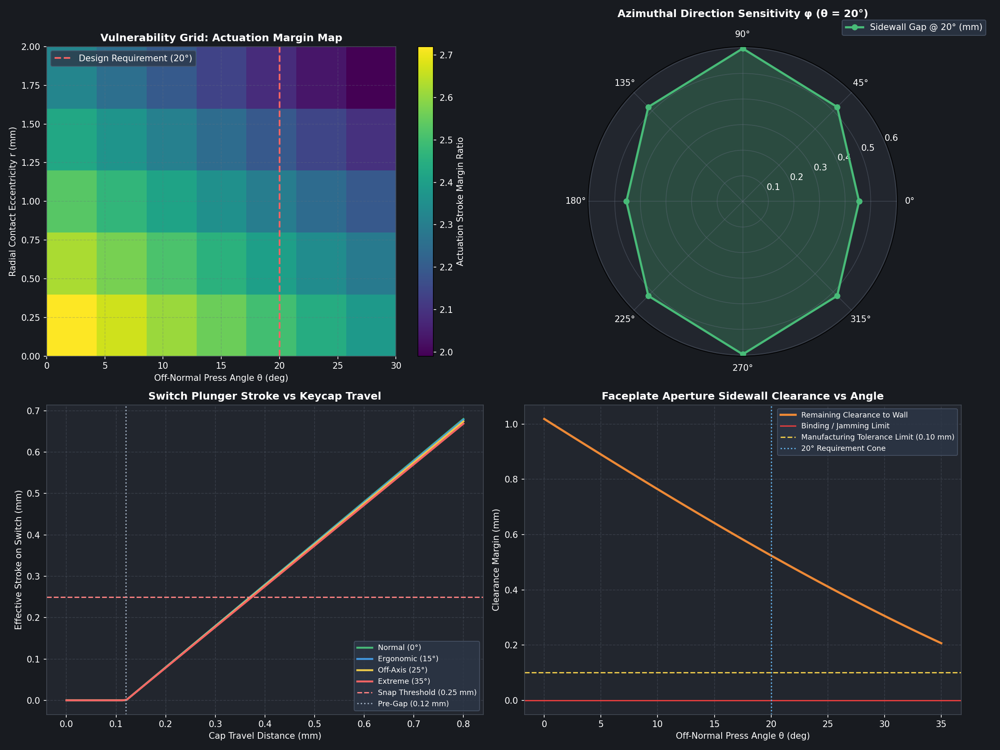

A calculator key rarely gets pressed straight down in the middle. A thumb catches an edge. A finger comes in from the side. A child presses a corner. The first question for our TPU membrane was not “does it move?” It was “which bad presses leave enough room for the key to reach the switch without scraping the faceplate?”

The StackCalc PCB is in fabrication, so the printed calculator is not yet a powered keypad. We used the interval to put numbers around the geometry that will meet the board: the printed faceplate aperture, the TPU web, the keycap stem, and the proposed tactile-switch interface. That produced a 280-condition press sweep and the plot below.

<!-- more -->

## Make “a crooked press” a test matrix

The study holds a 2.5 N reference press constant and varies four things that a user can change without noticing:

- seven off-normal angles from 0° to 30°;
- eight compass directions around the keycap;
- five radial contact offsets from the centre to 2.0 mm; and
- the resulting tilt, lateral motion, delivered plunger stroke, aperture clearance, and simplified web stress.

Seven angles × eight directions × five offsets gives 280 cases. The simulation starts with the CAD dimensions of the flexible membrane and faceplate. The model uses a 0.80 mm cap-travel limit, a 0.12 mm pretravel gap, and a 0.25 mm proposed switch-actuation threshold. The material, friction, and switch values are explicit inputs, not readings from a load cell.

That distinction matters. This is a geometry-and-contact model with stress estimates, rendered on the CAD mesh. It is useful for comparing revisions and locating bad regions before a board arrives. It is not a calibrated proof of force, endurance, or how this particular filament will feel after a thousand presses.

## Read the plots in the order a key fails

The upper-left map is the fast answer to “how much stroke reaches the switch?” It gets darker as the contact moves toward the cap edge and the finger angle increases. That is what we expect: an offset press introduces a moment, and the web spends some of the motion tilting instead of driving the stem straight down.

The upper-right polar chart asks whether a 20° press is equally forgiving in every direction. It is not. The rectangular key and aperture make the available sidewall room direction-dependent. A design that looks fine in one cross-section can still rub when pushed toward a different corner.

The lower-left plot separates keycap travel from switch travel. The initial 0.12 mm is deliberately quiet: it closes the gap before the switch is asked to move. Past that point, the plotted membrane geometry has more than the assumed 0.25 mm actuation stroke available before the 0.80 mm cap stop. That is the useful design margin; it is not an invitation to make the web softer without checking tilt.

The lower-right graph is the warning label. As press angle rises, the remaining clearance falls. We set a 0.10 mm tolerance line so the revision discussion is about room, not a vague impression of smoothness. The 280-case run contains 278 passes under its stated assumptions; the two edge cases are the kind of outlying, high-offset combinations that tell us where a physical edge-jab test belongs.

## The design decision was not “make it soft”

A flexible membrane performs two jobs at once. It has to let the key move vertically, and it has to resist enough lateral and rotational motion that the cap does not wedge in its aperture. Increasing compliance can improve a vertical stroke while making a corner press worse. Tightening the faceplate can make the key look more finished while spending the clearance that keeps it from rubbing.

That is why the faceplate chamfer and the web are coupled. We use the sweep to choose a geometry that has room for an angled press, then print the matching faceplate and membrane together. The earlier print-in-place-spring experiments taught us that a printable mechanism is not automatically the right production direction. The continuous TPU layer gives us a consistent alignment layer and a single set of webs to tune.

## What the fabricated board changes

Once the RP2350 board is fitted, this becomes a small bench test instead of a model-only exercise. We will use the same named cases—centre press, edge press, a 15° press, and the worst mapped edge direction—on a matching printed revision. The record needs actual key travel, force-versus-travel curves, switch closure, rebound, neighbour-key interaction, material, print settings, and cycle count.

The public [hardware guide](../../hardware.md) carries the printable project materials, and the companion [deformation-video post](2026-09-24-tpu-button-deformation-video.md) shows the cutaway used to make these contact paths visible. The useful question for other keypad builders is simple: which corner press would you put on the bench first?
