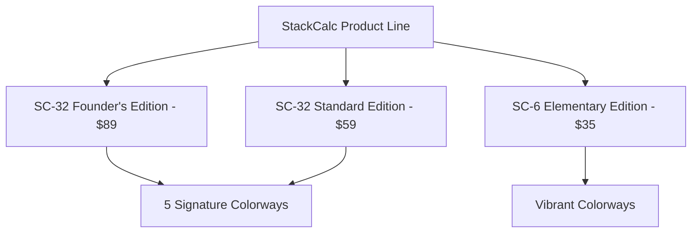
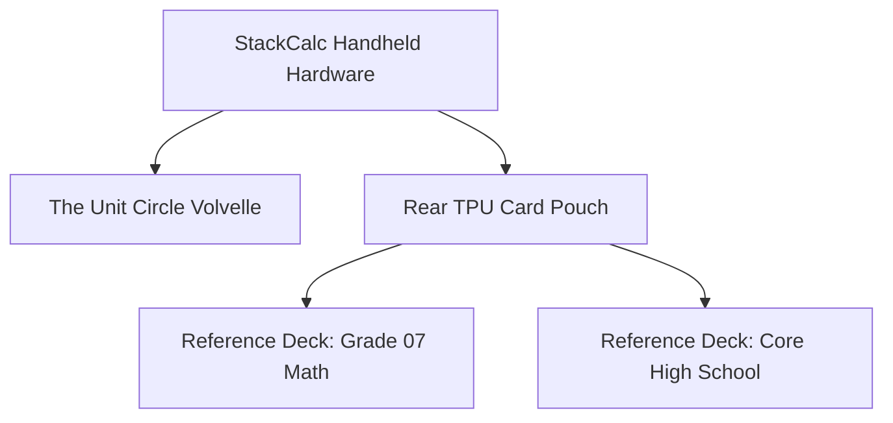

# Hardware E-Commerce & Product Expansion Strategy

The StackCalc physical calculator line delivers an affordable, tactile mathematical instrument for students, families learning math, and STEM professionals. At **$59**, StackCalc is the most accessible dedicated RPN scientific calculator available. 

To keep production costs low and provide a hands-on experience, StackCalc is distributed as a **simple 5-minute snap-together assembly kit**. The 4-layer mainboard arrives **100% pre-soldered, pre-tested, and pre-flashed** with all display and tactile switch circuitry in place. Users perform an effortless, tool-less sliding stack assembly in under 5 minutes without needing a soldering iron or technical skill—making it an engaging STEM activity for families and a quick desk setup for professionals.

---

## 1. The Shopify "Micro-Batch" Strategy

Rather than relying on vaporware waitlists or high-friction crowdfunding campaigns, StackCalc hardware kits are distributed through an exclusive, recurring **Batch Drop** model powered by an embedded Shopify Buy Button infrastructure on our custom GitHub Pages documentation and launch platform.


### Calculator Product Lineup



#### 1. SC-32 Founder's Edition ($89 USD)
- **Initial Volume:** Initial release strictly limited to **5 fully tested units (Batch 00)**.
- **Early Access & Personalization:** Priority early shipping, custom laser nameplate engraving on rear plate, protective TPU travel pouch, and dual-position desk stands.
- **Hardware Parity:** Physically identical hardware and pure 4-level RPN math engine to the standard edition.

#### 2. SC-32 Standard Edition ($59 USD)
- **Core Value:** At **$59**, this is the lowest-cost dedicated RPN scientific calculator on Earth, making RPN stack mathematics accessible to every student and professional.
- **Hardware & Assembly:** Identical 43-key mechanical tactile switches, high-contrast graphic display, pre-flashed Embedded Swift firmware, and 5-minute snap assembly. Standard serialized backplate (no name engraving).

#### 3. SC-6 Elementary Edition ($35 USD)
- **Target Audience:** Elementary students (Grades K–6) and foundational STEM education.
- **Educational Math Engine:** Simplified non-shifted layout featuring visual ten frames, number racks, place value, clock time, currency, skip-counting (`[REP]`), and a dedicated step-by-step fraction reduction key (`[SIMP]`).

#### Signature Colorways (Matching Companion Apps)
Customers select their colorway on Shopify at checkout, matching themes in the iOS & watchOS digital twins:
1. **RetroFuturism:** Apollo Off-White & Dark Blue (iOS Light Default)
2. **Stealth Industrial:** Matte Black & Slate (iOS Dark Default)
3. **Supernova:** Silk Crimson & Sunburst Gold
4. **Deep Space:** Cosmic Purple & Nebula Blue
5. **Voyager:** Nautical Navy & Frost White Contrast

### Packaging That Becomes Stands
Every calculator shipping box unfolds directly into:
- **78° Shelf Showcase Stand**
- **10.0° Ergonomic Typing Elevator Desk Wedge**

### Manufacturing Transparency
Marketing and product documentation explicitly celebrate our in-house artisanal manufacturing process:
- **Chassis Fabrication:** High-precision additive manufacturing in carbon-neutral PLA and chemical-resistant PETG, engineered with a $1.60857^\circ$ anti-wobble desk wedge and dual sliding rails.
- **Switch Interface:** 43 ALPS SKQGABE010 SMD switches with custom-engineered flexible TPU button membranes providing positive tactile snap over sealed dome matrices.
- **Enclosure Detailing:** Diode-laser engraved serialization, key legends, and alignment markings.

> [!NOTE]
> Manufacturing transparency frames StackCalc as an **exclusive, precision-crafted instrument kit** and field tool, rather than a generic mass-market consumer plastic gadget.

---

## 2. Personalization: Custom Nameplate Engraving

To deepen personal connection and reinforce the feel of serialized field equipment, every Batch 00 assembly kit includes optional personalized chassis engraving.

```
+-----------------------------------------------------------+
|  STACKCALC 32 // INSTRUMENT MARK II                       |
|  CALIBRATED FIELD HARDWARE                                |
|                                                           |
|  [ A. BAGHERZADEH ]  <-- Laser Engraved Nameplate         |
|                                                           |
|  BATCH 00 // UNIT 003 OF 005                              |
|  PICO RP2350 // SILICON REV B                             |
+-----------------------------------------------------------+
```

### Technical & Checkout Strategy
- **Shopify Line-Item Property:** Captured directly at checkout using the field:
  ```html
  <input type="text" name="properties[Engraving]" maxlength="15" placeholder="NAME">
  ```
- **Constraint Matrix:**
  - Character limit strictly clamped to **15 alphanumeric characters** (A-Z, 0-9, periods, and hyphens).
  - Automatically converted to uppercase to preserve the brutalist industrial aesthetic.
- **Typography & Toolpath Generation:**
  - All laser toolpaths are generated using the **Space Mono** monospaced font.
  - Ensures crisp, legible diode-laser burn profiles directly onto the rear PETG chassis plate without character overlap or kerning degradation.

---

## 3. Brand-Aligned Accessory Expansion

To increase Average Order Value (AOV) while maintaining uncompromising utility, StackCalc develops physical, non-electronic mathematical tools. These accessories focus entirely on high-utility mathematical reference and tactile physical manipulation.



### Accessory 1: The Unit Circle Volvelle ($15–$20)

A 100% 3D-printed, two-piece mechanical rotary disc calculator (a **Volvelle**) designed for trigonometric analysis without power or batteries.

```
       .---. 90° (π/2)
     /       \
180°|  [ x,y ]| 0° (0 rad)
(π) \  WINDOW /
       '---' 270° (3π/2)
```

- **Mechanical Design:**
  - Fabricated using print-in-place tolerances or a simple snap-fit plastic center pivot.
  - Zero metal screws, washers, or fasteners required—100% recyclable polymers.
  - Extremely reliable and rapid to slice and print on standard FDM 3D printer beds.
- **Operational Functionality:**
  - **Outer Ring (Fixed):** Laser-engraved with standard degree increments ($0^\circ, 30^\circ, 45^\circ, 60^\circ, 90^\circ \dots 360^\circ$) and exact radian measures ($0, \frac{\pi}{6}, \frac{\pi}{4}, \frac{\pi}{3}, \frac{\pi}{2} \dots 2\pi$).
  - **Inner Disc (Rotating):** Equipped with a precision cutout aperture window. As the disc rotates to align with a specific angle or radian, the window reveals the exact trigonometric coordinates:
    $$\left( \cos \theta, \sin \theta \right) \quad \text{and} \quad \tan \theta$$
- **Educational & Tactile Value:** Provides instantaneous spatial and numerical comprehension of unit circle geometry, serving as an indestructible desktop companion for physics and calculus students.

---

### Accessory 2: StackCalc Reference Decks ($15 / set)

Standardized, credit-card-sized ($85.6 \times 53.98\text{ mm}$) reference cards precision-printed in thin PLA or PETG.

- **Form Factor & Storage:** Engineered to slide directly into the integrated storage slot of the reversible TPU C-cover/pouch on the back of the calculator.
- **Content Architecture:** Maps conventional textbook algebraic notation directly to StackCalc RPN operational keystrokes. Eliminates syntax confusion during exams and laboratory work:

| Curriculum Topic | Standard Algebraic Notation | StackCalc Physical Keystrokes |
|---|---|---|
| **Hypotenuse** | $\sqrt{a^2 + b^2}$ | `[a] [ENTER] [x²] [b] [ENTER] [x²] [+] [√x]` |
| **Quadratic Formula** | $\frac{-b \pm \sqrt{b^2 - 4ac}}{2a}$ | `[b] [ENTER] [x²] [4] [a] [×] [c] [×] [-] [√x] ...` |
| **Percentage Change** | $\frac{y - x}{x} \times 100$ | `[x] [ENTER] [y] [Δ%]` |
| **Compound Interest** | $P (1 + r/n)^{nt}$ | `[r] [n] [÷] [1] [+] [n] [t] [×] [yˣ] [P] [×]` |

#### Phase 1 Rollout Decks

1. **Set 1: Grade 07 Mathematics (3 Cards / Deck):**
   - **Card A:** Fraction Arithmetic, Mixed Numbers, and Decimal Conversions.
   - **Card B:** Proportions, Unit Rates, and Percentage Problems.
   - **Card C:** Basic Geometric Formulas and Two-Step Linear Equations.
2. **Set 2: Core High School Mathematics (3 Cards / Deck):**
   - **Card A:** Quadratic Equations, Complex Roots, and Polynomial Evaluation.
   - **Card B:** Right-Triangle Trigonometry, Law of Sines, and Radians.
   - **Card C:** Time Value of Money (TVM), Exponential Growth, and Scientific Notation.

---

## 4. E-Commerce Integration Specifications

### Shopify Buy Button Architecture

The documentation and landing pages integrate the Shopify JavaScript SDK (`buybutton.js`) configured with customized brutalist components:
- Direct item addition with inline quantity selectors.
- Line-item property binding for personalized laser engraving.
- Instant checkout redirect directly to Shopify's secure PCI-compliant gateway (`shop.stackcalc.io`).

### Unit Economics & Average Order Value (AOV) Modeling

| Product | Retail Price | Production Cost (Est.) | Margin |
|---|:---:|:---:|:---:|
| **SC-32 Founder's Edition Kit** | $89.00 | $26.50 | 70.2% |
| **SC-32 Standard Edition Kit** | $59.00 | $18.20 | 69.1% |
| **SC-6 Elementary Edition Kit** | $35.00 | $11.50 | 67.1% |
| **The Unit Circle Volvelle** | $18.00 | $1.80 | 90.0% |
| **Reference Deck (Set 1 or Set 2)** | $15.00 | $1.20 | 92.0% |
| **Student Essentials Bundle** *(Kit + Volvelle + Set 1 & 2)* | $125.00 | $30.70 | 75.4% |

By combining the low-mass, rapid-print mathematical accessories with the flagship calculator kit, Average Order Value expands from **$89.00 to ~$125.00** while delivering tangible educational utility to students and professionals.
