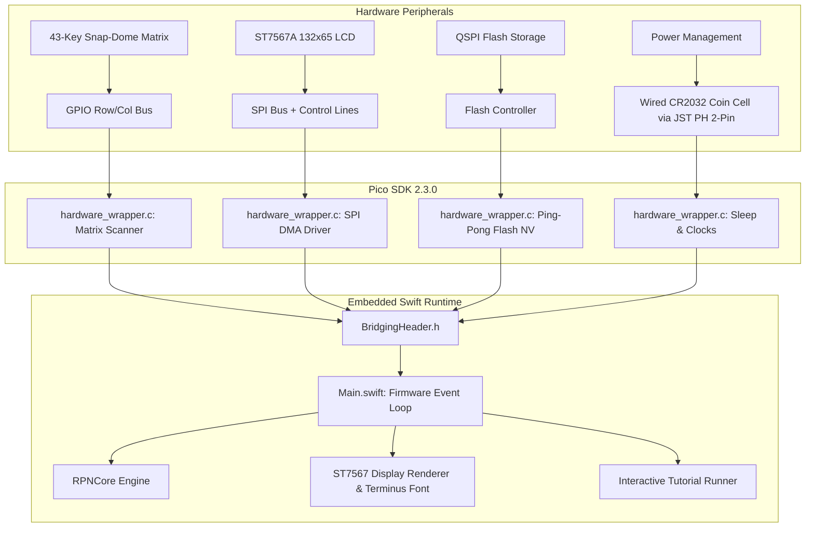

# Embedded Swift Firmware & Pico SDK Architecture

The StackCalc32 physical handheld instrument is powered by a custom bare-metal **Embedded Swift** runtime operating directly atop the **Raspberry Pi RP2350** microcontroller and Pico SDK 2.3.0.

Rather than relying on a heavy embedded OS or fragmented micro-Python interpreters, StackCalc uses Swift's official embedded profile (`-enable-experimental-feature Embedded`) to achieve deterministic mathematical execution, zero dynamic heap allocations, and sub-15ms cold-boot times.

---

## 1. System Architecture

The firmware architecture is split cleanly across two layers: a low-level C Hardware Abstraction Layer (HAL) interfacing with the Pico SDK peripherals, and a high-level Swift runtime hosting the deterministic `RPNCore` math engine and user interface.



---

## 2. Silicon & Target Platform

The instrument is powered by the **Raspberry Pi Pico 2** module (`SC1632`), built on the **RP2350** microcontroller featuring high-speed dual-core compute and flexible clock gating:

| Parameter | Specification | Implementation Notes |
|---|---|---|
| **Core Architecture** | Dual-core Arm Cortex-M33 / Hazard3 RISC-V | Standard build runs on Cortex-M33 with hardware double-precision FPU |
| **System Clock** | 150 MHz | Dynamically scaled down during idle and paused states |
| **Internal SRAM** | 520 KB | Fully partitioned with zero dynamic heap allocation |
| **Non-Volatile Storage** | 4 MB QSPI Flash | Dedicated 8 KB partition for ping-pong wear-leveled user state |
| **Cold-Boot Latency** | < 15 ms | Instant-on execution straight from XIP (Execute-In-Place) flash |
| **Quiescent Current** | < 30 µA | Ultra-low power dormant sleep on CR2032 battery rail |

---

## 3. Core Firmware Subsystems

### Keypad Matrix Scanning & Debounce
The 43 tactile switches are wired in a shared matrix layout consisting of an upper 6-column grid and a lower 4×5 arithmetic keypad with a centered double-wide `ENTER` key:
- **Matrix Strobe**: Scanned via `matrix_scan()` which cycles GPIO row lines and samples column states with internal pull-ups enabled.
- **Debounce Filter**: Consecutive samples must match over a stable hysteresis window before generating a discrete `CalculatorOperation` event.
- **Dormant Wakeup**: Keypad columns are configured as edge-triggered GPIO interrupt sources (`matrix_scan_wake_key()`). When in deep sleep, any keypress immediately wakes the RP2350 PLLs without losing calculation context.

### Transflective Graphic Display Pipeline (ST7567A)
The EastRising ST7567A 132×65 transflective LCD is driven via 4-wire hardware SPI:
- **Frame Buffer**: A compact 1-bit-per-pixel buffer (1,072 bytes) maps directly to the display pages.
- **Zero-Tear Blits**: The entire frame buffer is blitted directly via `display_send_buffer()` at SPI clock speeds up to 20 MHz.
- **Embedded Typography**: Characters are drawn from `font_bitmaps.c`, encoding the authentic **Terminus** 6×8 pixel font for 4 crisp lines of left-justified mathematical telemetry.

### Ping-Pong Non-Volatile Flash Persistence
StackCalc saves calculation registers and system state across power cycles without requiring dynamic memory or third-party serialization libraries:
- **Alternating Sectors**: Two 4 KB flash sectors alternate as active snapshots to provide wear-leveling and fail-safe recovery.
- **Fixed-Size Binary Payload**: Serializes the 4-level/8-level stack, lettered registers (A–Z), statistical summations ($\Sigma$), angular modes, and the tutorial completion bitmask.
- **CRC32 Integrity**: Each payload snapshot is guarded by a 32-bit CRC checksum. If power is interrupted mid-write, the firmware automatically falls back to the previous validated sector.

### Power Management & Sleep States
To achieve multi-month battery operation from a single standard CR2032 coin cell, the firmware employs multi-tier power states:
1. **Active Compute (150 MHz)**: Full clock frequency during numerical solver execution, polynomial evaluation, and Romberg definite integration.
2. **Idle Mode**: Gated system clocks while awaiting keypad scan events.
3. **Dormant Deep Sleep**: After 5 minutes of inactivity, the firmware issues `hw_display_sleep_c()` to shut down the ST7567A bias circuits, flushes state to flash, and disables internal oscillators, consuming less than 30 µA.

---

## 4. The Shared RPNCore Engine

A central principle of StackCalc is **bit-for-bit math parity across all surfaces**:
- The exact same Swift files (`StackCalcEngine.swift`, `RPNStack.swift`, `Solver.swift`, `ComplexMath.swift`) that compile into the native iOS and watchOS targets compile directly into the RP2350 binary.
- Compiling under Embedded Swift ensures zero reference-counting runtime overhead, strict value semantics, and stack-allocated closures.
- All floating-point evaluations conform to IEEE-754 double precision.

---

## 5. Build System & Compilation

The firmware build system uses CMake and Ninja to orchestrate both the Embedded Swift compiler and the ARM GCC toolchain.

### Build Prerequisites
- **Embedded Swift Toolchain**: Swift 6.0+ with embedded feature flags.
- **Raspberry Pi Pico SDK**: Version 2.3.0 (configured via `PICO_SDK_PATH`).
- **ARM Toolchain**: `arm-none-eabi-gcc` and `arm-none-eabi-binutils`.
- **CMake & Ninja**: Version 3.20+.

### Compilation Commands

From the repository root:

```bash
# 1. Build the production hardware UF2 binary:
Firmware/compile_firmware.sh hardware

# 2. Build instrumented ELF with target-side profiling:
Firmware/compile_firmware.sh profile

# 3. Build WebAssembly / Node.js simulator binary:
Firmware/compile_firmware.sh emulator

# 4. Run binary memory and ELF section size inspection:
python3 Firmware/profile_power_memory.py
```

Hardware build artifacts are emitted as `build/stackcalc32.uf2` and copied into the canonical manufacturing export directory (`Hardware/output/WatchCalc32_Manufacturing/Firmware_Files/`).

---

## 6. Flashing the Instrument

1. Connect the Raspberry Pi Pico 2 module on the StackCalc32 mainboard to your workstation via a USB data cable.
2. While holding down the physical `BOOTSEL` button (accessible via the top-cap pinhole or rear chassis service port), toggle power.
3. The RP2350 mounts as an external mass-storage volume named `RPI-RP2`.
4. Drag and drop `stackcalc32.uf2` onto the volume.
5. The device flashes in under two seconds and reboots immediately into the active Terminus calculator interface.