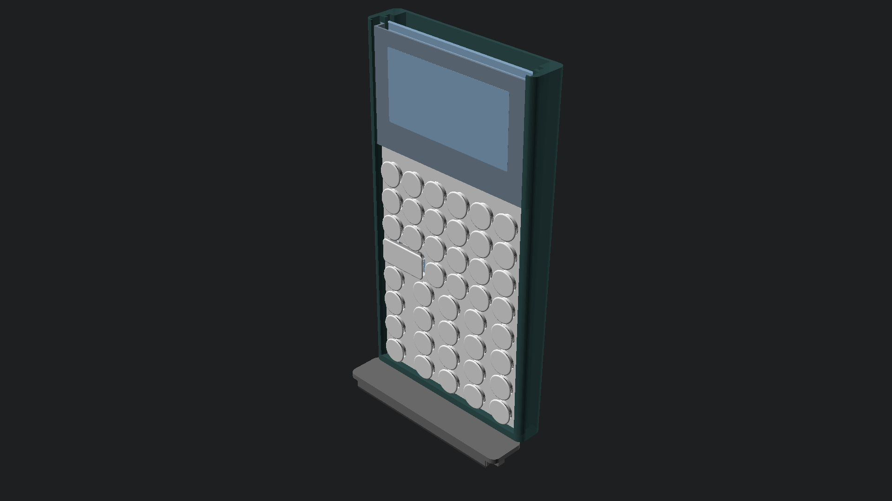
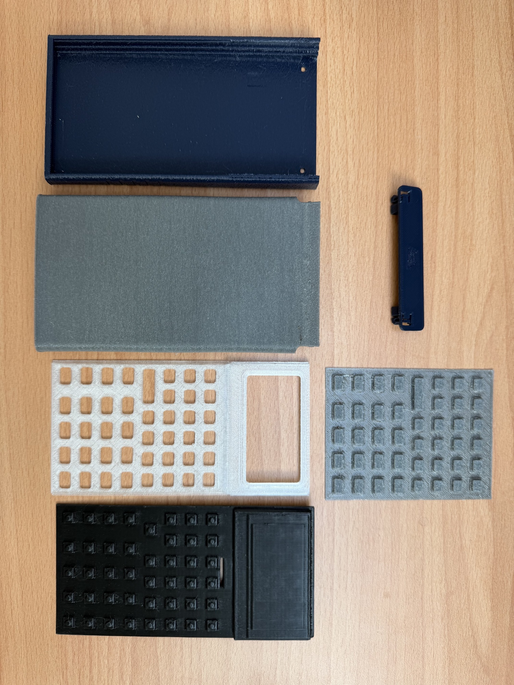
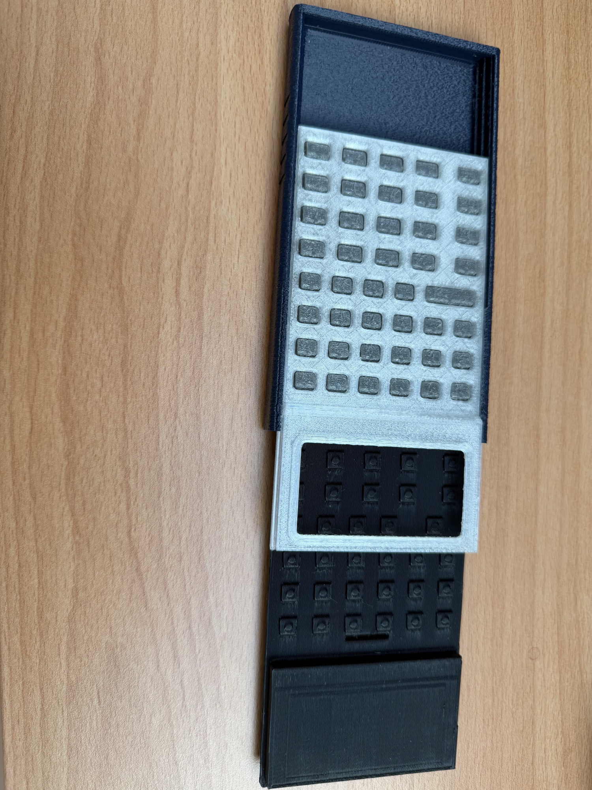
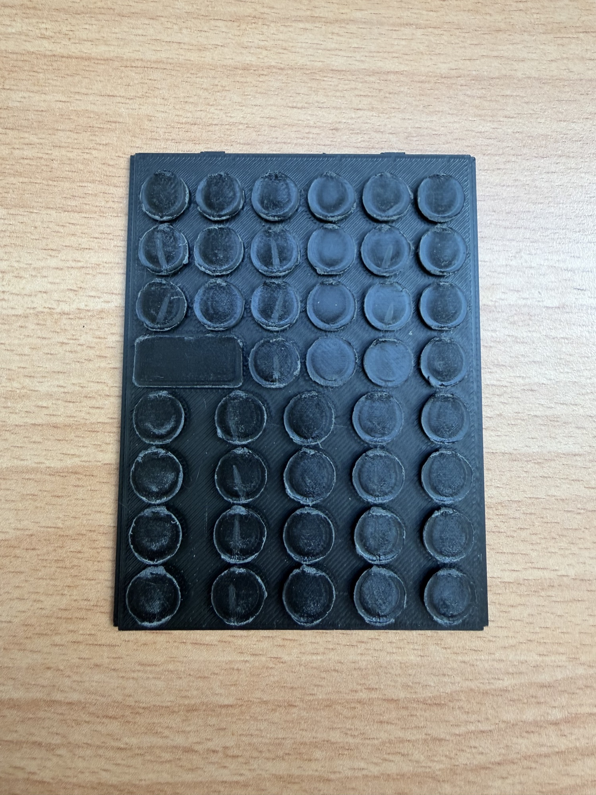
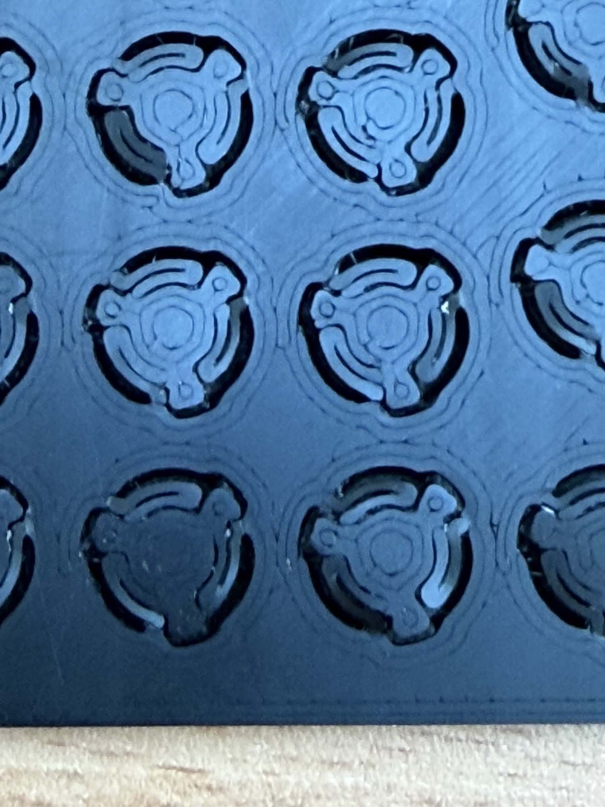

# Hardware build and capability reference

Current design contract: 2026-09-22. The physical calculator and bitmap emulator use **132×65** pixels: nine 132-byte pages, **1,188 bytes**, with one visible row in the final page. Module/controller identification and physical edge visibility still require verification against the installed specimen and BOM.

## Current CAD kit

The active source family is `chassis_award`, `top_cap_award`, `unified_faceplate_award` and `tpu_membrane_award`. The suffix is a CAD identifier, not an award or manufacturing qualification. The top cap defaults to **snap retention**. Screw/nut variants, separate faceplates, circular Test-9 fixtures and experimental covers/stands are not interchangeable current-kit instructions.

| From the source checkout | Output under scratch/stl |
| --- | --- |
| `make -C Hardware chassis` | `chassis_award.stl` |
| `make -C Hardware top-cap` | `top_cap_award.stl` |
| `make -C Hardware unibody-faceplate` | `unified_faceplate_award.stl` |
| `make -C Hardware button-membrane` | `tpu_membrane_award.stl` |

## Download the current mechanical prototype

The public mechanical release contains the matching four STL files used by the present printed prototype: chassis, faceplate, TPU membrane, and snap-retained cap. It does not include electronics source, firmware source, CAD generators, manufacturing artwork, or a claim that the printed calculator is a completed powered device.

[Download the current four-part mechanical STL set](downloads/stackcalc-current-mechanical-prototype-stls.zip){ .md-button }

## Proof reel

<video controls preload="metadata" poster="assets/prototype-front.jpg" style="width: 100%; max-width: 960px;">
  <source src="assets/stackcalc-proof-reel.mp4" type="video/mp4">
  Your browser does not support the video tag.
</video>

This 24-second reel uses the actual printed mechanical prototype, the shipping iPhone app, and the membrane, assembly, and stand simulations. It does not depict a powered physical calculator.

The matching PrusaSlicer 3MF reference projects are available in the Hackaday project Files area for people following the documented prototype print settings. Use the four STL files as a set; older print-in-place spring fixtures, separate faceplates, and alternate covers are exploration artifacts rather than substitute kit parts.

### Assembly and service

Dry-fit the matching faceplate and membrane in the chassis rails, then fit the snap-retained cap. The current release is an unpowered mechanical prototype: its RP2350 board design is in fabrication and is not installed in the pictured specimen. Once the board arrives, the integration sequence will add board seating, display alignment, switch reach, connector clearance, battery polarity, and power checks. Release the retention features rather than prying on the display surround when reopening the printed assembly.

### Material and marking direction

| Theme | Chassis appearance | Button material direction |
| --- | --- | --- |
| RetroFuturism | White/off-white PLA/PETG | Warm cream TPU |
| Stealth Industrial | Black PLA/PETG | Dark-blue TPU |
| Supernova | Red/gold silk | Gray TPU |
| Deep Space | Purple/green/blue silk | Dark-blue TPU |
| Voyager | Dark blue | Gray TPU |

Primary and secondary buttons share the same material. Button trenches are laser engraved and labels use laser foaming. Manufacturer/SKU, batch, hardness and qualified processing parameters are not yet confirmed here. Software colors communicate appearance; exact physical matches and abrasion resistance require specimen measurement. Orange/blue functional coding belongs exclusively to the fixed watch interface, including watch widgets. Filament base colors and manufacturing layer colors are separate.

### CAD illustrations and optional accessories

These images are CAD illustrations, not photographs of a qualified specimen. Compare their exact source configuration with the selected kit before assembly. Optional stands and covers have separate source configurations and are not validated kit contents or protection claims.

*Current 3D-printed mechanical parts prepared for fit and assembly exploration. The RP2350 calculator PCB design is complete and fabrication is in progress; no assembled, powered StackCalc board is on the bench yet.*

*The current tool-free mechanical assembly in progress. Physical retention, key force, and service claims remain to be measured on the matching final build.*

### Print-in-place spring exploration

Before selecting the current TPU membrane direction, we printed integrated spring and key experiments to study travel, return behavior, and print tolerance in a single part. These experiments informed the mechanical layout, but they are not the current keypad design or a validation of final key force.

*A printed test array with integrated circular key and spring features. It records an exploratory route that was superseded by the current TPU membrane direction.*

*Close view of the printed spring geometry. The current design work uses a separate TPU membrane; repeatable force, life, and tactile measurements remain future test work.*

---

## 2. HP32SII Parity & Modern Capability Rubric

This rubric tracks operational capabilities across all StackCalc surfaces compared against the original HP32SII. Capabilities below are implementation references; release claims require platform-specific regression and device evidence.

### Core Arithmetic & RPN Stack Operations

| Capability / Key | Original HP32SII | Physical Hardware (SC-32) | iOS App | watchOS App | Notes & Operational Details |
|---|:---:|:---:|:---:|:---:|---|
| **Basic Arithmetic (`+`, `-`, `×`, `÷`)** | ✅ | ✅ | ✅ | ✅ | Standard two-operand evaluation; drops Y onto X |
| **Stack Commit (`ENTER`)** | ✅ | ✅ | ✅ | ✅ | Copies X into Y and arms automatic stack lift |
| **Sign Toggle (`+/-`)** | ✅ | ✅ | ✅ | ✅ | Negates mantissa or active exponent |
| **Absolute Value (`\|x\|` / `ABS`)** | ✅ | ✅ | ✅ | ✅ | Promoted to Right Shift `+/-` for direct one-touch access |
| **Integer Remainder Division (`÷R`)** | ✅ | ✅ | ✅ | ✅ | Returns integer quotient and pushes remainder |
| **Scientific Notation (`E`)** | ✅ | ✅ | ✅ | ✅ | Initiates base-10 exponent entry (`1.23E4`) |
| **Register Swap (`𝑥≷𝑦`)** | ✅ | ✅ | ✅ | ✅ | Exchanges values in X and Y registers |
| **Stack Roll Down (`R↓`)** | ✅ | ✅ | ✅ | ✅ | Rotates four-level stack: X→T, Y→X, Z→Y, T→Z |
| **Stack Roll Up (`R↑`)** | ✅ | ✅ | ✅ | ✅ | Rotates four-level stack in reverse direction |
| **Last Argument Recovery (`LAST𝑥`)** | ✅ | ✅ | ✅ | ✅ | Restores previous X operand before last operation |
| **Full Precision View (`SHOW`)** | ✅ | ✅ | ✅ | ✅ | Temporarily reveals full 15-digit internal IEEE-754 value |
| **Backspace / Clear (`<-`, `C`)** | ✅ | ✅ | ✅ | ✅ | Deletes single digits during entry; clears active menu or line |

### Scientific & Transcendental Functions

| Capability / Key | Original HP32SII | Physical Hardware (SC-32) | iOS App | watchOS App | Notes & Operational Details |
|---|:---:|:---:|:---:|:---:|---|
| **Square Root (`√𝑥`)** | ✅ | ✅ | ✅ | ✅ | Evaluates $\sqrt{x}$; supports negative arguments in complex mode |
| **Square (`𝑥²`)** | ✅ | ✅ | ✅ | ✅ | Evaluates $x^2$ onto active stack |
| **Natural Logarithm (`LN`)** | ✅ | ✅ | ✅ | ✅ | Evaluates $\ln(x)$ base-$e$ |
| **Common Logarithm (`LOG`)** | ✅ | ✅ | ✅ | ✅ | Evaluates $\log_{10}(x)$ base-10 |
| **Natural Exponential (`𝑒ˣ`)** | ✅ | ✅ | ✅ | ✅ | Evaluates $e^x$ |
| **Base-10 Exponential (`10ˣ`)** | ✅ | ✅ | ✅ | ✅ | Evaluates $10^x$ |
| **Power (`𝑦ˣ`)** | ✅ | ✅ | ✅ | ✅ | Combines Y and X to evaluate $y^x$ |
| **Arbitrary Root (`ˣ√𝑦`)** | ✅ | ✅ | ✅ | ✅ | Evaluates $\sqrt[x]{y}$ |
| **Reciprocal (`¹/𝑥`)** | ✅ | ✅ | ✅ | ✅ | Evaluates $1/x$ |
| **Factorial / Gamma (`𝑥!`)** | ✅ | ✅ | ✅ | ✅ | Computes $n!$ for integers and $\Gamma(x+1)$ for non-integers |
| **Trigonometry (`SIN`, `COS`, `TAN`)** | ✅ | ✅ | ✅ | ✅ | Evaluates sine, cosine, tangent in current angular mode |
| **Inverse Trig (`ASIN`, `ACOS`, `ATAN`)** | ✅ | ✅ | ✅ | ✅ | Evaluates arcsine, arccosine, and arctangent |
| **Hyperbolic Modes (`HYP`)** | ✅ | ✅ | ✅ | ✅ | Arms hyperbolic trig: $\sinh, \cosh, \tanh, \text{asinh}$, etc. |
| **Constant Pi (`π`)** | ✅ | ✅ | ✅ | ✅ | Enters $\pi = 3.141592653589793...$ onto stack |

### Complex Numbers ($a + bi$)

| Capability / Key | Original HP32SII | Physical Hardware (SC-32) | iOS App | watchOS App | Notes & Operational Details |
|---|:---:|:---:|:---:|:---:|---|
| **Complex Pair Entry** | ✅ | ✅ | ✅ | ✅ | Rectangular real and imaginary coordinate input via `CMPLX` |
| **Euler's Identity Parity** | ✅ | ✅ | ✅ | ✅ | Evaluates $e^{\pi i} = -1.0000 + 0.0000i$ accurately |
| **Complex Transcendentals** | ✅ | ✅ | ✅ | ✅ | Full complex domain for roots, powers, logs, and trig |
| **Polar / Rectangular Conversion** | ✅ | ✅ | ✅ | ✅ | Instant transformation between $(r, \theta)$ and $(x, y)$ |

### Modern Fractions & Educational Mathematics

| Capability / Key | Original HP32SII | Physical Hardware (SC-32) | iOS App | watchOS App | Notes & Operational Details |
|---|:---:|:---:|:---:|:---:|---|
| **Three-Part Fraction Entry** | ✅ | ✅ | ✅ | ✅ | Formatted entry via `.Whole.Numerator.Denominator` |
| **Manual Step-by-Step Reduction** | ❌ | ✅ | ✅ | ✅ | `[SIMP]` softkey factors out common divisors iteratively |
| **Fraction/Decimal Toggle (`[FDISP]`)** | ✅ | ✅ | ✅ | ✅ | Instantly toggles display between exact fraction and decimal |
| **Mixed Fraction Arithmetic** | ✅ | ✅ | ✅ | ✅ | Direct addition, subtraction, multiplication of mixed numbers |

### Two-Variable Statistics & Curve Fitting

| Capability / Key | Original HP32SII | Physical Hardware (SC-32) | iOS App | watchOS App | Notes & Operational Details |
|---|:---:|:---:|:---:|:---:|---|
| **Data Accumulation (`Σ+`)** | ✅ | ✅ | ✅ | ✅ | Enters coordinate pair $(x, y)$ into dedicated stat registers |
| **Data Deletion (`Σ-`)** | ✅ | ✅ | ✅ | ✅ | Subtracts erroneous data point from active statistics |
| **Sample & Population Means (`𝑥̄, 𝑦̄`)** | ✅ | ✅ | ✅ | ✅ | Computes weighted arithmetic means of x and y |
| **Standard Deviations (`s, σ`)** | ✅ | ✅ | ✅ | ✅ | Computes sample ($s$) and population ($\sigma$) standard deviations |
| **Linear Regression (`L.R.`)** | ✅ | ✅ | ✅ | ✅ | Solves slope ($m$), y-intercept ($b$), and correlation ($r$) |
| **Summation Recall (`SUMS`)** | ✅ | ✅ | ✅ | ✅ | Recalls accumulated $\Sigma x, \Sigma y, \Sigma x^2, \Sigma y^2, \Sigma xy, n$ |

### Storage Registers & Program Variables

| Capability / Key | Original HP32SII | Physical Hardware (SC-32) | iOS App | watchOS App | Notes & Operational Details |
|---|:---:|:---:|:---:|:---:|---|
| **Register Store & Recall (`STO`, `RCL`)** | ✅ | ✅ | ✅ | ✅ | Stores/recalls values across 26 global lettered registers (A–Z) |
| **Indirect Register Addressing** | ✅ | ✅ | ✅ | ✅ | Uses register `(i)` as a pointer for dynamic indexed access |
| **Register Arithmetic** | ✅ | ✅ | ✅ | ✅ | In-place operations (`STO +`, `STO -`, `STO ×`, `STO ÷`) |
| **Continuous Memory** | ✅ | ✅ | ✅ | ✅ | Preserves all registers across power downs and sleep states |

### Advanced Numerical Solvers & Integration

| Capability / Key | Original HP32SII | Physical Hardware (SC-32) | iOS App | watchOS App | Notes & Operational Details |
|---|:---:|:---:|:---:|:---:|---|
| **Single-Root Solver (`SOLVE`)** | ✅ | ✅ | ✅ | ✅ | Numerical secant/Brent root-finder without algebraic CAS |
| **Numerical Integration (`∫`)** | ✅ | ✅ | ✅ | ✅ | Romberg / adaptive quadrature definite integral solver |
| **Cubic Polynomial Solver (`POLY`)** | ❌ | ✅ | ✅ | ✅ | Solves real and complex roots for $Ax^3 + Bx^2 + Cx + D = 0$ |
| **Time Value of Money (`TVM`)** | ❌ | ✅ | ✅ | ✅ | Dedicated financial amortizer ($N, I\%YR, PV, PMT, FV$) |

### Modern Interface & System Enhancements

| Capability / Feature | Original HP32SII | Physical Hardware (SC-32) | iOS App | watchOS App | Notes & Operational Details |
|---|:---:|:---:|:---:|:---:|---|
| **Interactive TUI Tutorials** | ❌ | ✅ | ✅ | ✅ | 16 built-in step-by-step guided lessons with verification |
| **Flexible Stack Architecture** | ❌ | ✅ | ✅ | ✅ | Configurable classic 4-level, 8-level, or unbounded stack |
| **Function Graphing (`PLOT`)** | ❌ | ❌ | ✅ | ✅ | Physical firmware disables PLOT; native-app graphing requires its supported interface |
| **Continuous Tactile Field (HPTC)** | ❌ | ❌ | ✅ | ❌ | Simulated mechanical travel via continuous CoreHaptics |
| **Pitch-Black OLED Mode** | ❌ | ❌ | ❌ | ✅ | True #000000 background optimized for Apple Watch displays |
| **Searchable Constants (`CNST`)** | Partial | ✅ | ✅ | ✅ | Hardware softkey index; searchable rich picker on iOS/watchOS |

---

## 3. Deliberate Quality-of-Life Departures from HP32SII

While maintaining functional parity, StackCalc incorporates deliberate modern enhancements to improve usability, durability, and educational clarity:

1. **Unified RPN Programming:**
   - *HP32SII:* Required users to navigate between an archaic algebraic equation mode and RPN keystroke programming.
   - *StackCalc:* Unifies all equation definition into deterministic RPN stack operations. This eliminates parser ambiguities and ensures identical execution behavior on microcontrollers, phones, and watches.
2. **Dedicated Absolute Value (`|x|`) Key:**
   - *HP32SII:* Hid the absolute value function deep within the secondary `PARTS` menu.
   - *StackCalc:* Assigns `|x|` directly to Right Shift `+/-`, providing instant one-touch evaluation.
3. **Modern Remainder Notation (`÷R`):**
   - *HP32SII:* Labeled integer division as `INT÷` above the `E` key.
   - *StackCalc:* Uses `÷R` to clearly communicate integer division with remainder, aligning with modern engineering and educational standards.
4. **Clean Power Architecture (Software Targets):**
   - *HP32SII:* Included a physical `OFF` key label.
   - *StackCalc:* Retains power management on the hardware unit, but hides unnecessary power buttons on iOS and watchOS where operating system lifecycle handlers manage state.
5. **Configurable Stack Depth:**
   - *HP32SII:* Restricted permanently to a 4-level stack ($X, Y, Z, T$).
   - *StackCalc:* The `FLAGS` menu allows selecting between classic 4-level, 8-level, and unbounded Infinite stack depths.
6. **Searchable Constants Directory:**
   - *HP32SII:* Relied on abbreviated, unindexed 2-letter codes.
   - *StackCalc:* Hardware uses organized softkey pagination, while companion apps feature a searchable database complete with full names, precise values, and physical SI units.
