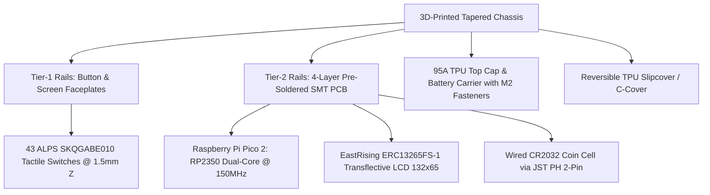

# Hardware Specifications & Capability Rubric

StackCalc is designed as a rugged, tactile physical instrument accompanied by a 1:1 software digital twin. We take engineering parity seriously: the exact deterministic calculation engine running on our physical RP2350 microcontroller powers our iOS and watchOS applications.

---

## 1. Physical Hardware Architecture & Assembly Kit Model

The StackCalc32 handheld calculator draws inspiration from the legendary HP32SII while introducing modern manufacturing tolerances, serviceable modular mechanics, and high-performance embedded silicon. 

All physical hardware is distributed exclusively as **DIY Hardware Assembly Kits**. The 4-layer FR4 mainboard arrives **100% pre-soldered and pre-flashed** with surface-mount components, allowing builders to achieve complete, tool-less assembly in under 5 minutes without a soldering iron.

### Physical Specifications

| Parameter | Authoritative Specification | Engineering Details & Tolerances |
|---|---|---|
| **Distribution Model** | **DIY Assembly Kit** | 100% pre-soldered SMT board; frictionless 5-minute tool-less slide assembly |
| **Microcontroller Module** | **Raspberry Pi Pico 2 (`SC1632`)** | RP2350 (Dual Cortex-M33 / Hazard3 RISC-V @ 150 MHz, Hardware double FPU, 4MB QSPI flash) |
| **Firmware Runtime** | Bare-Metal Embedded Swift | Zero dynamic allocation, deterministic execution, sub-15ms cold boot |
| **Display Module** | **EastRising ERC13265FS-1** (2.5-inch) | 132×65 pixel FSTN transflective graphic LCD with ST7567 / ST7567A controller |
| **Display Connection** | 10-pin 0.5mm FPC ZIF | Hirose `FH12-10S-0.5SH(55)` bottom-contact connector (`J1`) |
| **Display Active Area** | 56.73 × 27.92 mm | Bezel opening: 57.13 × 28.32 mm; Glass viewing area: 66.0 × 32.5 mm |
| **Typography** | Native Terminus Font | Bundled 6×8 pixel font for 4 lines of left-justified stack text |
| **Keypad Matrix** | **43 SMD Tactile Switches** | ALPS `SKQGABE010` (1.5mm Z-height off PCB surface, 180g actuation force) |
| **Key Pitch** | 11.50 mm (H) × 11.30 mm (V) | Upper 6-column matrix (22 keys) and 4×5 arithmetic pad (20 keys) |
| **ENTER Key** | Double-Wide (21.90 × 10.40 mm) | Centered switch on 19.20 × 9.20 mm carriage with 4 captive flange sectors |
| **Button Kinematics** | 0.80 mm Down / 0.20 mm Up | 0.80 mm downward working travel; 0.20 mm upward release |
| **Faceplate Options** | Rounded Retro or HP-32SII | 3 planar spiral springs (rounded) or captive diamond cartridge (HP-32SII) |
| **Dimensions (Bare)** | **80.0 × 148.0 × 16.0 mm max** | 11.9 mm keypad depth tapering to 16.0 mm display depth |
| **Rear Taper** | **1.60857° Planar Wedge** | Continuous desk contact; zero rocking under upper function-key rows |
| **Mainboard PCB** | **72.0 × 142.4 × 1.6 mm** | 4-layer FR4 SMT board with gold immersion finish (ENIG) |
| **Power Architecture** | **Wired CR2032 Coin Cell Holder** | JST PH 2-pin side-entry header (`S2B-PH-K-S(LF)(SN)`); <30µA dormant sleep |
| **Top Cap Enclosure** | 95A-Class Flexible TPU | Houses wired CR2032 battery carrier, braces screen frame, flared M2 nut towers |
| **Protective Cover** | Reversible TPU C-Cover | 83.8 × 149.3 × 18.2 mm; front storage shield or rear desktop sleeve with card slot |
| **Packaging & Stands** | 6.6 × 4.9 × 1.9 in Mailer Box | Multi-tier protective isolation converting into **78° Showcase & 10° Typing Stands** |

### The DIY Assembly Kit Experience

To comply with international regulatory frameworks (FCC Part 15 SDoC evaluation kit rules) while celebrating maker culture, StackCalc32 is provided as an unassembled development kit:

1. **Zero-Solder Mechanical Sliding Stack:**
   - **Step 1 (Faceplates):** The button faceplate and screen faceplate slide into the Tier-1 chassis rails, interlocking via hidden tongue-and-groove pockets.
   - **Step 2 (PCB):** The populated 4-layer mainboard slides smoothly down the Tier-2 rails behind the faceplates until the tactile switches seat against the button plungers at the fixed switch datum.
   - **Step 3 (Top Cap & Battery):** The 95A TPU top cap with integrated CR2032 battery carrier slides down to close the display frame, secured by two M2 screws into brass nuts seated in flared towers.
   - **Step 4 (Slipcover):** The reversible TPU C-cover slides over the calculator.
2. **Protective Packaging That Becomes Dual Stands:**
   - The custom 6.6 × 4.9 × 1.9 inch mailer box organizes each component into dedicated vertical tiers (PCB, Chassis, Top Cap, Button Membrane, Faceplate, and TPU Pouch).
   - Once unboxed, the internal packaging elements assemble into two ergonomic desktop fixtures:
     - **The 78° Upright Shelf Showcase Stand:** Displays the calculator at an optimal portrait viewing angle with an integrated rear docking slot for the TPU pouch.
     - **The 10.0° Ergonomic Typing Elevator Desk Wedge:** Raises the rear by exactly 1.0 inch (25.4 mm) for fatigue-free desktop calculation.

### Hardware Editions

1. **SC-32 Professional (Flagship Kit — In Production):**
   - Full scientific, transcendental, complex number, statistical, and financial calculation engine.
   - Powered by the Raspberry Pi Pico 2 (RP2350) with 4 MB QSPI flash, supporting 16 built-in TUI tutorials and flash persistence.
2. **SC-6 Basic Variant (In Development):**
   - Tailored specifically for primary education (K–5).
   - Introduces visual Ten Frames, Number Racks, step-by-step fraction reduction (`[SIMP]`), and currency math.

---

## 2. HP32SII Parity & Modern Capability Rubric

This rubric tracks operational capabilities across all StackCalc surfaces compared against the original HP32SII. Every operation produces mathematically bit-identical results.

### Core Arithmetic & RPN Stack Operations

| Capability / Key | Original HP32SII | Physical Hardware (SC-32) | iOS App | watchOS App | Notes & Operational Details |
|---|:---:|:---:|:---:|:---:|---|
| **Basic Arithmetic (`+`, `-`, `×`, `÷`)** | ✅ | ✅ | ✅ | ✅ | Standard two-operand evaluation; drops Y onto X |
| **Stack Commit (`ENTER`)** | ✅ | ✅ | ✅ | ✅ | Copies X into Y and arms automatic stack lift |
| **Sign Toggle (`+/-`)** | ✅ | ✅ | ✅ | ✅ | Negates mantissa or active exponent |
| **Absolute Value (`\|x\|` / `ABS`)** | ✅ | ✅ | ✅ | ✅ | Promoted to Blue Shift `+/-` for direct one-touch access |
| **Integer Remainder Division (`÷R`)** | ✅ | ✅ | ✅ | ✅ | Returns integer quotient and pushes remainder |
| **Scientific Notation (`E`)** | ✅ | ✅ | ✅ | ✅ | Initiates base-10 exponent entry (`1.23E4`) |
| **Register Swap (`𝑥≷𝑦`)** | ✅ | ✅ | ✅ | ✅ | Exchanges values in X and Y registers |
| **Stack Roll Down (`R↓`)** | ✅ | ✅ | ✅ | ✅ | Rotates four-level stack: X→T, Y→X, Z→Y, T→Z |
| **Stack Roll Up (`R↑`)** | ✅ | ✅ | ✅ | ✅ | Rotates four-level stack in reverse direction |
| **Last Argument Recovery (`LAST𝑥`)** | ✅ | ✅ | ✅ | ✅ | Restores previous X operand before last operation |
| **Full Precision View (`SHOW`)** | ✅ | ✅ | ✅ | ✅ | Temporarily reveals full 15-digit internal IEEE-754 value |
| **Backspace / Clear (`<-`, `C`)** | ✅ | ✅ | ✅ | ✅ | Deletes single digits during entry; clears active menu or line |

### Scientific & Transcendental Functions

| Capability / Key | Original HP32SII | Physical Hardware (SC-32) | iOS App | watchOS App | Notes & Operational Details |
|---|:---:|:---:|:---:|:---:|---|
| **Square Root (`√𝑥`)** | ✅ | ✅ | ✅ | ✅ | Evaluates $\sqrt{x}$; supports negative arguments in complex mode |
| **Square (`𝑥²`)** | ✅ | ✅ | ✅ | ✅ | Evaluates $x^2$ onto active stack |
| **Natural Logarithm (`LN`)** | ✅ | ✅ | ✅ | ✅ | Evaluates $\ln(x)$ base-$e$ |
| **Common Logarithm (`LOG`)** | ✅ | ✅ | ✅ | ✅ | Evaluates $\log_{10}(x)$ base-10 |
| **Natural Exponential (`𝑒ˣ`)** | ✅ | ✅ | ✅ | ✅ | Evaluates $e^x$ |
| **Base-10 Exponential (`10ˣ`)** | ✅ | ✅ | ✅ | ✅ | Evaluates $10^x$ |
| **Power (`𝑦ˣ`)** | ✅ | ✅ | ✅ | ✅ | Combines Y and X to evaluate $y^x$ |
| **Arbitrary Root (`ˣ√𝑦`)** | ✅ | ✅ | ✅ | ✅ | Evaluates $\sqrt[x]{y}$ |
| **Reciprocal (`¹/𝑥`)** | ✅ | ✅ | ✅ | ✅ | Evaluates $1/x$ |
| **Factorial / Gamma (`𝑥!`)** | ✅ | ✅ | ✅ | ✅ | Computes $n!$ for integers and $\Gamma(x+1)$ for non-integers |
| **Trigonometry (`SIN`, `COS`, `TAN`)** | ✅ | ✅ | ✅ | ✅ | Evaluates sine, cosine, tangent in current angular mode |
| **Inverse Trig (`ASIN`, `ACOS`, `ATAN`)** | ✅ | ✅ | ✅ | ✅ | Evaluates arcsine, arccosine, and arctangent |
| **Hyperbolic Modes (`HYP`)** | ✅ | ✅ | ✅ | ✅ | Arms hyperbolic trig: $\sinh, \cosh, \tanh, \text{asinh}$, etc. |
| **Constant Pi (`π`)** | ✅ | ✅ | ✅ | ✅ | Enters $\pi = 3.141592653589793...$ onto stack |

### Complex Numbers ($a + bi$)

| Capability / Key | Original HP32SII | Physical Hardware (SC-32) | iOS App | watchOS App | Notes & Operational Details |
|---|:---:|:---:|:---:|:---:|---|
| **Complex Pair Entry** | ✅ | ✅ | ✅ | ✅ | Rectangular real and imaginary coordinate input via `CMPLX` |
| **Euler's Identity Parity** | ✅ | ✅ | ✅ | ✅ | Evaluates $e^{\pi i} = -1.0000 + 0.0000i$ accurately |
| **Complex Transcendentals** | ✅ | ✅ | ✅ | ✅ | Full complex domain for roots, powers, logs, and trig |
| **Polar / Rectangular Conversion** | ✅ | ✅ | ✅ | ✅ | Instant transformation between $(r, \theta)$ and $(x, y)$ |

### Modern Fractions & Educational Mathematics

| Capability / Key | Original HP32SII | Physical Hardware (SC-32) | iOS App | watchOS App | Notes & Operational Details |
|---|:---:|:---:|:---:|:---:|---|
| **Three-Part Fraction Entry** | ✅ | ✅ | ✅ | ✅ | Formatted entry via `.Whole.Numerator.Denominator` |
| **Manual Step-by-Step Reduction** | ❌ | ✅ | ✅ | ✅ | `[SIMP]` softkey factors out common divisors iteratively |
| **Fraction/Decimal Toggle (`[FDISP]`)** | ✅ | ✅ | ✅ | ✅ | Instantly toggles display between exact fraction and decimal |
| **Mixed Fraction Arithmetic** | ✅ | ✅ | ✅ | ✅ | Direct addition, subtraction, multiplication of mixed numbers |

### Two-Variable Statistics & Curve Fitting

| Capability / Key | Original HP32SII | Physical Hardware (SC-32) | iOS App | watchOS App | Notes & Operational Details |
|---|:---:|:---:|:---:|:---:|---|
| **Data Accumulation (`Σ+`)** | ✅ | ✅ | ✅ | ✅ | Enters coordinate pair $(x, y)$ into dedicated stat registers |
| **Data Deletion (`Σ-`)** | ✅ | ✅ | ✅ | ✅ | Subtracts erroneous data point from active statistics |
| **Sample & Population Means (`𝑥̄, 𝑦̄`)** | ✅ | ✅ | ✅ | ✅ | Computes weighted arithmetic means of x and y |
| **Standard Deviations (`s, σ`)** | ✅ | ✅ | ✅ | ✅ | Computes sample ($s$) and population ($\sigma$) standard deviations |
| **Linear Regression (`L.R.`)** | ✅ | ✅ | ✅ | ✅ | Solves slope ($m$), y-intercept ($b$), and correlation ($r$) |
| **Summation Recall (`SUMS`)** | ✅ | ✅ | ✅ | ✅ | Recalls accumulated $\Sigma x, \Sigma y, \Sigma x^2, \Sigma y^2, \Sigma xy, n$ |

### Storage Registers & Program Variables

| Capability / Key | Original HP32SII | Physical Hardware (SC-32) | iOS App | watchOS App | Notes & Operational Details |
|---|:---:|:---:|:---:|:---:|---|
| **Register Store & Recall (`STO`, `RCL`)** | ✅ | ✅ | ✅ | ✅ | Stores/recalls values across 26 global lettered registers (A–Z) |
| **Indirect Register Addressing** | ✅ | ✅ | ✅ | ✅ | Uses register `(i)` as a pointer for dynamic indexed access |
| **Register Arithmetic** | ✅ | ✅ | ✅ | ✅ | In-place operations (`STO +`, `STO -`, `STO ×`, `STO ÷`) |
| **Continuous Memory** | ✅ | ✅ | ✅ | ✅ | Preserves all registers across power downs and sleep states |

### Advanced Numerical Solvers & Integration

| Capability / Key | Original HP32SII | Physical Hardware (SC-32) | iOS App | watchOS App | Notes & Operational Details |
|---|:---:|:---:|:---:|:---:|---|
| **Single-Root Solver (`SOLVE`)** | ✅ | ✅ | ✅ | ✅ | Numerical secant/Brent root-finder without algebraic CAS |
| **Numerical Integration (`∫`)** | ✅ | ✅ | ✅ | ✅ | Romberg / adaptive quadrature definite integral solver |
| **Cubic Polynomial Solver (`POLY`)** | ❌ | ✅ | ✅ | ✅ | Solves real and complex roots for $Ax^3 + Bx^2 + Cx + D = 0$ |
| **Time Value of Money (`TVM`)** | ❌ | ✅ | ✅ | ✅ | Dedicated financial amortizer ($N, I\%YR, PV, PMT, FV$) |

### Modern Interface & System Enhancements

| Capability / Feature | Original HP32SII | Physical Hardware (SC-32) | iOS App | watchOS App | Notes & Operational Details |
|---|:---:|:---:|:---:|:---:|---|
| **Interactive TUI Tutorials** | ❌ | ✅ | ✅ | ✅ | 16 built-in step-by-step guided lessons with verification |
| **Flexible Stack Architecture** | ❌ | ✅ | ✅ | ✅ | Configurable classic 4-level, 8-level, or unbounded stack |
| **Function Graphing (`PLOT`)** | ❌ | ✅ | ✅ | ✅ | Hardware ST7567A pixel plot; interactive pinch/pan on iOS |
| **Continuous Tactile Field (HPTC)** | ❌ | ❌ | ✅ | ❌ | Simulated mechanical travel via continuous CoreHaptics |
| **Pitch-Black OLED Mode** | ❌ | ❌ | ❌ | ✅ | True #000000 background optimized for Apple Watch displays |
| **Searchable Constants (`CNST`)** | Partial | ✅ | ✅ | ✅ | Hardware softkey index; searchable rich picker on iOS/watchOS |

---

## 3. Deliberate Quality-of-Life Departures from HP32SII

While maintaining functional parity, StackCalc incorporates deliberate modern enhancements to improve usability, durability, and educational clarity:

1. **Unified RPN Programming:**
   - *HP32SII:* Required users to navigate between an archaic algebraic equation mode and RPN keystroke programming.
   - *StackCalc:* Unifies all equation definition into deterministic RPN stack operations. This eliminates parser ambiguities and ensures identical execution behavior on microcontrollers, phones, and watches.
2. **Dedicated Absolute Value (`|x|`) Key:**
   - *HP32SII:* Hid the absolute value function deep within the secondary `PARTS` menu.
   - *StackCalc:* Assigns `|x|` directly to Blue Shift `+/-`, providing instant one-touch evaluation.
3. **Modern Remainder Notation (`÷R`):**
   - *HP32SII:* Labeled integer division as `INT÷` above the `E` key.
   - *StackCalc:* Uses `÷R` to clearly communicate integer division with remainder, aligning with modern engineering and educational standards.
4. **Clean Power Architecture (Software Targets):**
   - *HP32SII:* Included a physical `OFF` key label.
   - *StackCalc:* Retains power management on the hardware unit, but hides unnecessary power buttons on iOS and watchOS where operating system lifecycle handlers manage state.
5. **Configurable Stack Depth:**
   - *HP32SII:* Restricted permanently to a 4-level stack ($X, Y, Z, T$).
   - *StackCalc:* The `FLAGS` menu allows selecting between classic 4-level, 8-level, and unbounded Infinite stack depths.
6. **Searchable Constants Directory:**
   - *HP32SII:* Relied on abbreviated, unindexed 2-letter codes.
   - *StackCalc:* Hardware uses organized softkey pagination, while companion apps feature a searchable database complete with full names, precise values, and physical SI units.
