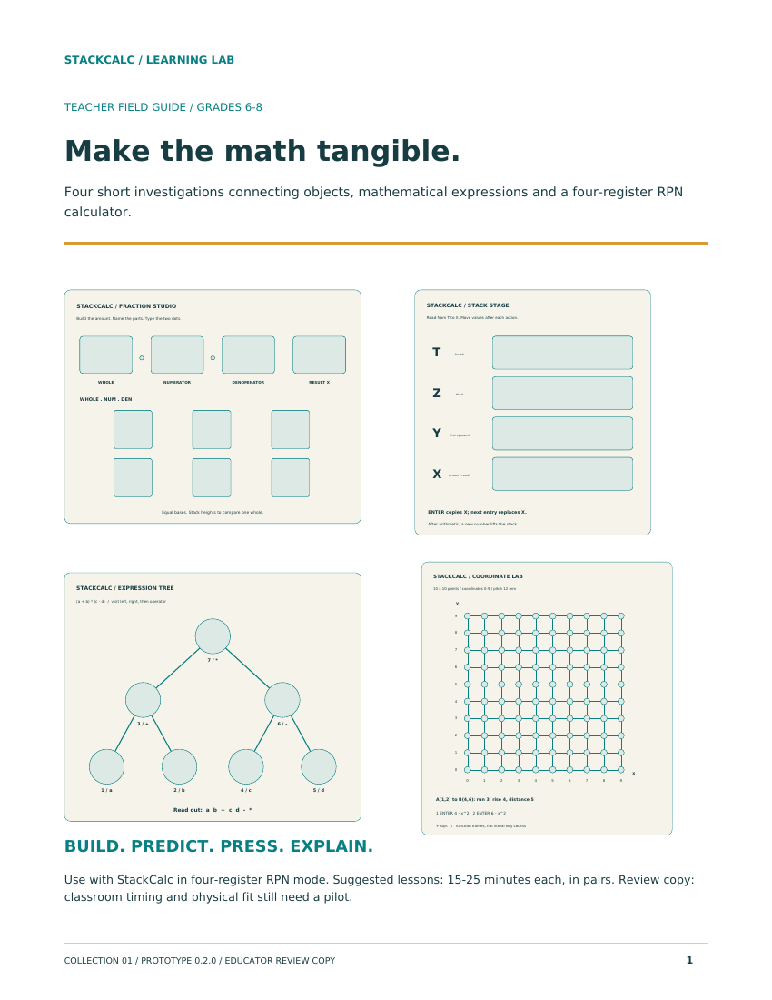
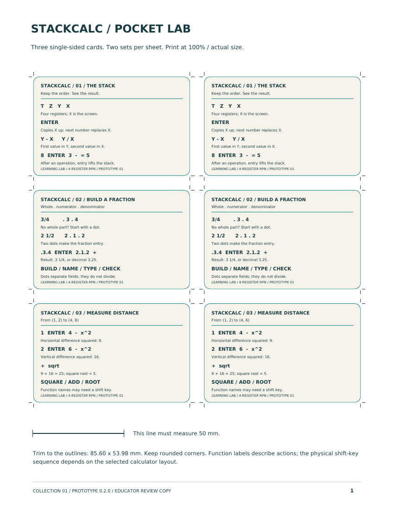

# StackCalc Learning Lab

The Learning Lab is the first physical teaching-resource collection in the StackCalc ecosystem. It gives a learner tangible ways to represent quantities, a four-register stack, an expression tree, and coordinate relationships before translating them into calculator operations.

The internally maintained collection contains 13 STL plates with 79 solids, matching OpenSCAD sources, laser artwork, a catalog manifest, reference cards, and a teacher booklet. The public release below contains the printable STL plates and teacher PDFs.

*The first page of the printable teacher guide labels the four connected investigations. The pictured boards are teaching representations, rather than unengraved STL previews.*

## The first collection

| Resource | What it makes visible |
| --- | --- |
| Fraction studio | A quantity, its whole, numerator, and denominator before an RPN fraction entry. |
| Stack stage | Four value tiles arranged as X, Y, Z, and T, so ENTER, stack lift, and binary operations have a physical model. |
| Expression tree | Seven removable tokens for reading an expression in postorder before keying the resulting RPN sequence. |
| Coordinate lab | A 10 × 10 point grid and locator pegs for measuring a 3-4-5 triangle and checking a distance calculation. |
| Pocket cards | Compact references for stack, fractions, and distance exercises. |

## A common calculation model

The calculator, apps, and Learning Lab share a single premise: values arrive before the operation that consumes them. The Learning Lab turns that sequence into a question a learner can inspect: what goes on the stack now, and what two values will this operation use?

The fraction studio uses blocks with a common 24 × 24 mm footprint. Whole, half, third, quarter, sixth, and eighth blocks are 96/n mm tall, so equivalent towers meet at the same height. The stack stage is a 158 × 164 mm board with four reusable value tiles. The expression-tree board is 196 × 164 mm with tokens for `a`, `b`, `+`, `c`, `d`, `-`, and `*`. Those are design facts about the supplied prototype; they do not demonstrate learning outcomes.

*The printable reference cards label the stack, fraction, and distance activities used with the STL plates.*

## Prototype status

The Learning Lab is ready for printing and teacher review. The calculator is an unpowered four-part mechanical prototype, and its RP2350 PCB is in fabrication. We will add fit, engraving, and educator findings as they are collected.

## Download the prototype materials

The 0.2.0 STL pack is the canonical printable release of the Learning Lab. It contains the 13 STL plates only; the teaching cards and teacher booklet are provided separately as PDFs. Source code, CAD generators, and manufacturing artwork are not part of this public download.

| File | Contents |
| --- | --- |
| [Learning Lab STL pack 0.2.0](downloads/stackcalc-learning-lab-0.2.0-stl-pack.zip) | The 13 printable STL plates for the first collection. SHA-256: `b0dc8ecd980a4760ca1bd5c9038d93ff23a29736937eb6bf7017881926908fa1` |
| [Reference cards — Letter](downloads/reference-cards-letter.pdf) | Printable stack, fraction, and distance cards for US Letter paper. |
| [Reference cards — A4](downloads/reference-cards-a4.pdf) | Printable stack, fraction, and distance cards for A4 paper. |
| [Teacher booklet — Letter](downloads/teacher-booklet-letter.pdf) | Eight-page investigation guide and worksheet for US Letter paper. |
| [Teacher booklet — A4](downloads/teacher-booklet-a4.pdf) | Eight-page investigation guide and worksheet for A4 paper. |

Read the related engineering notes and catalog:

- [Product & Hardware Catalog](products.md)
- [Why RPN needs an ecosystem](blog/posts/2026-09-22-why-rpn-needs-an-ecosystem-not-another-retro-replica.md)
- [Make the four-level stack visible](blog/posts/2026-09-22-making-the-four-level-stack-visible.md)
- [Teach a fraction as a sequence](blog/posts/2026-09-22-teaching-fractions-as-an-rpn-sequence.md)
- [Read an expression tree as a postfix program](blog/posts/2026-09-22-reading-an-expression-tree-as-a-postfix-program.md)
