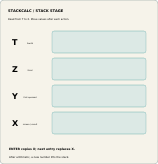

# StackCalc Learning Lab

The Learning Lab is the first physical teaching-resource collection in the StackCalc ecosystem. It does not replace the calculator. It gives a learner tangible ways to represent quantities, a four-register stack, an expression tree, and coordinate relationships before translating them into calculator operations.

The collection is a completed source-and-manufacturing prototype, not a classroom-outcome study or a retail kit. It contains 13 STL plates with 79 solids, matching OpenSCAD sources, laser artwork, a catalog manifest, reference cards, and a teacher booklet.

## The first collection

| Resource | What it makes visible |
| --- | --- |
| Fraction studio | A quantity, its whole, numerator, and denominator before an RPN fraction entry. |
| Stack stage | Four value tiles arranged as X, Y, Z, and T, so ENTER, stack lift, and binary operations have a physical model. |
| Expression tree | Seven removable tokens for reading an expression in postorder before keying the resulting RPN sequence. |
| Coordinate lab | A 10 × 10 point grid and locator pegs for measuring a 3-4-5 triangle and checking a distance calculation. |
| Pocket cards | Compact references for stack, fractions, and distance exercises. |

## A common calculation model

The calculator, apps, and Learning Lab share a single premise: values arrive before the operation that consumes them. The Learning Lab turns that sequence into a question a learner can inspect: what goes on the stack now, and what two values will this operation use?

The fraction studio uses blocks with a common 24 × 24 mm footprint. Whole, half, third, quarter, sixth, and eighth blocks are 96/n mm tall, so equivalent towers meet at the same height. The stack stage is a 158 × 164 mm board with four reusable value tiles. The expression-tree board is 196 × 164 mm with tokens for `a`, `b`, `+`, `c`, `d`, `-`, and `*`. Those are design facts about the supplied prototype; they do not demonstrate learning outcomes.

## Current boundaries

The teaching resources are designed and generated locally. Printer fit, engraving contrast, edge durability, writing-surface behavior, classroom use, curriculum alignment, pricing, packaging, and retail fulfillment all require separate physical and educator validation. The calculator itself remains an unpowered four-part mechanical prototype while its RP2350 PCB is developed.

## Download the prototype materials

The 0.2.0 prototype bundle is the canonical release of the current Learning Lab source, STL plates, generated artwork, manufacturing references, and print-ready teaching materials. It is published for reproduction and review; it is not a retail kit or a claim of classroom validation.

| File | Contents |
| --- | --- |
| [Learning Lab prototype bundle 0.2.0](downloads/stackcalc-learning-lab-0.2.0-prototype.zip) | Complete source and generated outputs, including the 13 STL plates and manufacturing assets. SHA-256: `59d38255959e62001c27b1fd51453ba02e5b1d90749e201a3086393d7e44c67d` |
| [Reference cards — Letter](downloads/reference-cards-letter.pdf) | Printable stack, fraction, and distance cards for US Letter paper. |
| [Reference cards — A4](downloads/reference-cards-a4.pdf) | Printable stack, fraction, and distance cards for A4 paper. |
| [Teacher booklet — Letter](downloads/teacher-booklet-letter.pdf) | Eight-page investigation guide and worksheet for US Letter paper. |
| [Teacher booklet — A4](downloads/teacher-booklet-a4.pdf) | Eight-page investigation guide and worksheet for A4 paper. |

Read the related engineering notes:

- [Why RPN needs an ecosystem](blog/posts/2026-09-22-why-rpn-needs-an-ecosystem-not-another-retro-replica.md)
- [Make the four-level stack visible](blog/posts/2026-09-22-making-the-four-level-stack-visible.md)
- [Teach a fraction as a sequence](blog/posts/2026-09-22-teaching-fractions-as-an-rpn-sequence.md)
- [Read an expression tree as a postfix program](blog/posts/2026-09-22-reading-an-expression-tree-as-a-postfix-program.md)
