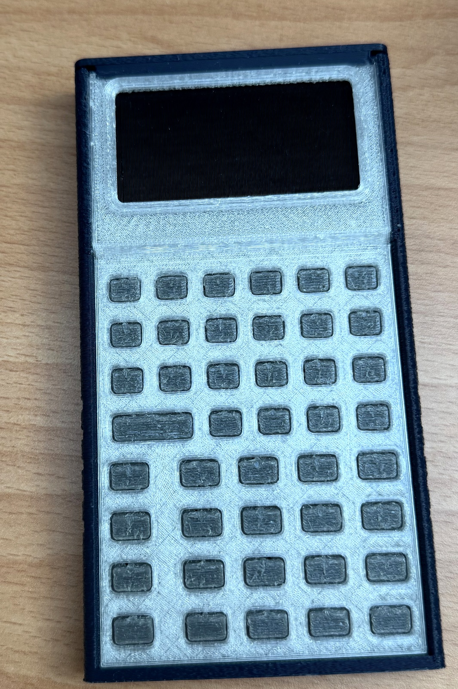
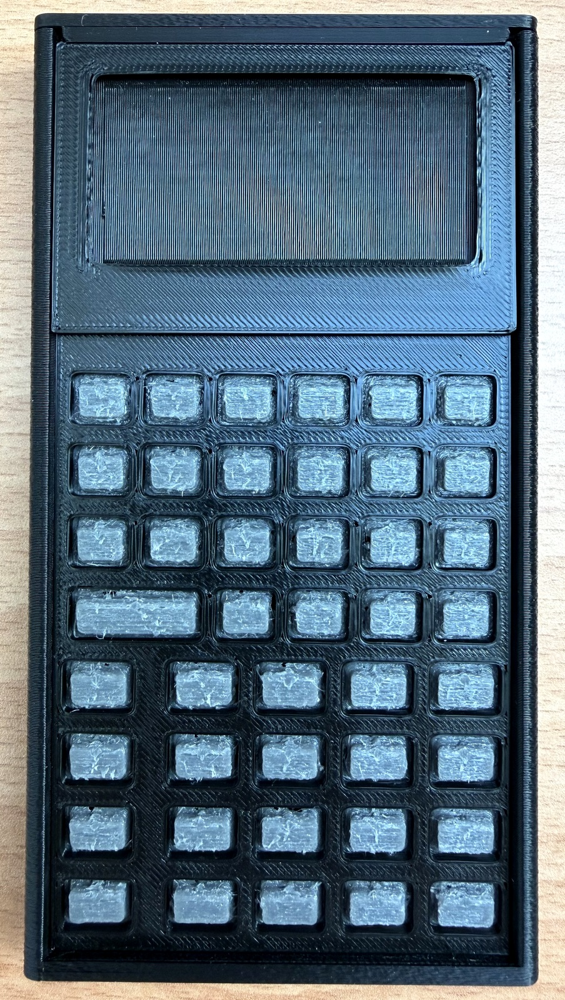
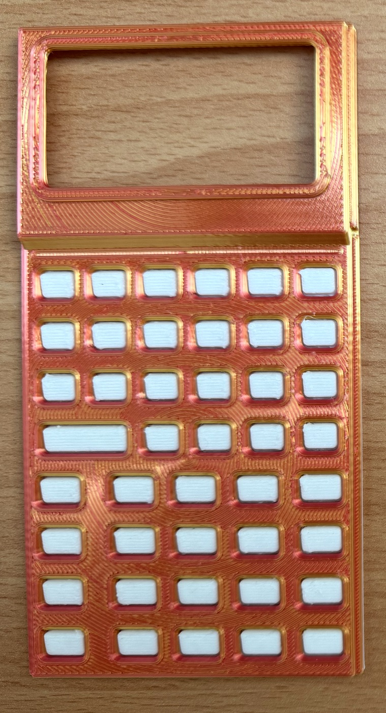
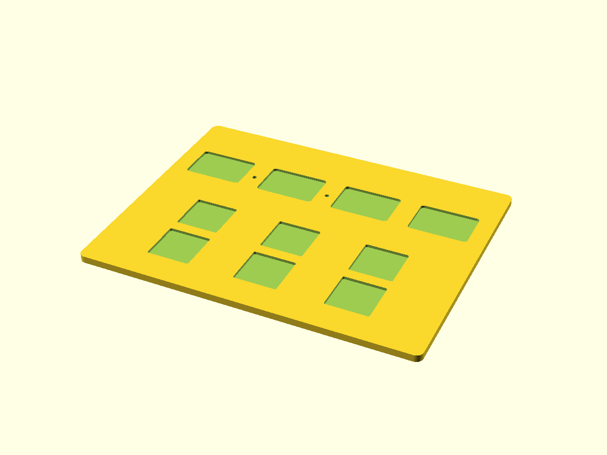
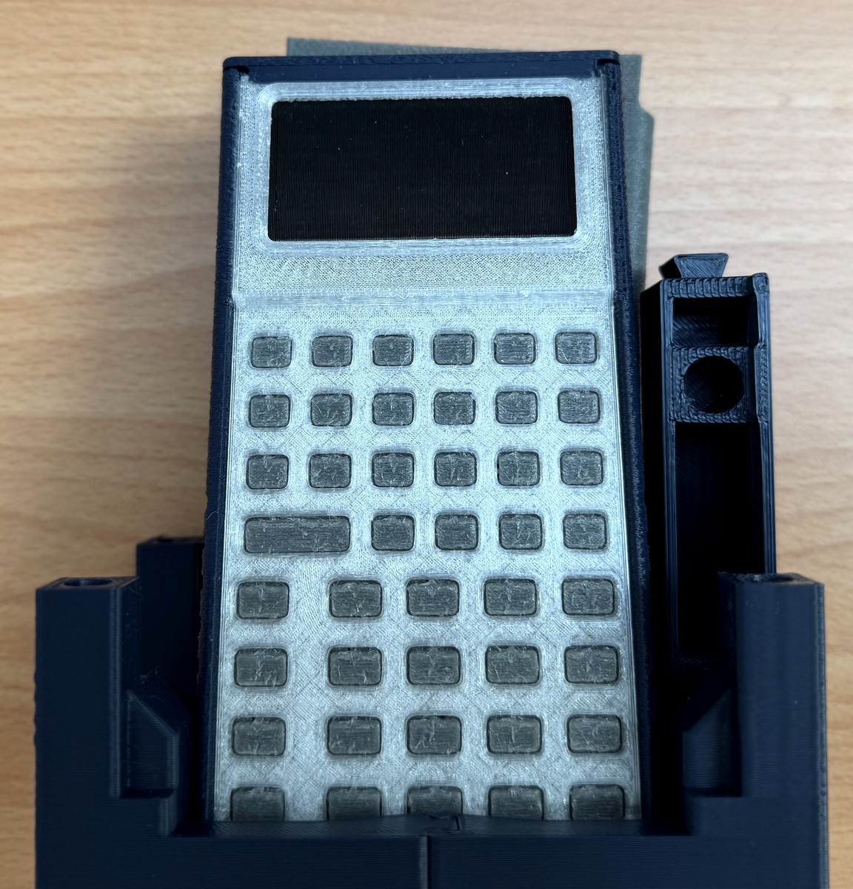
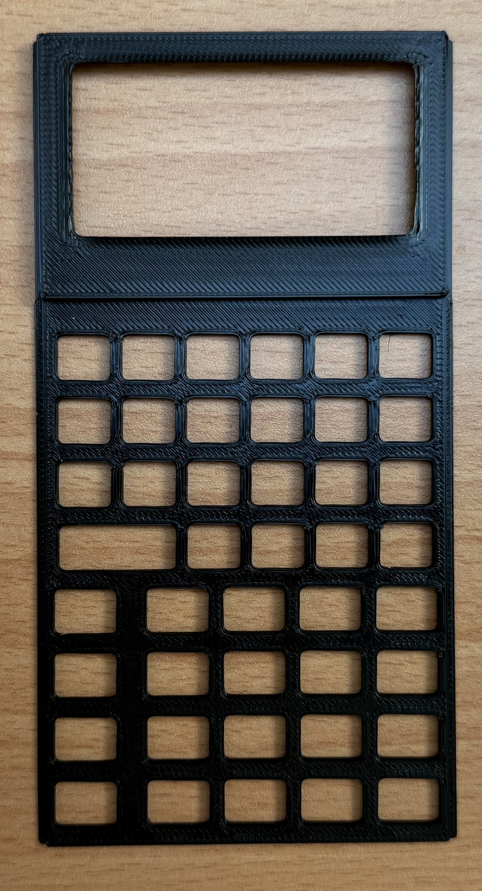
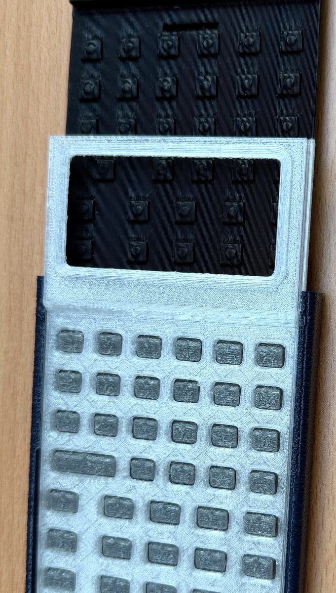
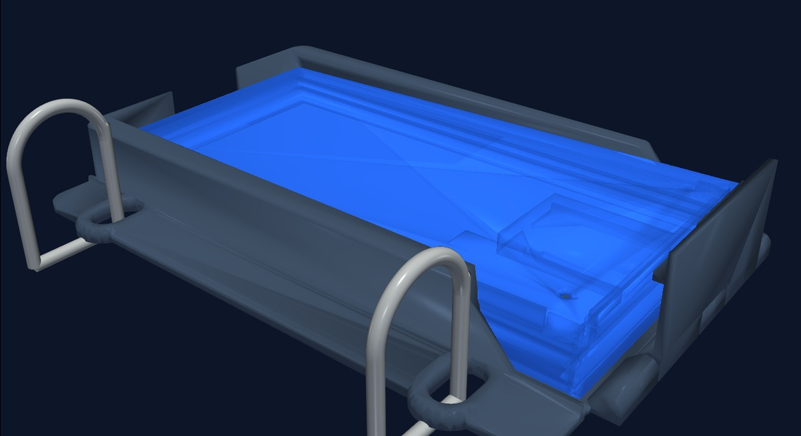

  

    // SYSTEM: STACKCALC HARDWARE &amp; MAKER DIRECTORY
    REVISION: 2026.09
  

  <h1 class="text-3xl sm:text-5xl font-mono font-bold tracking-tight text-icyblue my-2">PRODUCT CATALOG</h1>
  

    Dedicated tactile RPN instruments, modular faceplates, protective TPU pouches, physical classroom manipulatives, curriculum workbooks, and free open maker downloads. Built for bare-metal calculation clarity.
  

  

    <a href="#system-01-instruments" class="px-3 py-1 bg-charcoal border border-mask/40 text-icyblue hover:border-accentCyan hover:text-accentCyan no-underline">01 · INSTRUMENTS</a>
    <a href="#system-02-manipulatives" class="px-3 py-1 bg-charcoal border border-mask/40 text-icyblue hover:border-accentCyan hover:text-accentCyan no-underline">02 · MANIPULATIVES</a>
    <a href="#system-03-modular-accessories" class="px-3 py-1 bg-charcoal border border-mask/40 text-icyblue hover:border-accentCyan hover:text-accentCyan no-underline">03 · FACEPLATES &amp; POUCHES</a>
    <a href="#system-04-curriculum" class="px-3 py-1 bg-charcoal border border-mask/40 text-icyblue hover:border-accentCyan hover:text-accentCyan no-underline">04 · CURRICULUM &amp; DECKS</a>
    <a href="#system-05-downloads" class="px-3 py-1 bg-charcoal border border-mask/40 text-icyblue hover:border-accentCyan hover:text-accentCyan no-underline">05 · MAKER DOWNLOADS</a>
    <a href="https://hackaday.io/project/206743-stackcalc32-a-tactile-rpn-calculator" target="_blank" class="px-3 py-1 bg-charcoal border border-accentCyan/50 text-accentCyan hover:bg-accentCyan hover:text-pitch no-underline flex items-center gap-1">BUILD LOGS ↗</a>
  

<!-- ==========================================================================
     SYSTEM 01: INSTRUMENTS & DIGITAL TWIN
     ========================================================================== -->

  SYSTEM 01 // DEDICATED INSTRUMENTS &amp; DIGITAL TWIN
  HARDWARE FABRICATION &bull; 1:1 EMULATION

  <!-- SC-32 Founder's Edition -->
  

    

      // MODEL: SC-32-FND-00
      &bull; IN FABRICATION
    

    

      
    

    

      

        <h3 class="te-title">SC-32 Founder's Edition</h3>
        $79 USD
      

      
Limited Founder's Run 00. Tactile handheld Reverse Polish Notation scientific calculator. High-contrast reflective monochrome graphic LCD, 43 snap-dome keys, and tool-free sliding enclosure.

      

        
PROCESSORRaspberry Pi RP2350

        
DISPLAY132&times;65 Graphic LCD (ST7567A)

        
KEYPAD43 Snap-Dome (400g) + 95A TPU

        
CHASSIS4-Part Interlocking Tool-Free

        
POWERCR2032 Coin Cell / USB-C

        
COMPLIANCESAT, ACT &amp; AP Exam Permitted

        
EXCLUSIVESLaser-Serialized Stainless Plate

      

    

    

      <a href="../#preorder" class="te-btn-primary">Pre-Order Founder's Edition &rarr;</a>
    

  

  <!-- SC-32 Regular Edition -->
  

    

      // MODEL: SC-32-STD
      &bull; COMING Q4
    

    

      
    

    

      

        <h3 class="te-title">SC-32 Regular Edition</h3>
        $59 USD
      

      
Everyday handheld RPN scientific calculator engineered for STEM students and technical professionals. Standardized injection/durable print chassis in five signature contrast colorways.

      

        
ARCHITECTURERP2350 Bare-Metal RPNCore

        
COLORWAYSApollo, Stealth, Supernova, Deep Space, Voyager

        
ENCLOSURE5-Minute Tool-Free Snap-Fit

        
KEYPAD43 Tactile Domes + Shift Legends

        
PACKAGINGConverts to Dual-Angle Stand

        
COMPLIANCESAT, ACT &amp; AP Non-CAS Approved

      

    

    

      <a href="../#preorder" class="te-btn-secondary">Join Notification Waitlist &rarr;</a>
    

  

  <!-- SC-6 Elementary Edition -->
  

    

      // MODEL: SC-6-ELEM
      &bull; PROTOTYPING
    

    

      
    

    

      

        <h3 class="te-title">SC-6 Elementary Edition</h3>
        $35 USD
      

      
Early numeracy and fraction foundations calculator designed for Grades K–6 classrooms. Features large-format tactile keys, ten-frame visual mathematics, and step-by-step simplification.

      

        
INTERFACEOversized Domes + Color Coding

        
VISUAL MATHTen-Frames, Number Racks &amp; Blocks

        
FRACTIONSDedicated [SIMP] Step-by-Step Key

        
AUDIENCEGrades K–6 Math Classrooms

        
POWERDual CR2032 / USB-C Desktop

      

    

    

      <a href="../hardware/" class="te-btn-secondary">View Architecture Spec &rarr;</a>
    

  

  <!-- Digital Twin Companion -->
  

    

      // MODEL: SC-APP-IOS
      &bull; AVAILABLE NOW (v1.1)
    

    

      
    

    

      

        <h3 class="te-title">Digital Twin (iOS / watchOS)</h3>
        FREE
      

      
Full 1:1 mathematical and state-machine parity with the physical calculator. Standalone Apple Watch app with digital crown inertial stack scrolling, tactile haptic feedback, and Lock Screen stack widgets.

      

        
PARITY1:1 Clean-Room HP-32SII Engine

        
THEMESRetroFuturism, Stealth Industrial, Supernova, Deep Space, Voyager

        
APPLE WATCHStandalone &bull; Digital Crown Scroll

        
TELEMETRYZero Tracking &bull; Zero Cloud Ads

        
COST100% Free on the App Store

      

    

    

      <a href="https://apps.apple.com/app/id6801788040" target="_blank" class="te-btn-primary">Download on Apple App Store ↗</a>
    

  

<!-- ==========================================================================
     SYSTEM 02: MANIPULATIVES & PHYSICAL STANDS
     ========================================================================== -->

  SYSTEM 02 // TACTILE MANIPULATIVES &amp; STANDS
  PHYSICAL MATH TOOLS &bull; ETSY STOREFRONT

  <!-- SC-LL-01 Learning Lab Kit -->
  

    

      // SKU: SC-LL-KIT-01
      &bull; IN PRODUCTION
    

    

      
    

    

      

        <h3 class="te-title">Learning Lab Tactile Kit</h3>
        $48 USD
      

      
Complete 79-piece hands-on STEM manipulative laboratory. Bridges tactile physical blocks with RPN operational stack mechanics. Includes Fraction Studio, Stack Stage, Expression Tree, and Coordinate Grid.

      

        
PARTS79 Precision 3D-Printed &amp; Marked Parts

        
FRACTION TRAY192&times;151 mm Recessed Bed + 26 Towers

        
STACK STAGE4-Register (T, Z, Y, X) + 4 Dry-Erase Tiles

        
EXPRESSION TREEBinary Tree Board + 7 Removable Tokens

        
COORDINATE BOARD10&times;10 Pegboard &bull; Pythagorean 3-4-5

        
DISCLOSURE3D Manipulatives Only &bull; No Calculator

      

    

    

      <a href="../learning-lab/" class="te-btn-primary">Explore Lab Details &rarr;</a>
    

  

  <!-- SC-STAND-01 Interlocking Puzzle Stand -->
  

    

      // SKU: SC-STAND-01
      &bull; IN PRODUCTION
    

    

      
    

    

      

        <h3 class="te-title">Interlocking Puzzle Stand</h3>
        $18 USD
      

      
Precision 3-piece friction-fit interlocking display stand. Dual ergonomic angles for seated desktop calculation or upright shelf presentation. Disassembles in 2 seconds to lay 100% flat at 6 mm.

      

        
GEOMETRY22&deg; Seated Desk / 58&deg; Shelf Display

        
CONSTRUCTION3-Piece Friction-Fit Interlocking PLA

        
PACKABILITYCollapses to 6 mm Flat for Pencil Cases

        
COMPATIBILITYSC-32, iPhone &amp; Apple Watch

        
FINISHESMatte Charcoal, Bone White, Deep Cyan

      

    

    

      <a href="../hardware/#assembly-and-service" class="te-btn-secondary">View Stand Geometry &rarr;</a>
    

  

<!-- ==========================================================================
     SYSTEM 03: MODULAR ACCESSORIES, POUCHES & FACEPLATES
     ========================================================================== -->

  SYSTEM 03 // MODULAR ACCESSORIES, POUCHES &amp; FACEPLATES
  FIELD ACCESSORIES &bull; SC-32 &amp; SC-6 COMPATIBLE

  <!-- SC-FP-32 Modular Scientific Faceplates -->
  

    

      // SKU: SC-FP-32
      &bull; IN FABRICATION
    

    

      
    

    

      

        <h3 class="te-title">SC-32 Faceplate</h3>
        $14 / $48
      

      
Modular snap-fit faceplate for the SC-32 scientific calculator. Features 43-key matrix cutouts with debossed dual-shift scientific engravings (yellow math &amp; blue system tools). Tool-free rail swap in &lt;10s.

      

        
TARGET MODESC-32 Scientific RPN

        
ENGRAVINGS43 Keys + Yellow/Blue Dual Shifts

        
CHASSIS FITUniversal SC Sliding Rail Envelope

        
COLORWAYS5 Signature App-Matched Finishes

      

    

    

      <a href="../hardware/#material-and-marking-direction" class="te-btn-secondary">View SC-32 Spec &rarr;</a>
    

  

  <!-- SC-FP-06 Modular Elementary Faceplates -->
  

    

      // SKU: SC-FP-06
      &bull; PROTOTYPING
    

    

      
    

    

      

        <h3 class="te-title">SC-6 Faceplate</h3>
        $14 / $48
      

      
Modular snap-fit faceplate for the SC-6 elementary calculator. Identical physical outer chassis geometry as the SC-32, with specialized button cutouts for ten-frames, number racks, and step-by-step [SIMP] reduction.

      

        
TARGET MODESC-6 Elementary &amp; Fractions

        
ENGRAVINGSVisual Math (Ten-Frames) &amp; [SIMP]

        
CHASSIS FITUniversal SC Sliding Rail Envelope

        
COLORWAYS5 Signature App-Matched Finishes

      

    

    

      <a href="../hardware/" class="te-btn-secondary">View SC-6 Spec &rarr;</a>
    

  

  <!-- SC-POUCH-01 Reversible Protective TPU Travel Pouch -->
  

    

      // SKU: SC-POUCH-01
      &bull; IN PRODUCTION
    

    

      
    

    

      

        <h3 class="te-title">TPU Travel Pouch</h3>
        $14 USD
      

      
Tactile drop-resistant protective sleeve cast in flexible 90A TPU. Fits both SC-32 and SC-6. Features a reversible dual-tone finish (Azure Blue &amp; Slate Charcoal), debossed logo, and rear slot for 3 CR80 cards.

      

        
COMPATIBILITYUniversal (SC-32 &amp; SC-6)

        
MATERIALShore 90A Flexible Polyurethane

        
FINISHReversible Azure Blue / Slate

        
CARD STORAGEHolds 3 CR80 Quick-Reference Cards

      

    

    

      <a href="../hardware/#current-cad-kit" class="te-btn-secondary">Check Dimensions &rarr;</a>
    

  

  <!-- SC-BIND-01 3-Ring STEM Binder Storage Pouch -->
  

    

      // SKU: SC-BIND-01
      &bull; FIRST EDITION
    

    

      
    

    

      

        <h3 class="te-title">STEM Binder Pouch</h3>
        $18 USD
      

      
Reinforced anti-tear frosted TPU binder sleeve with standard 3-ring binder grommets. Designed for school and university students to keep their SC-32 or SC-6 calculator, reference cards, and pencils bound inside binders.

      

        
COMPATIBILITYUniversal (SC-32 &amp; SC-6)

        
BINDER FITStandard US 3-Ring &amp; ISO A4

        
COMPARTMENTSCalculator Well + Cards + Pencils

        
MATERIALReinforced Frosted Matte 95A TPU

      

    

    

      <a href="../learning-lab/" class="te-btn-secondary">Classroom Usage &rarr;</a>
    

  

<!-- ==========================================================================
     SYSTEM 04: CURRICULUM WORKBOOKS & REFERENCE DECKS
     ========================================================================== -->

  SYSTEM 04 // CURRICULUM WORKBOOKS &amp; REFERENCE DECKS
  CLASSROOM GUIDES &bull; CR80 DECKS

  <!-- SC-BOOK-01 RPN Math Labs Workbook -->
  

    

      // SKU: SC-BOOK-01
      &bull; FIRST EDITION
    

    

      
    

    

      

        <h3 class="te-title">RPN Math Labs Workbook</h3>
        $24 / $65
      

      
36-page full-color spiral guide featuring 20 hands-on STEM investigations for Grades 6–9. Connects tactile manipulative experiments directly to RPN operational keystroke logs.

      

        
STUDENT EDITION$24 USD &bull; Spiral Guide + Worksheets

        
CLASSROOM PACK$65 USD &bull; Pack of 10 + Teacher Key

        
LICENSESingle-Teacher 35-Student Copy Rights

        
ALIGNMENTCommon Core &bull; Grades 6–9 STEM

      

    

    

      <a href="../learning-lab/#curriculum-investigations" class="te-btn-secondary">View Curriculum Index &rarr;</a>
    

  

  <!-- SC-REF-01 Quick-Reference Decks -->
  

    

      // SKU: SC-REF-01
      &bull; IN STOCK
    

    

      
    

    

      

        <h3 class="te-title">CR80 Quick-Reference Decks</h3>
        $15 USD
      

      
Dual-column pocket cards matching standard credit card dimensions (CR80) that slide directly into the calculator's rear TPU pouch. Side-by-side textbook formulas and exact RPN keystrokes.

      

        
DIMENSIONS85.6 &times; 54.0 mm (CR80 PVC / Cardstock)

        
SET 1 (MIDDLE)Fractions, Proportions, Geometry

        
SET 2 (HIGH)Quadratics, Trig, Vectors, TVM

        
DIGITAL ACCESSFree Printable PDF Available Below

      

    

    

      <a href="#system-05-downloads" class="te-btn-secondary">Get Printable Free &darr;</a>
    

  

  <!-- SC-VOL-01 Unit Circle Volvelle -->
  

    

      // SKU: SC-VOL-01
      &bull; PROTOTYPE
    

    

      

        <h3 class="te-title">Unit Circle Volvelle</h3>
        $12 USD
      

      
Zero-battery rotating dual-disc tactile trigonometric calculator. Rotating inner disc reveals exact coordinate pairs, degree/radian conversions, and tangent values through aperture windows.

      

        
MATERIALLaser-Cut Acrylic / Heavy Matte Stock

        
SCALES0&deg;–360&deg; Degrees &bull; 0–2&pi; Radians

        
OUTPUTSExact Sin, Cos, Tan &amp; Coordinate Pairs

        
STATUSPrototype Educational Accessory

      

    

    

      <a href="../learning-lab/" class="te-btn-secondary">Curriculum Context &rarr;</a>
    

  

<!-- ==========================================================================
     SYSTEM 05: FREE OPEN MAKER DOWNLOADS
     ========================================================================== -->

  SYSTEM 05 // FREE OPEN MAKER DOWNLOADS
  ZERO COST &bull; OPEN HARDWARE LICENSE

  <!-- Cassette 01: Enclosure STLs -->
  

    

      

        // PACK 01 &bull; 3D PRINT
        ZIP &bull; 1.15 MB
      

      <h4 class="te-cassette-title">SC-32 Enclosure STLs</h4>
      
Complete 4-part tool-free sliding mechanical assembly: chassis, faceplate with LCD cowl, 95A flexible TPU keypad membrane, and snap cap. Rev 0.2.0.

    

    <a href="../downloads/stackcalc-current-mechanical-prototype-stls.zip" class="te-btn-primary">Download .ZIP &darr;</a>
  

  <!-- Cassette 02: Manipulatives Pack -->
  

    

      

        // PACK 02 &bull; CLASSROOM
        ZIP &bull; 300 KB
      

      <h4 class="te-cassette-title">Learning Lab STLs</h4>
      
All 13 STL print plates (79 parts): Fraction Studio tray, 26 proportional vertical fraction towers, Stack Stage tray, Tree board, and Coordinate grid.

    

    <a href="../downloads/stackcalc-learning-lab-0.2.0-stl-pack.zip" class="te-btn-primary">Download .ZIP &darr;</a>
  

  <!-- Cassette 03: Teacher Starter Guide -->
  

    

      

        // PACK 03 &bull; GUIDE
        PDF &bull; 74 KB
      

      <h4 class="te-cassette-title">Teacher Starter Guide</h4>
      
Eight-page introductory curriculum guide with four foundational RPN investigations and reproducible student worksheet masters.

    

    

      <a href="../downloads/teacher-booklet-letter.pdf" class="te-btn-secondary text-center text-[10px] px-1 py-1">Letter &darr;</a>
      <a href="../downloads/teacher-booklet-a4.pdf" class="te-btn-secondary text-center text-[10px] px-1 py-1">A4 &darr;</a>
    

  

  <!-- Cassette 04: Printable Reference Sheets -->
  

    

      

        // PACK 04 &bull; CARDS
        PDF &bull; 44 KB
      

      <h4 class="te-cassette-title">Printable Reference</h4>
      
High-contrast printable cardstock sheets covering four-register operational stack rules ($X, Y, Z, T$), fractions, and distance formulas.

    

    

      <a href="../downloads/reference-cards-letter.pdf" class="te-btn-secondary text-center text-[10px] px-1 py-1">Letter &darr;</a>
      <a href="../downloads/reference-cards-a4.pdf" class="te-btn-secondary text-center text-[10px] px-1 py-1">A4 &darr;</a>
    

  

<!-- Outbound Hackaday Project Card -->

  

    // FIELD LOGS &bull; COMMUNITY ENGINEERING
    HACKADAY.IO EXCLUSIVE
  

  <h3 class="font-mono text-xl font-bold text-icyblue my-2">FOLLOW THE HARDWARE BUILD LOGS</h3>
  

    We publish weekly low-level engineering logs directly on Hackaday — covering RP2350 PCB routing, TPU return membrane finite element analysis, rail friction tolerances, and bare-metal firmware emulation.
  

  <a href="https://hackaday.io/project/206743-stackcalc32-a-tactile-rpn-calculator" target="_blank" class="te-btn-primary inline-block font-mono font-bold text-xs uppercase px-5 py-2.5">
    View Build Logs on Hackaday.io ↗
  </a>

